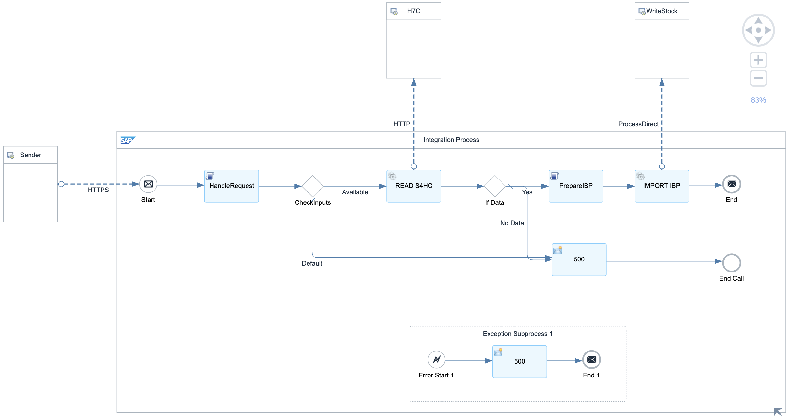
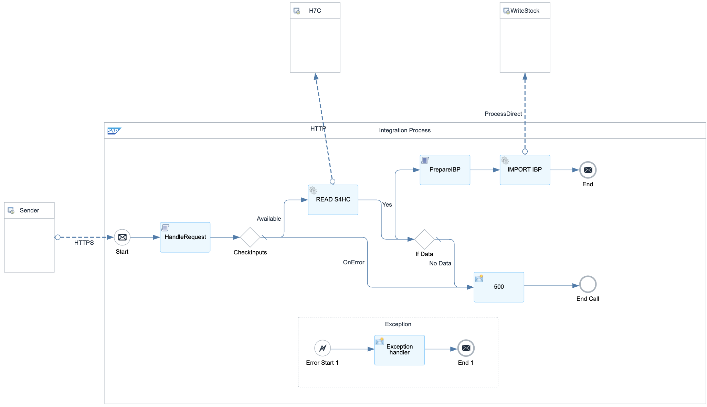

# Data Integration Scenarios for SAP Integrated Business Planning for Supply Chain 

\| [Recipes by Topic](../../readme.md ) \| [Recipes by Author](../../author.md ) \| [Request Enhancement](https://github.com/SAP-samples/cloud-integration-flow/issues/new?assignees=&labels=Recipe%20Fix,enhancement&template=recipe-request.md&title=Improve%20Data%20Integration%20Scenarios%20for%20SAP%20Integrated%20Business%20Planning%20for%20Supply%20Chain) \| [Report a bug](https://github.com/SAP-samples/cloud-integration-flow/issues/new?assignees=&labels=Recipe%20Fix,bug&template=bug_report.md&title=Issue%20with%20Data%20Integration%20Scenarios%20for%20SAP%20Integrated%20Business%20Planning%20for%20Supply%20Chain)\| [Fix documentation](https://github.com/SAP-samples/cloud-integration-flow/issues/new?assignees=&labels=Recipe%20Fix,documentation&template=bug_report.md&title=Docu%20fix%20Data%20Integration%20Scenarios%20for%20SAP%20Integrated%20Business%20Planning%20for%20Supply%20Chain) \| 

  | [SAP Business Accelerator Hub](https://api.sap.com/allcommunity) | 
 ----|----| 

Integration for Stocks and Production Document Data into SAP Integrated Business Planning for Supply Chain using OData

The package contains the following Integration Flows:

<ul>
 <li>Read Material / Stock Data from SAP S/4HANA and prepare a payload for sending it into SAP Integrated Business Planning (IBP) for Supply Chain with OData</li>
 <li>Send Production Document Data from SAP S/4HANA and prepare a payload for sending it into SAP Integrated Business Planning (IBP) for Supply Chain&nbsp;</li>
 <li>A flow to process input data into SAP Integrated Business Planning (IBP) for Supply Chain, which is called by the two previous flows</li>
</ul>

[Download the integration package](DataIntegrationScenariosforSAPIntegratedPlanningforSupplyChain.zip)\
[View package on the SAP Business Accelerator Hub](https://api.sap.com/package/DataIntegrationScenariosforSAPIntegratedPlanningforSupplyChain)\
[View documentation](DataIntegrationScenariosforSAPIntegratedPlanningforSupplyChain.pdf)\
[View high level effort](effort.md)
## Integration flows
### Get all materials from SAP S4HANA 
Retrieve all materials from SAP S/4HANA using Odata being triggered by a REST API. \
 
### Write data to SAP Integrated Business Planning 
Process direct to Import stock data to SAP IBP \
 
### Get all production documents from SAP S4HANA 
Retrieve all production documents from SAP S/4HANA using Odata being triggered by a REST API. \
 