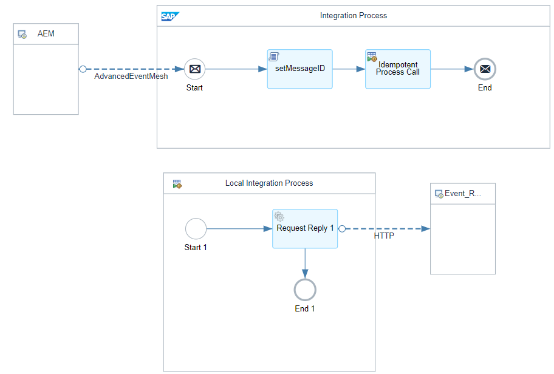
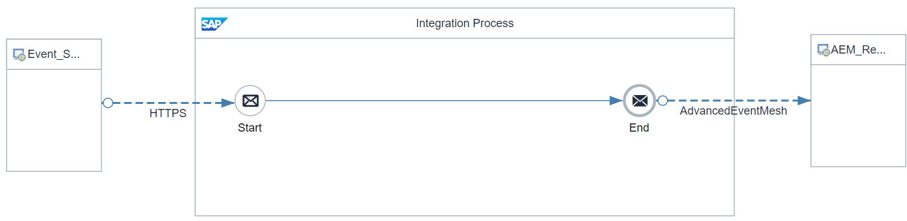

# Enabling Exactly Once in Order via Cloud Integration 

\| [Recipes by Topic](../../readme.md ) \| [Recipes by Author](../../author.md ) \| [Request Enhancement](https://github.com/SAP-samples/cloud-integration-flow/issues/new?assignees=&labels=Recipe%20Fix,enhancement&template=recipe-request.md&title=Improve%20Enabling%20Exactly%20Once%20in%20Order%20via%20Cloud%20Integration) \| [Report a bug](https://github.com/SAP-samples/cloud-integration-flow/issues/new?assignees=&labels=Recipe%20Fix,bug&template=bug_report.md&title=Issue%20with%20Enabling%20Exactly%20Once%20in%20Order%20via%20Cloud%20Integration)\| [Fix documentation](https://github.com/SAP-samples/cloud-integration-flow/issues/new?assignees=&labels=Recipe%20Fix,documentation&template=bug_report.md&title=Docu%20fix%20Enabling%20Exactly%20Once%20in%20Order%20via%20Cloud%20Integration) \| 

  | [SAP Business Accelerator Hub](https://api.sap.com/allcommunity) | 
 ----|----| 

Enabling Exactly Once in Order via Cloud Integration

This Package enables Exactly Once in Order (EOIO) processing with SAP Integration Suite, Advanced Event Mesh (AEM) utilizing partitioned Queues using the "Advanced Event Mesh Adapter for SAP Integration Suite"&nbsp;based on the blog:

<a href="https://community.sap.com/t5/technology-blogs-by-sap/enabling-in-order-processing-with-sap-integration-suite-advanced-event-mesh/ba-p/13703498#M172490" rel="nofollow">https://community.sap.com/t5/technology-blogs-by-sap/enabling-in-order-processing-with-sap-integration-suite-advanced-event-mesh/ba-p/13703498#M172490</a>

This package provides two IFlows:

1. Produce Event from AEM Exactly Once In Order&nbsp;

2. Consume Event from AEM Exactly Once In Order&nbsp;

&nbsp;

Download "Advanced Event Mesh Adapter" Version 1.3.0 as a prerequisite for this Package

<a href="https://api.sap.com/package/AdvancedEventMeshAdapterforSAPIntegrationSuite/overview" rel="nofollow">https://api.sap.com/package/AdvancedEventMeshAdapterforSAPIntegrationSuite/overview</a>

[Download the integration package](EnablingExactlyOnceinOrderviaCloudIntegration.zip)\
[View package on the SAP Business Accelerator Hub](https://api.sap.com/package/EnablingExactlyOnceinOrderviaCloudIntegration)\
[View high level effort](effort.md)
## Integration flows
### Consume Event from AEM Exactly Once In Order 
Consume Events from Advanced Event Mesh
(AEM) via AEM Adapter with quality of service Exactly Once In Order (EOIO) \
 
### Produce Event to AEM Exactly Once In Order 
Produce Events to Advanced Event Mesh
(AEM) via AEM Adapter with quality of service Exactly Once In Order (EOIO) \
 