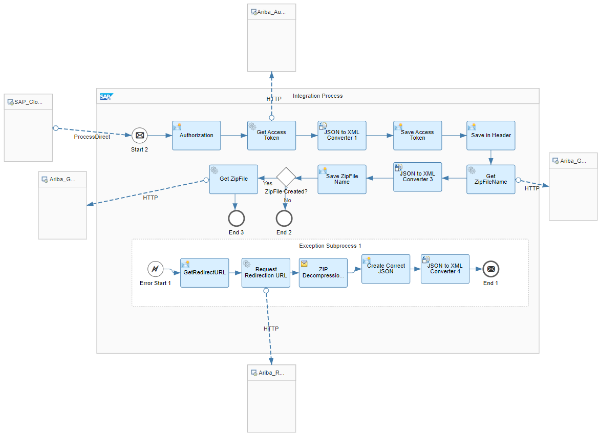
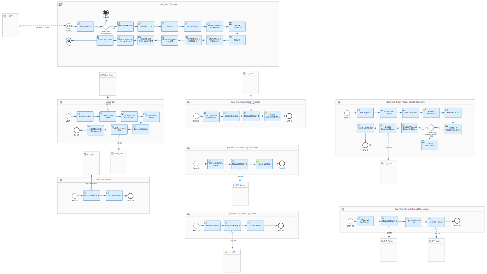
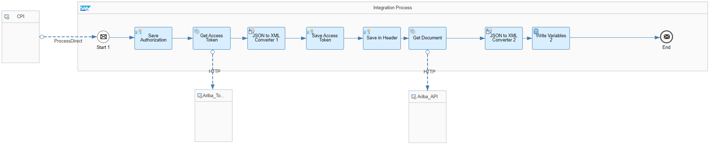
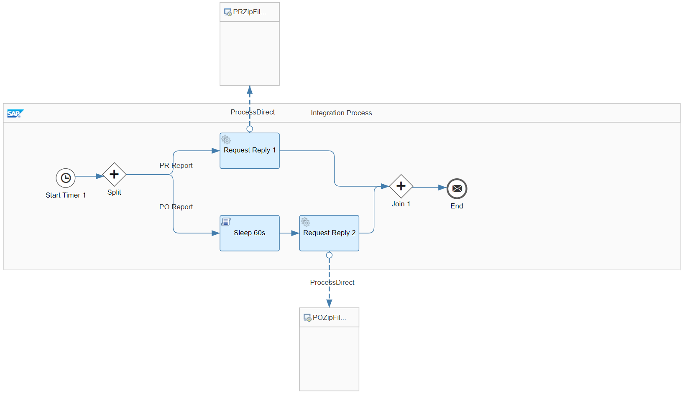
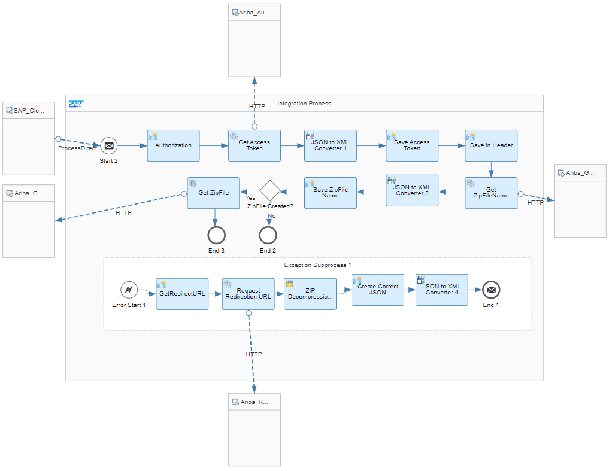
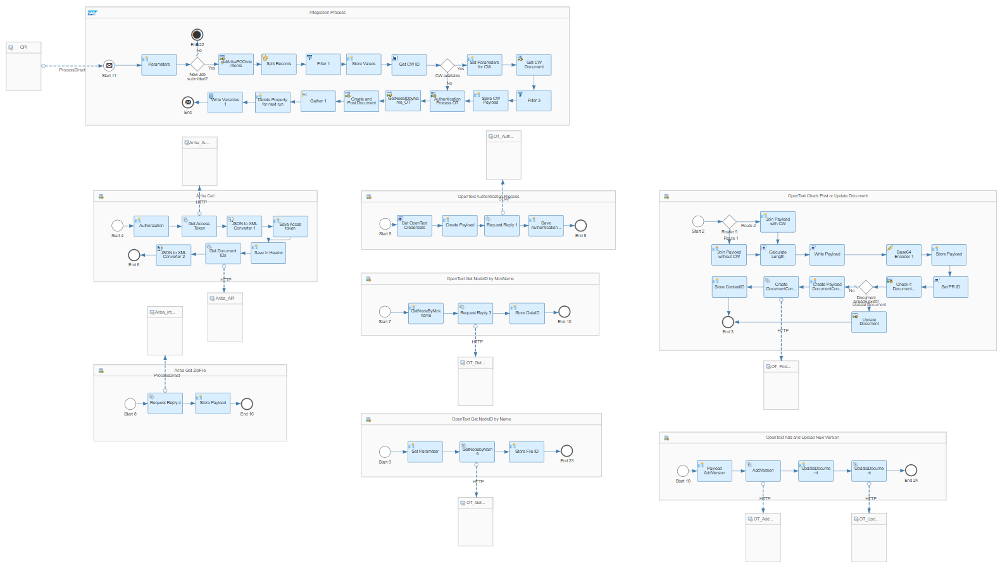
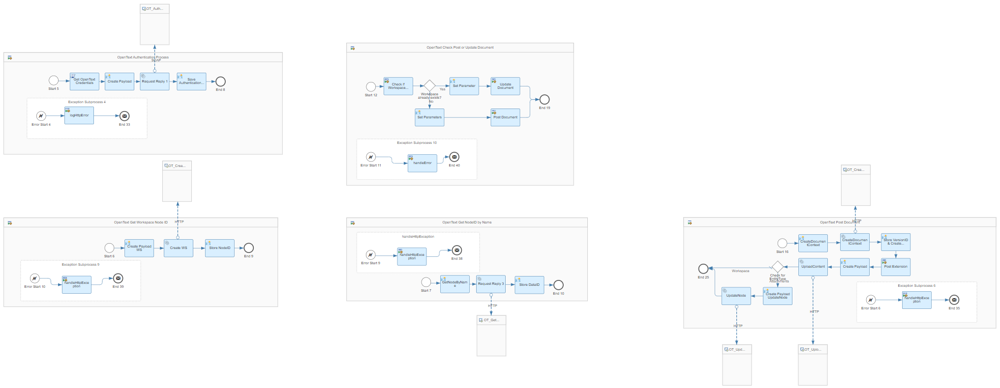
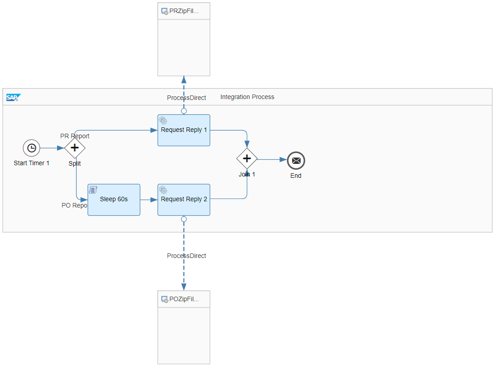
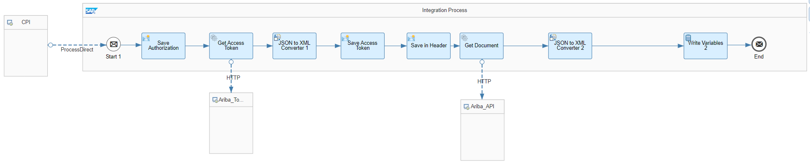

# Integration between SAP Ariba and OpenText 

\| [Recipes by Topic](../../readme.md ) \| [Recipes by Author](../../author.md ) \| [Request Enhancement](https://github.com/SAP-samples/cloud-integration-flow/issues/new?assignees=&labels=Recipe%20Fix,enhancement&template=recipe-request.md&title=Improve%20Integration%20between%20SAP%20Ariba%20and%20OpenText) \| [Report a bug](https://github.com/SAP-samples/cloud-integration-flow/issues/new?assignees=&labels=Recipe%20Fix,bug&template=bug_report.md&title=Issue%20with%20Integration%20between%20SAP%20Ariba%20and%20OpenText)\| [Fix documentation](https://github.com/SAP-samples/cloud-integration-flow/issues/new?assignees=&labels=Recipe%20Fix,documentation&template=bug_report.md&title=Docu%20fix%20Integration%20between%20SAP%20Ariba%20and%20OpenText) \| 

  | [SAP Business Accelerator Hub](https://api.sap.com/allcommunity) | 
 ----|----| 

This integration package provides an integration between SAP Ariba and the Third Party system OpenText for replicating purchase requisition, purchase orders and sourcing projects.

By using the Ariba APIs purchase requisition, purchase orders as well as sourcing projects are retrieved and replicated to a specific folder in the document management system OpenText.

[Download the integration package](IntegrationbetweenSAPAribaandOpenText.zip)\
[View package on the SAP Business Accelerator Hub](https://api.sap.com/package/IntegrationbetweenSAPAribaandOpenText)\
[View documentation](Documentation_IntegrationbetweenSAPAribaandOpenText.pdf)\
[View high level effort](effort.md)
## Integration flows
### Get Ariba Purchase Requisition Report 
Process Direct flows that picks up the job in SAP Ariba to get the Purchase Request report via ZIP file \
 
### Replicate purchase requisitions from SAP Ariba to OpenText 
This iflow is called by the SAP Cloud Integration Timer iflow and replicates purchase requisitions from SAP Ariba to OpenText.
It calls the following Iflow to retrieve the data from SAP Ariba:
- Get Ariba Purchase Request Report \
 
### Create Ariba Purchase Requisition Report 
Process Direct flows that submits the job in SAP Ariba to get the Purchase Request report via ZIP file \
 
### Replicate purchase requisitions and purchase orders from SAP Ariba to OpenText 
This Iflow triggers the following Iflows to replicate PO and PR from SAP Ariba to OpenText.

- Replicate purchase orders from SAP Ariba to OpenText
- Replicate purchase requisitions from SAP Ariba to OpenText \
 
### Get Ariba Purchase Order Report 
Process Direct flows that picks up the job in SAP Ariba to get the Purchase Order report via ZIP file \
 
### Replicate purchase orders from SAP Ariba to OpenText 
This iflow is called by the SAP Cloud Integration Timer iflow and replicates purchase order from SAP Ariba to OpenText.
It calls the following Iflow to retrieve the data from SAP Ariba:
- Get Ariba Purchase Order Report \
 
### Replicate sourcing projects from SAP Ariba to OpenText 
This iflow requests sourcing projects from SAP Ariba APIs and replicates them to a specific folder in OpenText. \
 
 
  
### Submit job request for purchase requisition report and purchase order report in SAP Ariba 
This Iflow triggers the following Iflow to submit the job request in SAP Ariba for PRReport and POReport:
- Create Ariba Purchase Request Report
- Create Ariba Purchase Order Report \
 
### Create Ariba Purchase Order Report 
Process Direct flows that submits the job in SAP Ariba to get the Purchase Order report via ZIP file \
 