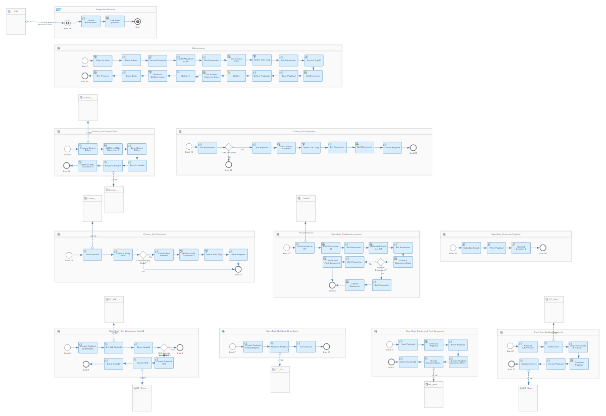
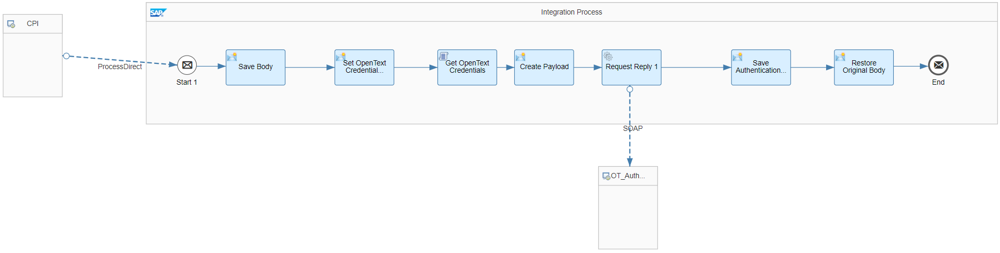
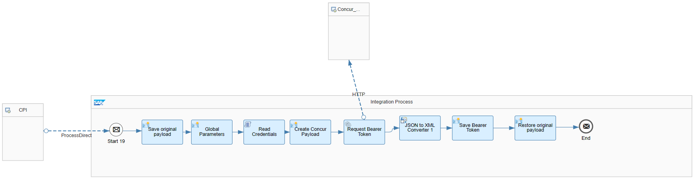
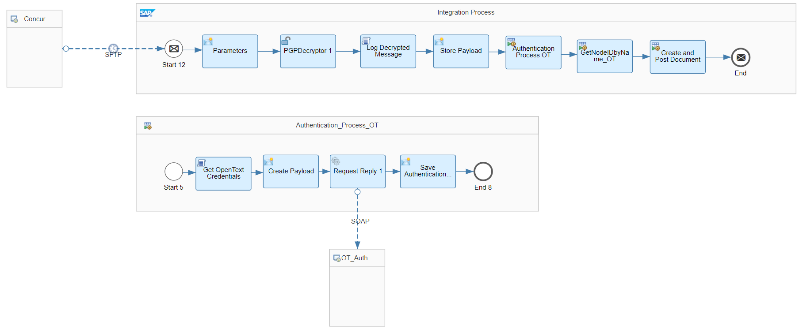
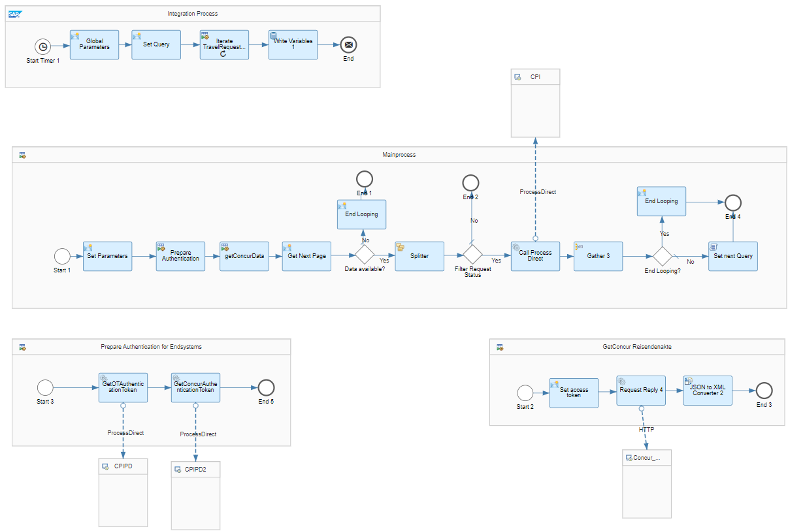

# Integration between SAP Concur and OpenText

\| [Recipes by Topic](../../readme.md ) \| [Recipes by Author](../../author.md ) \| [Request Enhancement](https://github.com/SAP-samples/cloud-integration-flow/issues/new?assignees=&labels=Recipe%20Fix,enhancement&template=recipe-request.md&title=Improve%20Integration%20between%20SAP%20Concur%20and%20OpenText%20 ) \| [Report a bug](https://github.com/SAP-samples/cloud-integration-flow/issues/new?assignees=&labels=Recipe%20Fix,bug&template=bug_report.md&title=Issue%20with%20Integration%20between%20SAP%20Concur%20and%20OpenText%20 ) \| [Fix documentation](https://github.com/SAP-samples/cloud-integration-flow/issues/new?assignees=&labels=Recipe%20Fix,documentation&template=bug_report.md&title=Docu%20fix%20Integration%20between%20SAP%20Concur%20and%20OpenText%20 ) \|

 | [SAP Business Accelerator Hub](https://api.sap.com/allcommunity) |
----|----|

By using the SAP Concur APIs, travel requests are retrieved and replicated to a work space in the document management system OpenText.

This package allows you to do the following:

* Process Direct iFlow replicates travel requests from SAP Concur to OpenText
* ProcessDirect_Authenticate to OpenText
* ProcessDirect_Authenticate to SAP Concur
* Replicate travel request from SAP Concur to OpenText via Cognos reports
* Timer_Triggers the replication of travel requests from SAP Concur to OpenText

[Download the integration package](IntegrationbetweenSAPConcurandOpenText.zip)\
[View package on the SAP Business Accelerator Hub](https://api.sap.com/package/IntegrationbetweenSAPConcurandOpenText/overview)\
[View documentation](Documentation_IntegrationbetweenSAPConcurandOpenText.pdf)\
[View high level effort estimate](effort.md)

## Integration Flows

### Process Direct iFlow replicates travel requests from SAP Concur to OpenText
This iflow is called by the SAP Cloud Integration Timer iflow and replicates the travel requests from SAP Concur to OpenText.\
[View on SAP Business Accelerator Hub](https://api.sap.com/integrationflow/Process_Direct_iFlow_replicates_travel_requests_from_SAP_Concur_to_OpenText)

### ProcessDirect_Authenticate to OpenText
This process direct Iflow authenticates to OpenText\
[View on SAP Business Accelerator Hub](https://api.sap.com/integrationflow/ProcessDirect_Authenticate_to_OpenText)

### ProcessDirect_Authenticate to SAP Concur
This process direct Iflow authenticates to the SAP Concur APIs\
[View on SAP Business Accelerator Hub](https://api.sap.com/integrationflow/ProcessDirect_Authenticate_to_SAP_Concur)

### Replicate travel request from SAP Concur to OpenText via Cognos reports
This iflows picks up the cognos files from a SFTP server and replicates it to a specific folder in OpenText.\
[View on SAP Business Accelerator Hub](https://api.sap.com/integrationflow/Replicate_travel_request_from_SAP_Concur_to_OpenText_via_Cognos_reports)

### Timer_Triggers the replication of travel requests from SAP Concur to OpenText
This Iflows triggers the following Iflows to replicate travel requests from SAP Concur to OpenText: - Process Direct iFlow replicates travel requests from SAP Concur to OpenText\
[View on SAP Business Accelerator Hub](https://api.sap.com/integrationflow/Timer_Triggers_the_replication_of_travel_requests_from_SAP_Concur_to_OpenText)
