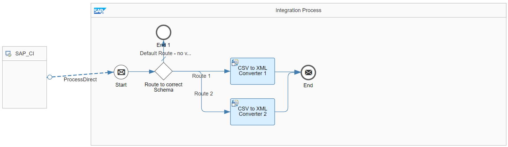
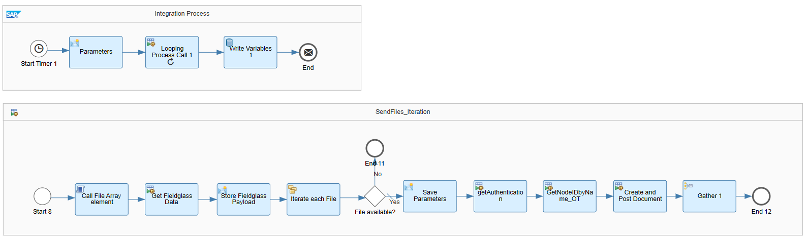
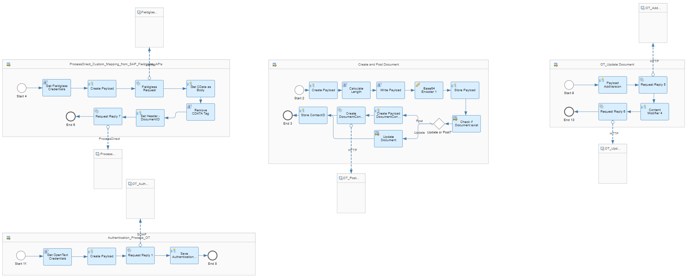
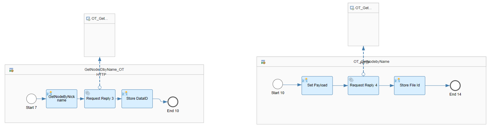

# Integration between SAP Fieldglass and OpenText 

\| [Recipes by Topic](../../readme.md ) \| [Recipes by Author](../../author.md ) \| [Request Enhancement](https://github.com/SAP-samples/cloud-integration-flow/issues/new?assignees=&labels=Recipe%20Fix,enhancement&template=recipe-request.md&title=Improve%20Integration%20between%20SAP%20Fieldglass%20and%20OpenText) \| [Report a bug](https://github.com/SAP-samples/cloud-integration-flow/issues/new?assignees=&labels=Recipe%20Fix,bug&template=bug_report.md&title=Issue%20with%20Integration%20between%20SAP%20Fieldglass%20and%20OpenText)\| [Fix documentation](https://github.com/SAP-samples/cloud-integration-flow/issues/new?assignees=&labels=Recipe%20Fix,documentation&template=bug_report.md&title=Docu%20fix%20Integration%20between%20SAP%20Fieldglass%20and%20OpenText) \| 

  | [SAP Accelerator Business Hub](https://api.sap.com/allcommunity) | 
 ----|----| 

This integration package provides an integration between SAP Fieldglass and the Third Party system OpenText for replicating Fieldglass specific data, e.g. purchase orders.

By using the Fieldglass APIs some defined data, e.g. purchase orders, are retrieved and replicated to a specific folder in the document management system OpenText.

&nbsp;

[Download the integration package](IntegrationbetweenSAPFieldglassandOpenText.zip)\
[View package on the SAP Accelerator Business Hub](https://api.sap.com/package/IntegrationbetweenSAPFieldglassandOpenText)\
[View documentation](Documentation_IntegrationbetweenSAPFieldglassandOpenText.pdf)\
[View high level effort](effort.md)
## Integration flows
### Custom specific transformation from SAP Fieldglass REST APIs to OpenText structure 
This process direct flow provides possibilities to customize mapping from SAP Fieldglass APIs to some specific XSD Schema. \
 
### Replicate data from SAP Fieldglass to a specific folder in OpenText 
This iflows requests information from SAP Fieldglass custom REST API and replicates it to a specific folder in OpenText. \
 
 
 