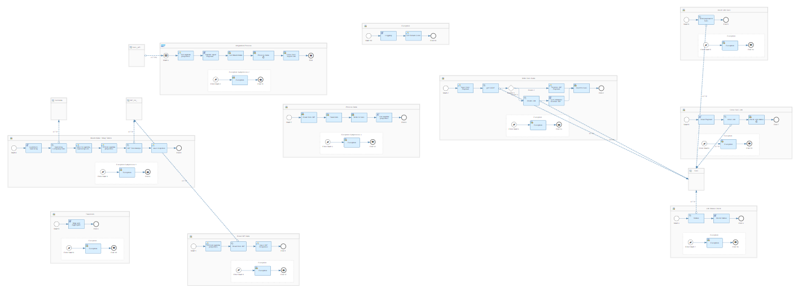
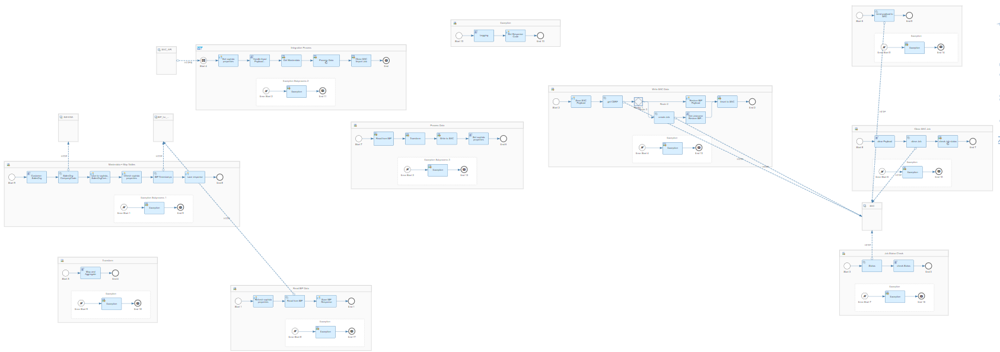
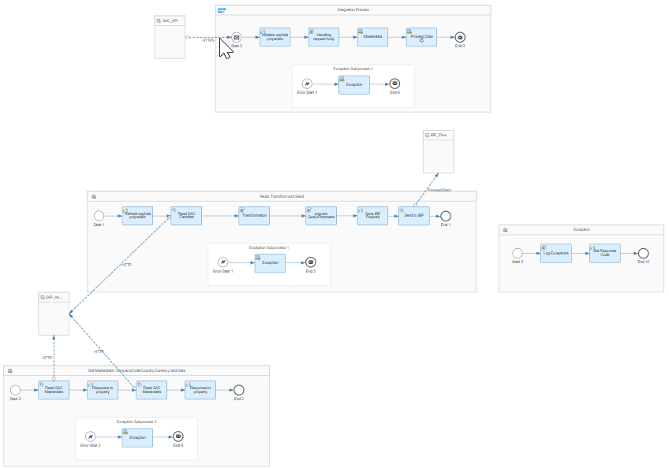
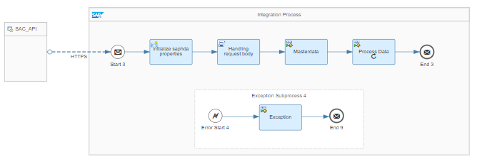
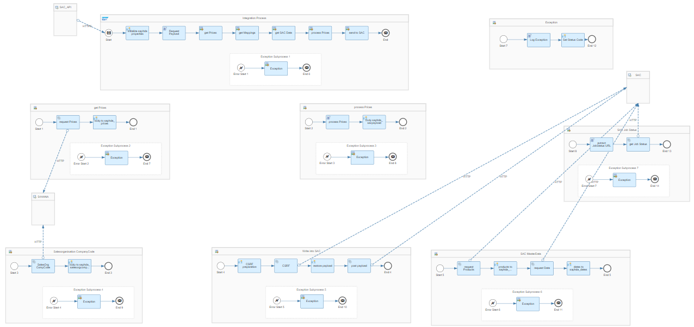
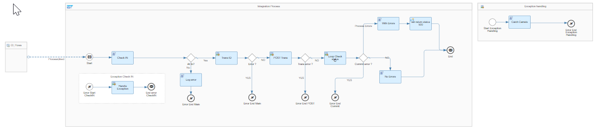
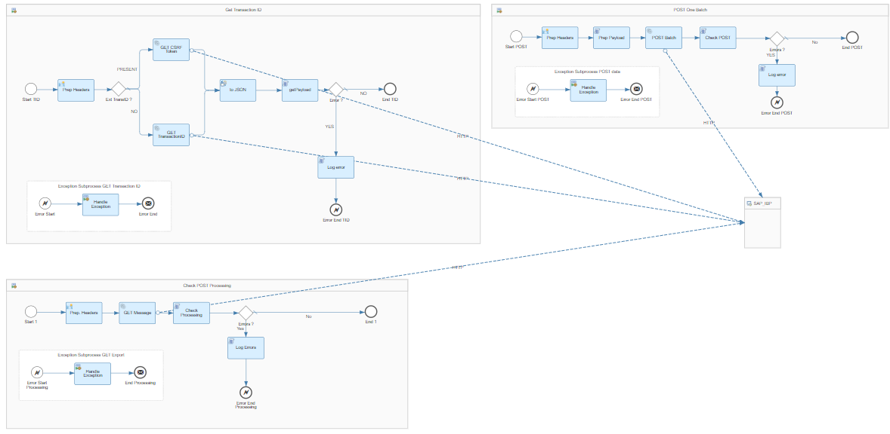
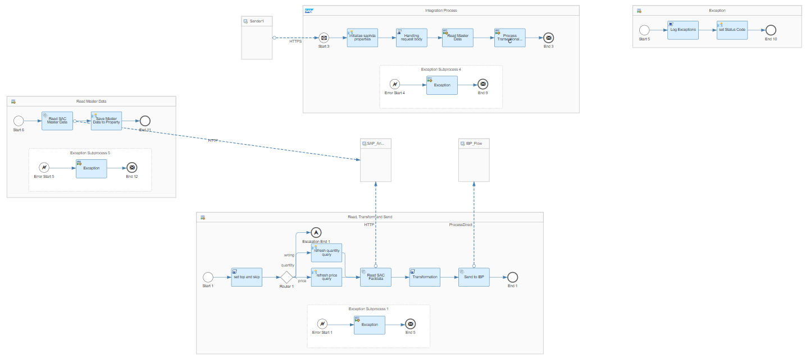
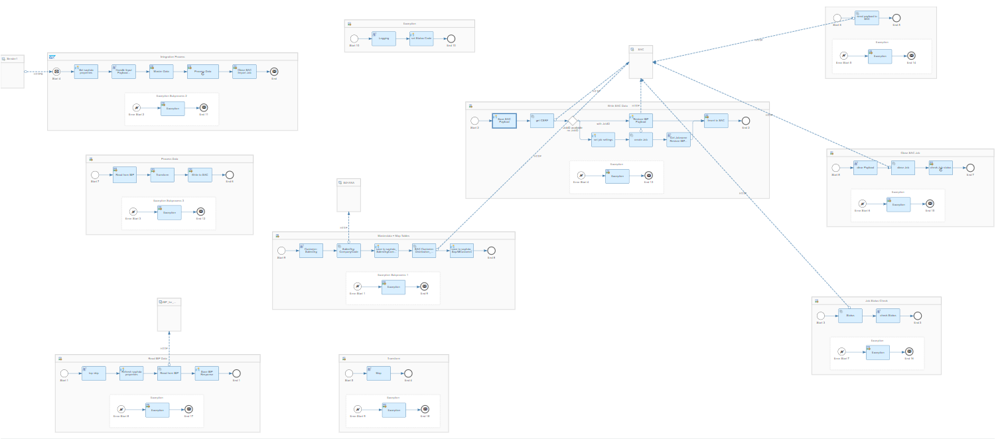

# Integration between SAP Integrated Business Planning for demand and SAP Analytics Cloud 

\| [Recipes by Topic](../../readme.md ) \| [Recipes by Author](../../author.md ) \| [Request Enhancement](https://github.com/SAP-samples/cloud-integration-flow/issues/new?assignees=&labels=Recipe%20Fix,enhancement&template=recipe-request.md&title=Improve%20Email%20Integration%20with%20S/4HANA%20Cloud%20Custom%20Business%20Object) \| [Report a bug](https://github.com/SAP-samples/cloud-integration-flow/issues/new?assignees=&labels=Recipe%20Fix,bug&template=bug_report.md&title=Issue%20with%20Email%20Integration%20with%20S/4HANA%20Cloud%20Custom%20Business%20Object)\| [Fix documentation](https://github.com/SAP-samples/cloud-integration-flow/issues/new?assignees=&labels=Recipe%20Fix,documentation&template=bug_report.md&title=Docu%20fix%20Email%20Integration%20with%20S/4HANA%20Cloud%20Custom%20Business%20Object) \| 

  | [SAP Business Accelerator Hub](https://api.sap.com/allcommunity) | 
 ----|----| 

Send baseline quantities from SAP Integrated Business Planning (IBP) for demand to SAP Analytics Cloud sales and marketing planning. Send back drivers from SAP Analytics Cloud models to SAP Integrated Business Planning for demand.

The package contains the following Integration Flows:

- Send baseline from SAP Integrated Business Planning (IBP) for demand to SAP Analytics Cloud sales planning
- Send baseline from SAP Integrated Business Planning (IBP) for demand to SAP Analytics Cloud marketing planning
- Send drivers from SAP Analytics Cloud sales planning to SAP Integrated Business Planning (IBP) for demand
- Send drivers from SAP Analytics Cloud marketing planning to SAP Integrated Business Planning (IBP) for demand
- Send price Information from SAP S/4HANA to SAP Analytics Cloud marketing planning
- Write to SAP Integrated Business Planning (IBP) for demand with oData
- Send CNR Prices and Quantities from SAP Analytics Cloud to SAP IBP for Demand
- Send SAP IBP for Demand impacts to SAP Analytics Cloud CNR model
- Send SAP S4HANA actuals to SAP IBP for Demand

[Download the integration package](IntegrationbetweenSAPIntegratedBusinessPlanningfordemandandSAPAnalyticsCloud.zip)\
[View package on the SAP Business Accelerator Hub](https://api.sap.com/package/IntegrationbetweenSAPIntegratedBusinessPlanningfordemandandSAPAnalyticsCloud/overview)\
[View documentation - Send SAP Analytics Cloud Marketing model drivers to IBP for Demand](SendSAPAnalyticsCloudMarketingmodeldriverstoIBPforDemand.pdf)\
[View documentation - Send SAP Analytics Cloud Sales model drivers to IBP for Demand](SendSAPAnalyticsCloudSalesmodeldriverstoIBPforDemand.pdf)\
[View documentation - Send SAP IBP baseline to SAC Sales Model](SendSAPIBPbaselinetoSACSalesModel.pdf)\
[View documentation - Send SAP IBP for Demand baseline to Analytics Cloud Marketing model](SendSAPIBPforDemandbaselinetoAnalyticsCloudMarketingmodel.pdf)\
[View documentation - Send SAP S4HANA Prices to SAP Analytics Cloud Sales model](SendSAPS4HANAPricestoSAPAnalyticsCloudSalesmodel.pdf)\
[View documentation - Write into IBP with oData](WriteintoIBPwithoData.pdf)\
[View documentation - Send CNR Prices and Quantities from SAP Analytics Cloud to SAP IBP for Demand](SendCNRpricesandquantitiesfromSAPAnalyticsCloudtoSAPIBPfordemand.pdf)\
[View documentation - Send SAP IBP for Demand impacts to SAP Analytics Cloud CNR model](SendCNRimpactsfromSAPIBPfordemandtoSAPAnalyticsCloud.pdf)\
[View documentation - Send SAP S4HANA actuals to SAP IBP for Demand](CommercialPlanningSendS4HANAActualstoIBPforDemand.pdf)\
[View high level effort](effort.md)

## Integration Flows

### Send IBP for Demand baseline to SAP Analytics Cloud Marketing model
Interface to send baseline from SAP Integrated Business Planning (IBP) for demand to SAP Analytics Cloud Marketing planning\
[View on SAP Business Accelerator Hub](https://api.sap.com/integrationflow/Send_IBP_for_Demand_baseline_to_SAP_Analytics_Cloud_Marketing_model)\

### Send IBP for Demand baseline to SAP Analytics Cloud Sales model
Interface to send baseline from SAP Integrated Business Planning (IBP) for demand to SAP Analytics Cloud Sales planning\
[View on SAP Business Accelerator Hub](https://api.sap.com/integrationflow/Send_IBP_for_Demand_baseline_to_SAP_Analytics_Cloud_Sales_model)\

### Send SAP Analytics Cloud Marketing model drivers to IBP for Demand
Interface to send drivers from SAP Analytics Cloud Marketing planning to SAP Integrated Business Planning (IBP) for demand\
[View on SAP Business Accelerator Hub](https://api.sap.com/integrationflow/Send_SAP_Analytics_Cloud_Marketing_model_drivers_to_IBP_for_Demand)\

### Send SAP Analytics Cloud Sales model drivers to IBP for Demand
Interface to send drivers from SAP Analytics Cloud Sales planning to SAP Integrated Business Planning (IBP) for demand\
[View on SAP Business Accelerator Hub](https://api.sap.com/integrationflow/Send_SAP_Analytics_Cloud_Sales_model_drivers_to_IBP_for_Demand)\
\

### Send SAP S4HANA prices to SAP Analytics Cloud Marketing model
Interface to send Price Information from SAP S/4HANA to SAP Analytics Cloud Marketing planning\
[View on SAP Business Accelerator Hub](https://api.sap.com/integrationflow/Send_SAP_S4HANA_prices_to_SAP_Analytics_Cloud_Marketing_model)\

### Write to SAP IBP for Demand using oData
Interface to write to SAP Integrated Business Planning (IBP) for demand with oData\
[View on SAP Business Accelerator Hub](https://api.sap.com/integrationflow/Write_to_SAP_IBP_for_Demand_using_oData)\
\

### Send CNR Prices and Quantities from SAP Analytics Cloud to SAP IBP for Demand
Interface to send Consensus Net Revenue Prices and Quantities from SAP Analytics Cloud Marketing planning to SAP Integrated Business Planning (IBP) for demand\
[View on SAP Business Accelerator Hub](https://api.sap.com/integrationflow/Send_CNR_Prices_and_Quantities_from_SAP_Analytics_Cloud_to_IBP_for_Demand)\

### Send SAP IBP for Demand impacts to SAP Analytics Cloud CNR model
Interface to send IBP for Demand impacts to SAP Analytics Cloud Consensus Net Revenue model\
[View on SAP Business Accelerator Hub](https://api.sap.com/integrationflow/Send_IBP_for_Demand_impacts_to_SAP_Analytics_Cloud_CNR_model)\

### Send SAP S4HANA actuals to SAP IBP for Demand
Interface to send actuals from SAP S/4HANA to IBP for Demand\
[View on SAP Business Accelerator Hub](https://api.sap.com/integrationflow/Send_S4_actuals_to_IBP_for_Demand)\

