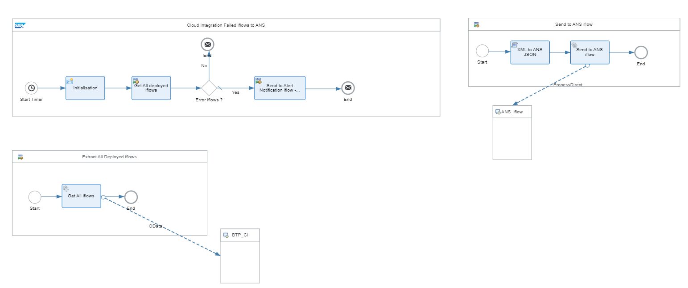
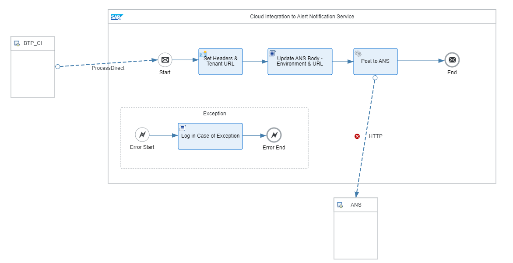

# Integration Suite Alerting Framework using SAP BTP Alert Notification Service

\| [Recipes by Topic](../../readme.md ) \| [Recipes by Author](../../author.md ) \| [Request Enhancement](https://github.com/SAP-samples/cloud-integration-flow/issues/new?assignees=&labels=Recipe%20Fix,enhancement&template=recipe-request.md&title=Improve%20SAP%20SuccessFactors%20Employee%20Central%20Integration%20with%20SAP%20Concur%20 ) \| [Report a bug](https://github.com/SAP-samples/cloud-integration-flow/issues/new?assignees=&labels=Recipe%20Fix,bug&template=bug_report.md&title=Issue%20with%20SAP%20SuccessFactors%20Employee%20Central%20Integration%20with%20SAP%20Concur%20 ) \| [Fix documentation](https://github.com/SAP-samples/cloud-integration-flow/issues/new?assignees=&labels=Recipe%20Fix,documentation&template=bug_report.md&title=Docu%20fix%20SAP%20SuccessFactors%20Employee%20Central%20Integration%20with%20SAP%20Concur%20 ) \|

 | [SAP Business Accelerator Hub](https://api.sap.com/allcommunity) |
----|----|

This package contains multiple iflows designed to extract and send Cloud Integration Events to SAP BTP Alert Notification Service as below

1 - Send Events to ANS\
2 - Send Cloud Integration Error iflows events to ANS\
3 - Send Cloud Integration Error Messages events to ANS\
4 - Send Cloud Integration JMS events to ANS\
5 - Send Cloud Integration Expiring Certificates events to ANS\
6 - Send Explicit (Exception/Notification) Events to ANS

[Download the integration package](IntegrationSuiteAlertingFrameworkusingSAPBTPAlertNotificationService.zip)\
[View package on the SAP Business Accelerator Hub](https://api.sap.com/package/IntegrationSuiteAlertingFrameworkusingSAPBTPAlertNotificationService/overview)\
[View documentation](BTPAlertingFrameworkDocumentation.pdf)\
[View high level effort estimate](effort.md)

## Integration Flows

### Send Cloud Integration Error iflows to ANS
This iflow identifies deployed iflows in a failed status and transfers this information to the common Generic "Events to Alert Notification" iflow using ProcessDirect.\
 
 
 ### Send Cloud Integration Error Messages to ANS
This iflow identifies failed messages from Message Processing logs and transfers this information to the common Generic "Events to Alert Notification" iflow using ProcessDirect.\
 
 
 ### Send Cloud Integration Expiring Certificates to ANS
This iflow identifies all the keystore entries that have expired or expiring in the next 30 days and transfers this information to the common Generic "Events to Alert Notification" iflow using ProcessDirect.\
 
 
 ### Send Events to ANS
This is a common generic iflow that exposes a ProcessDirect Endpoint to accept Alert Notification Service compliant event JSON and forwards it across to Alert Notification Service Endpoint for further action.\
 
 
 ### Send Explicit Exceptions-Notifications-Events to ANS
This iflow accepts ANS-compliant JSON for errors, notifications, events that are not captured automatically & require explicit (external) alerting and transfers this information to the common Generic "Events to Alert Notification" iflow.\
 
 
  ### Send JMS Resources Overload Info to ANS
This iflow identifies the critical (more than 80% usage) or exhausted JMS resources and transfers this information to the common Generic "Events to Alert Notification" iflow using ProcessDirect.\
 
