# SAP Ariba Sourcing Integration with Third-Party System 

\| [Recipes by Topic](../../readme.md ) \| [Recipes by Author](../../author.md ) \| [Request Enhancement](https://github.com/SAP-samples/cloud-integration-flow/issues/new?assignees=&labels=Recipe%20Fix,enhancement&template=recipe-request.md&title=Improve%20SAP%20Ariba%20Sourcing%20Integration%20with%20Third-Party%20System) \| [Report a bug](https://github.com/SAP-samples/cloud-integration-flow/issues/new?assignees=&labels=Recipe%20Fix,bug&template=bug_report.md&title=Issue%20with%20SAP%20Ariba%20Sourcing%20Integration%20with%20Third-Party%20System)\| [Fix documentation](https://github.com/SAP-samples/cloud-integration-flow/issues/new?assignees=&labels=Recipe%20Fix,documentation&template=bug_report.md&title=Docu%20fix%20SAP%20Ariba%20Sourcing%20Integration%20with%20Third-Party%20System) \| 

  | [SAP Business Accelerator Hub](https://api.sap.com/allcommunity) | 
 ----|----| 

This package offers integration flows designed for extracting and extending SAP Ariba Sourcing documents, seamlessly integrating with SAP Ariba Extensibility.

This comprehensive package offers integration flows designed for extracting and extending SAP Ariba Sourcing documents, seamlessly integrating with SAP Ariba Extensibility.

Utilizing the powerful capabilities of both SAP Integration Suite and SAP Ariba APIs, it facilitates the efficient download of Sourcing Events, providing a robust solution for enhancing your SAP Ariba ecosystem.

&nbsp;

[Download the integration package](IntegrationwithSAPAribaSourcing.zip)\
[View package on the SAP Business Accelerator Hub](https://api.sap.com/package/IntegrationwithSAPAribaSourcing)\
[View documentation](https://community.sap.com/t5/spend-management-blogs-by-sap/sap-ariba-extensibility-download-sourcing-events-using-sap-integration/ba-p/13577290)\
[View high level effort](effort.md)
## Integration flows
### Retrieve SAP Ariba Sourcing Events and Project Details 
With the events already downloaded, obtain additional information about the event and project. \
 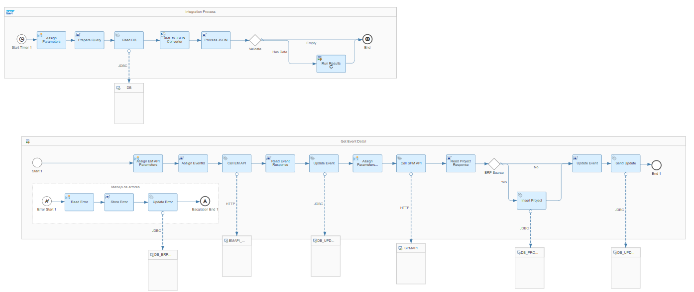
### Retrieve SAP Ariba Sourcing Project Users 
Once the projects are downloaded, retrieve information about the users associated with that project. \
 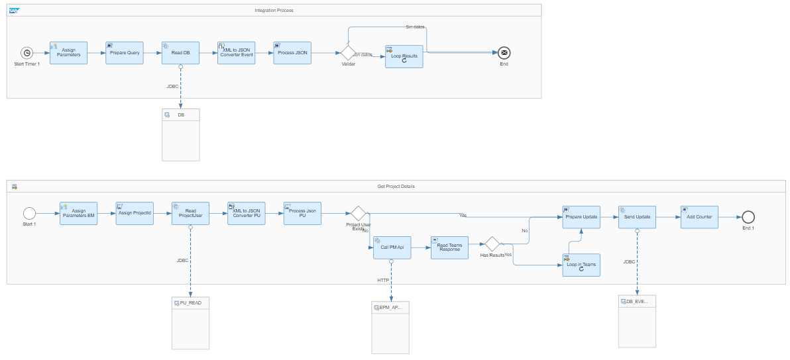
 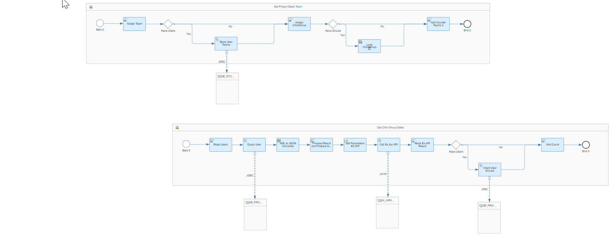
### Retrieve the latest updated SAP Ariba Sourcing Events 
This flow will check the latest updates to events to see if any that were in Draft status have changed to Pending Selection. \
 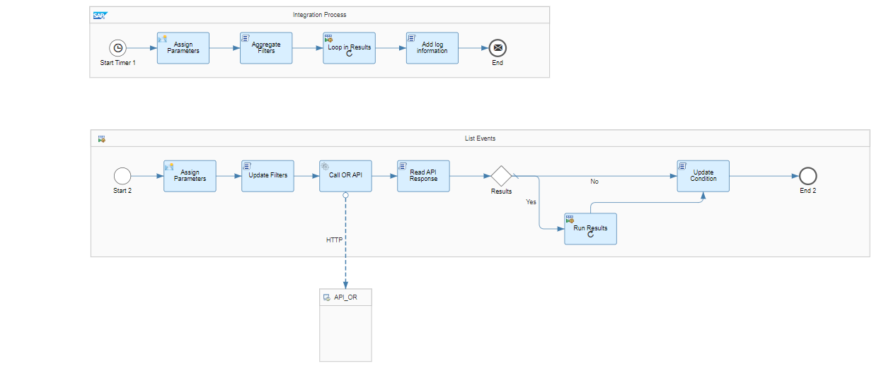
 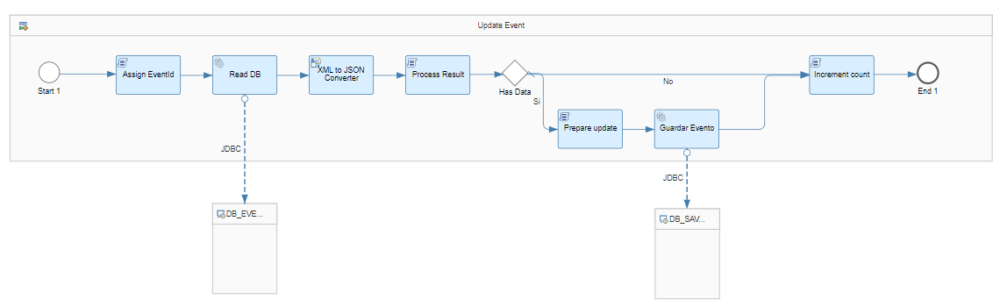
### Retrieve the latest updated SAP Ariba Sourcing Projects 
This flow will check for any updates in the information of the projects already downloaded in the extension. \
 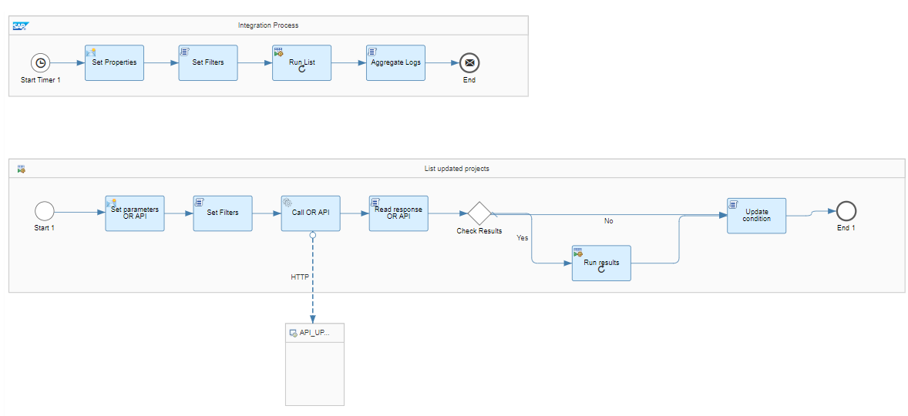
 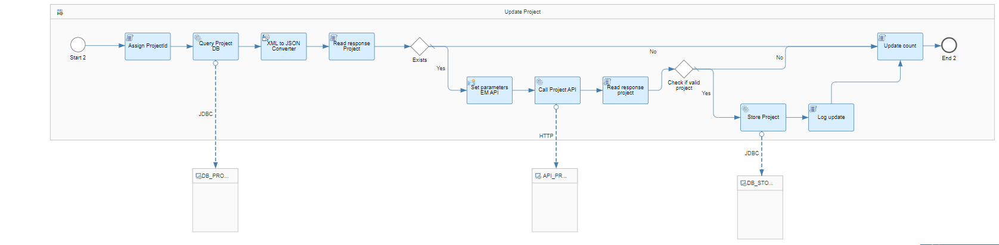
### Retrieve the latest updated SAP Ariba Sourcing Supplier Bids 
This flow will check for any updates to prices and other terms in an existing bid. \
 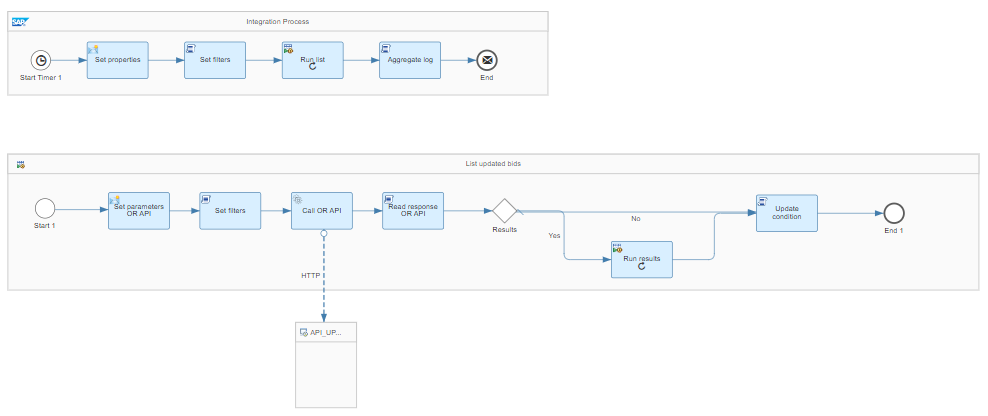
 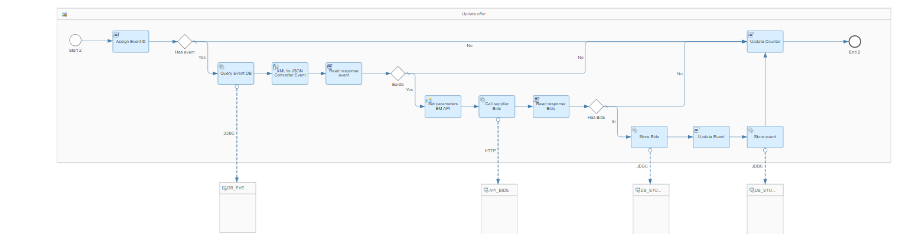
### Retrieve the latest created SAP Ariba Sourcing Events 
Use the Operation Reporting view to retrieve all events created in the last 24 hours. \
 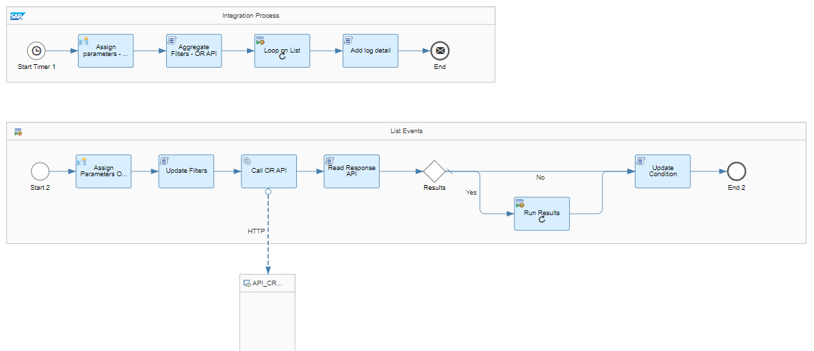
 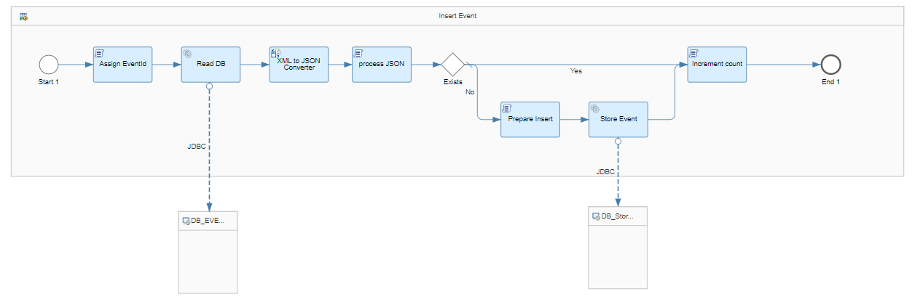
### Retrieve SAP Ariba Sourcing Supplier Invitations and Supplier Bids 
With the events downloaded, obtain information about Supplier Invitations and Supplier Bids. \
 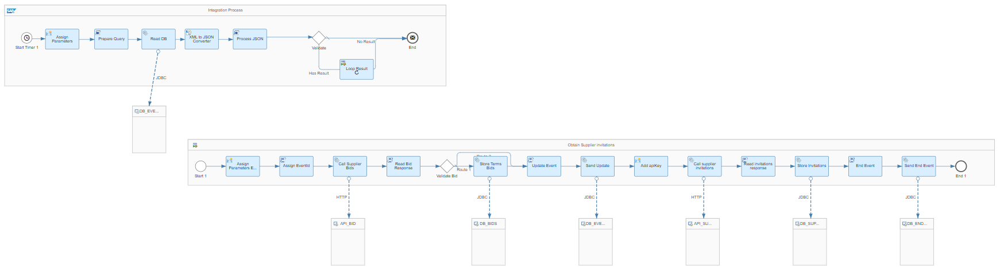
### Retrieve the latest updated SAP Ariba Sourcing Project Users 
This flow will check for any updates in project groups to update the project users table in the database. \
 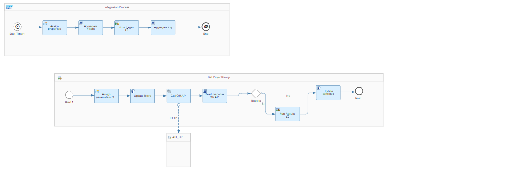
 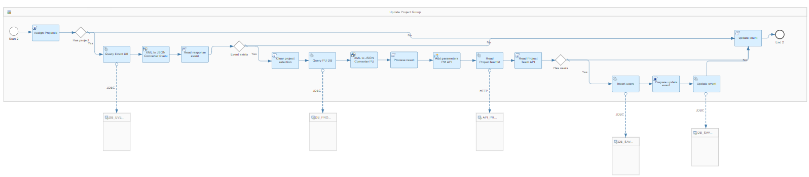
### Retrieve SAP Ariba Sourcing Items and Items Terms Events 
With the events downloaded, retrieve information about Items and their terms. \
 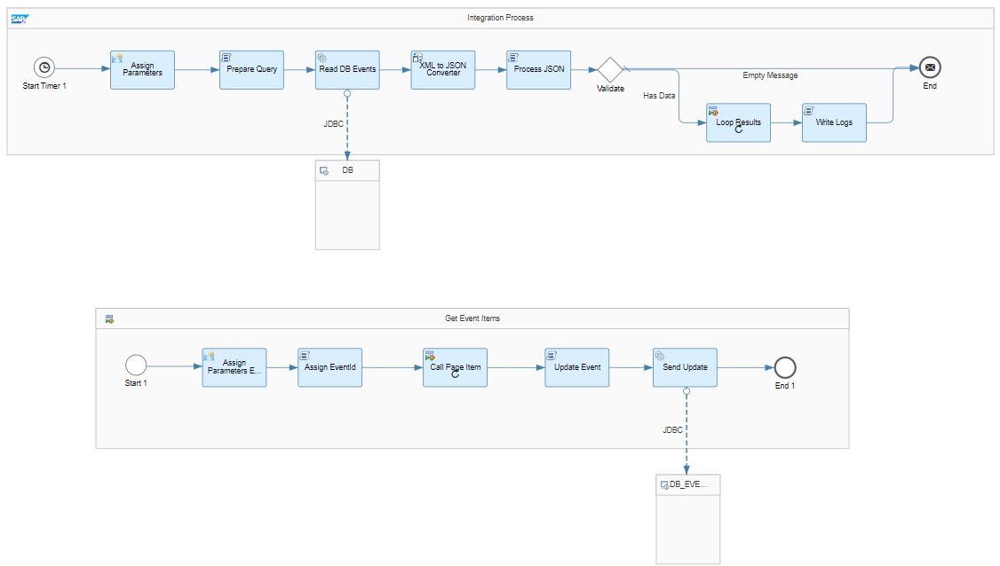
 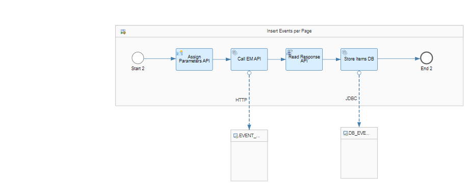
### Retrieve the latest created SAP Ariba Sourcing Supplier Bids 
This flow will check if bids were added to an event. \
 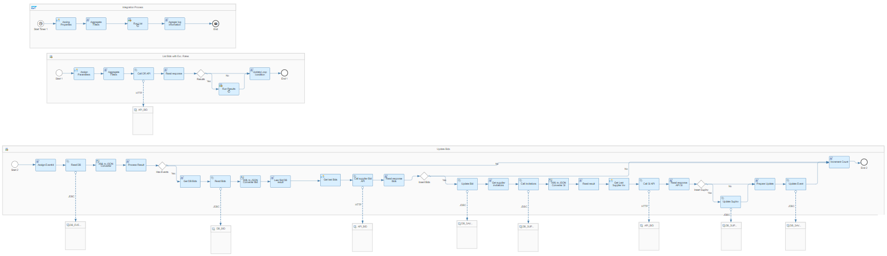