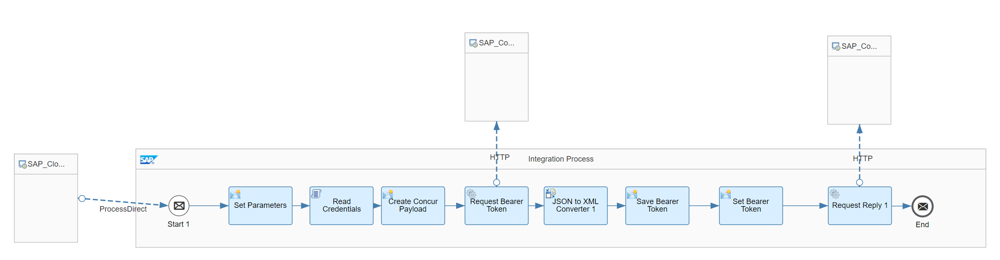

# SAP Concur API Integration with SAP Cloud Integration

\| [Recipes by Topic](../../readme.md ) \| [Recipes by Author](../../author.md ) \| [Request Enhancement](https://github.com/SAP-samples/cloud-integration-flow/issues/new?assignees=&labels=Recipe%20Fix,enhancement&template=recipe-request.md&title=Improve%20SAP%20Concur%20API%20Integration%20with%20SAP%20Cloud%20Integration%20 ) \| [Report a bug](https://github.com/SAP-samples/cloud-integration-flow/issues/new?assignees=&labels=Recipe%20Fix,bug&template=bug_report.md&title=Issue%20with%20SAP%20Concur%20API%20Integration%20with%20SAP%20Cloud%20Integration%20 ) \| [Fix documentation](https://github.com/SAP-samples/cloud-integration-flow/issues/new?assignees=&labels=Recipe%20Fix,documentation&template=bug_report.md&title=Docu%20fix%20SAP%20Concur%20API%20Integration%20with%20SAP%20Cloud%20Integration%20 ) \|

 | [SAP Accelerator Business Hub](https://api.sap.com/allcommunity) |
----|----|

Connect to any SAP Concur API by providing a way to authenticate and request data. It should be used as a subprocess integration flow that is called by another integration flow on Cloud Integration to retrieve data from any SAP Concur API with a GET request.

This package allows you to do the following:

* Connect to SAP Concur API

[Download the integration package](SAPConcurAPIIntegrationwithSAPCloudIntegration.zip)\
[View package on the SAP Accelerator Business Hub](https://api.sap.com/package/IntegrationwithSAPConcurAPI/overview)

## Integration Flows

### Connect to SAP Concur API
This integration flow provides a way to connect to any SAP Concur API by fetching the Access Token from SAP Concur and connecting to the SAP Concur API.\
[View on SAP Accelerator Business Hub](https://api.sap.com/integrationflow/ProcessDirect_Authorization_Concur)

