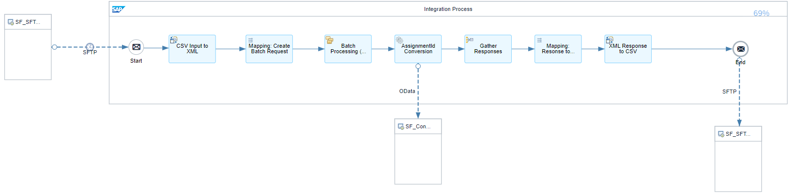

# Integration with SAP SuccessFactors to automatically convert Assignment ID 

\| [Recipes by Topic](../../readme.md ) \| [Recipes by Author](../../author.md ) \| [Request Enhancement](https://github.com/SAP-samples/cloud-integration-flow/issues/new?assignees=&labels=Recipe%20Fix,enhancement&template=recipe-request.md&title=Improve%20Integration%20with%20SAP%20SuccessFactors%20for%20automatically%20convert%20Assignment%20ID) \| [Report a bug](https://github.com/SAP-samples/cloud-integration-flow/issues/new?assignees=&labels=Recipe%20Fix,bug&template=bug_report.md&title=Issue%20with%20Integration%20with%20SAP%20SuccessFactors%20for%20automatically%20convert%20Assignment%20ID)\| [Fix documentation](https://github.com/SAP-samples/cloud-integration-flow/issues/new?assignees=&labels=Recipe%20Fix,documentation&template=bug_report.md&title=Docu%20fix%20Integration%20with%20SAP%20SuccessFactors%20for%20automatically%20convert%20Assignment%20ID) \| 

  | [SAP Business Accelerator Hub](https://api.sap.com/allcommunity) | 
 ----|----| 

It converts/updates SAP SuccessFactors Assignment ID of Users based a CSV input file.

This package picks up a CSV File from an SFTP server and maps it into the request to update/convert the Assignment ID in SAP SuccessFactors using the OData API. The response of the update is provided on the SFTP server.

[Download the integration package](IntegrationwithSAPSuccessFactorsforautomaticallyconvertAssignmentID.zip)\
[View package on the SAP Business Accelerator Hub](https://api.sap.com/package/IntegrationwithSAPSuccessFactorsforautomaticallyconvertAssignmentID)\
[View documentation](AssignmentIdExternalConversion.pdf)\
[View high level effort](effort.md)
## Integration flows
### Convert Assignment ID in SAP SuccessFactors via SFTP 
This integration flow takes Assignment ID  data from a input CSV file from a SFTP and updates Assignment ID of users in SAP SuccessFactors via OData API. \
 