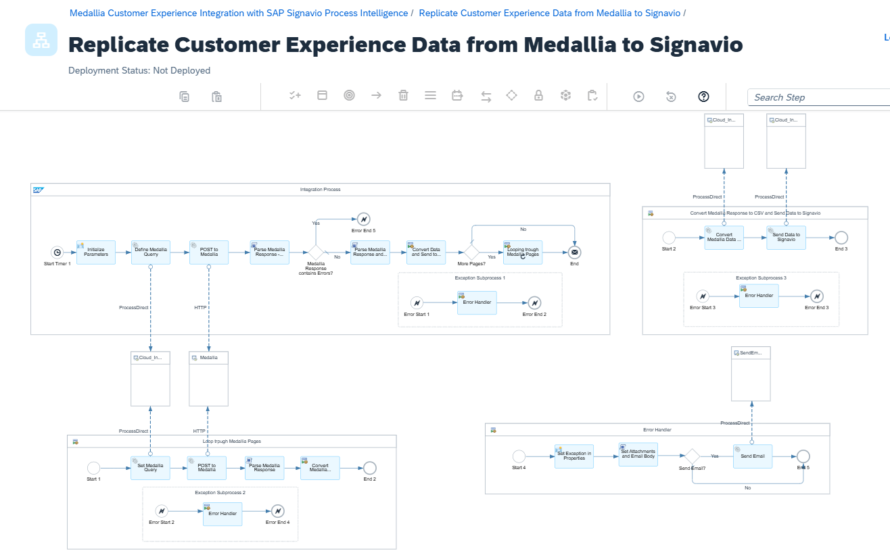
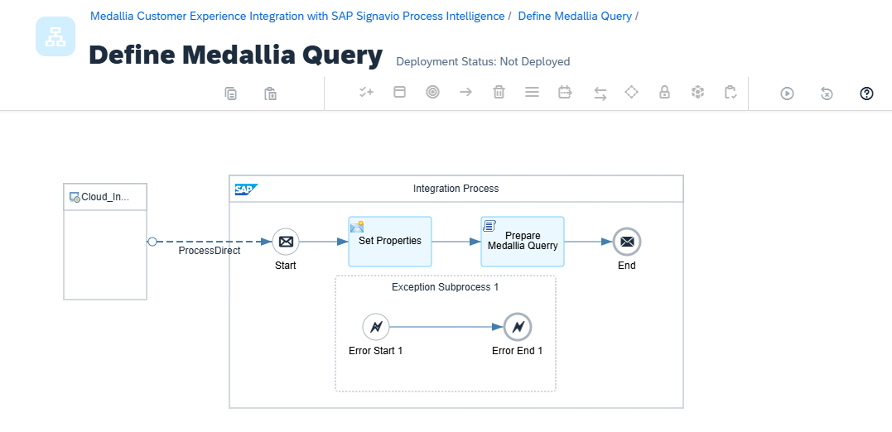
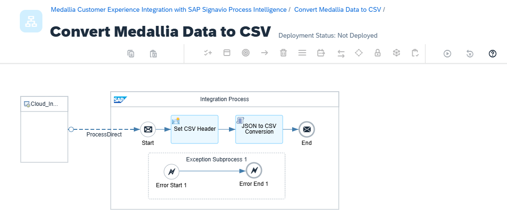
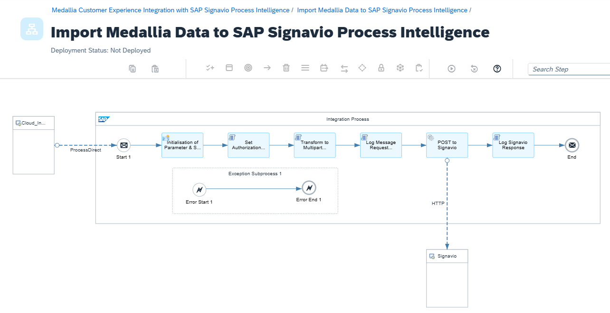
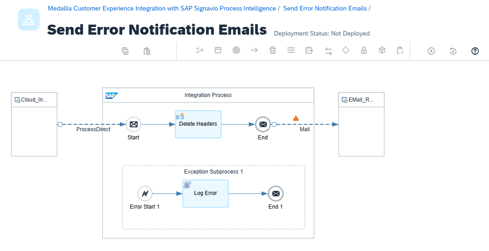

# Medallia Customer Experience Integration with SAP Signavio Process Intelligence

\| [Recipes by Topic](../../readme.md ) \| [Recipes by Author](../../author.md ) \| [Request Enhancement](https://github.com/SAP-samples/cloud-integration-flow/issues/new?assignees=&labels=Recipe%20Fix,enhancement&template=recipe-request.md&title=Improve%20Enabling%20Exactly%20Once%20in%20Order%20via%20Cloud%20Integration) \| [Report a bug](https://github.com/SAP-samples/cloud-integration-flow/issues/new?assignees=&labels=Recipe%20Fix,bug&template=bug_report.md&title=Issue%20with%20Enabling%20Exactly%20Once%20in%20Order%20via%20Cloud%20Integration)\| [Fix documentation](https://github.com/SAP-samples/cloud-integration-flow/issues/new?assignees=&labels=Recipe%20Fix,documentation&template=bug_report.md&title=Docu%20fix%20Enabling%20Exactly%20Once%20in%20Order%20via%20Cloud%20Integration) \| 

  | [SAP Business Accelerator Hub](https://api.sap.com/allcommunity) | 
 ----|----| 

This Package enables the replication of Customer Experience Data between Medallia and SAP Signavio Process Intelligence involving synchronizing of data across both environments.

This package provides five IFlows:

1. Replicate Customer Experience Data from Medallia to Signavio&nbsp;

2. Define Medallia Query&nbsp;

3. Convert Medallia Data to CSV&nbsp;

4. Import Medallia Data to SAP Signavio Process Intelligence&nbsp;

5. Send Error Notification Emails&nbsp;

&nbsp;

[Download the integration package](MedalliaCustomerExperienceIntegrationwithSAPSignavioProcessIntelligence.zip)\
[View package on the SAP Business Accelerator Hub](https://api.sap.com/package/MedalliaCustomerExperienceIntegrationwithSAPSignavioProcessIntelligence)\
[View documentation](MedalliaCustomerExperienceIntegrationwithSAPSignavioProcessIntelligence.pdf)

[View high level effort](effort.md)
## Integration flows
### Replicate Customer Experience Data from Medallia to Signavio
Main IFlow to replicate Customer Experience Data from Medallia (Scheduler) to SAP Signavio Process Intelligence \
 
 ### Define Medallia Query
Define Medallia Query via SAP Cloud Integration (Direct Process Adapter) \
 
### Convert Medallia Data to CSV
Convert Medallia Data to CSV via SAP Cloud Integration (Direct Process Adapter) \
 
### Import Medallia Data to SAP Signavio Process Intelligence
Import Medallia Data via SAP Cloud Integration (Direct Process Adapter) to SAP Signavio Process Intelligence (HTTP Adapter) \
 
### Send Error Notification Emails
Send Error Notification Emails via SAP Cloud Integration (Direct Process Adapter) via EMail (eMail Adapter) \
 
