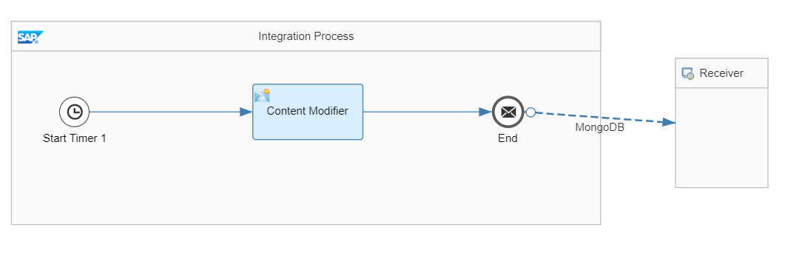
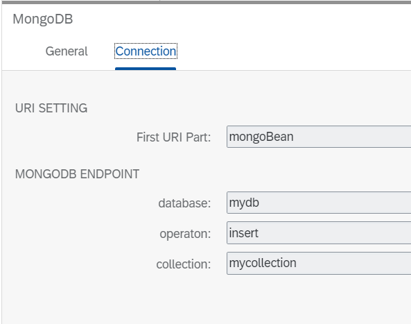
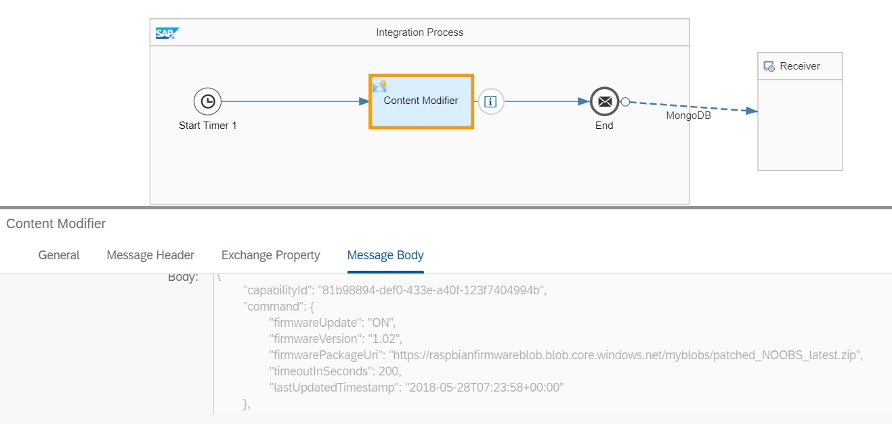
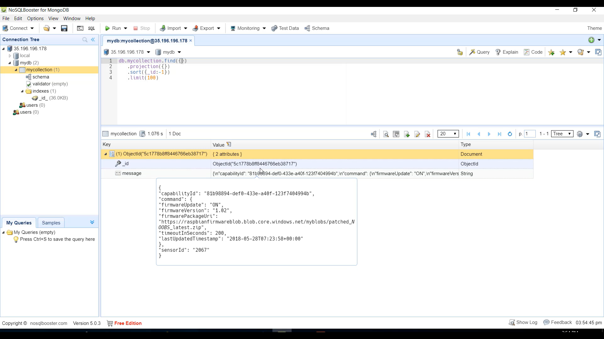

# Build custom MongoDB integration adapter

\| [Recipes by Topic](../../readme.md ) \| [Recipes by Author](../../author.md ) \| [Request Enhancement](https://github.com/SAP/apibusinesshub-integration-recipes/issues/new?assignees=&labels=Recipe%20Fix,enhancement&template=recipe-request.md&title=Improve%20MongoDB-integration-adapter%20 ) \| [Report a bug](https://github.com/SAP/apibusinesshub-integration-recipes/issues/new?assignees=&labels=Recipe%20Fix,bug&template=bug_report.md&title=Issue%20with%20MongoDB-integration-adapter%20 ) \| [Fix documentation](https://github.com/SAP/apibusinesshub-integration-recipes/issues/new?assignees=&labels=Recipe%20Fix,documentation&template=bug_report.md&title=Docu%20fix%20MongoDB-integration-adapter%20 ) \|

 | [Mayur Mohan Belur](https://github.com/mayurmohan ) |
----|----|

The MongoDB: MongoDB is a very popular NoSQL solution and the camel-mongodb component integrates Camel with MongoDB allowing you to interact with MongoDB collections both as a producer (performing operations on the collection) and as a consumer (consuming documents from a MongoDB collection)

This integration adapter enables an integration flow to connect to MongoDb collection.

[Download the integration flow sample](IntegrationFlow/MongoDB-integrationflow.zip)\

[Instructions to build the adapter](../../build-deploy-camel-community-adapters.md)

## References
* [Connecting to MongoDB server from SAP Cloud Platform Integration using Camel MongoDB component](https://blogs.sap.com/2020/07/23/connecting-to-mongodb-server-from-sap-cloud-platform-integration-using-camel-mongodb-component/)\
* [MongoDB Camel component documentation](https://cwiki.apache.org/confluence/display/CAMEL/MongoDB)\

## Sample integration flow
In this integration flow the payload configured as a message payload will be persisted to MongoDB database Collections.

### Sample Input
The hard coded message in the content modifier will be pushed to the queue. \

### Sample Output
Here we see the message sent is visible on the MongoDB server\
