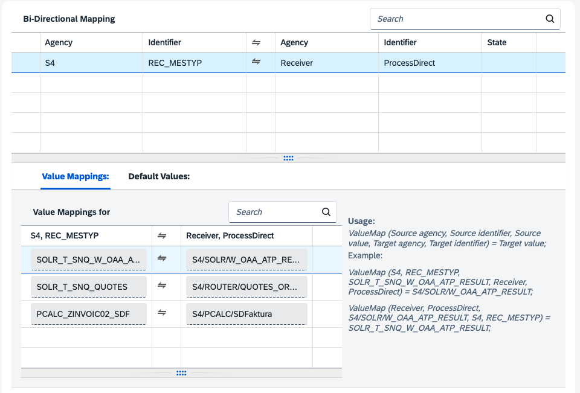

# Pattern IDoc Recipient - Dynamic Routing of IDoc 

\| [Recipes by Topic](../../readme.md ) \| [Recipes by Author](../../author.md ) \| [Request Enhancement](https://github.com/SAP-samples/cloud-integration-flow/issues/new?assignees=&labels=Recipe%20Fix,enhancement&template=recipe-request.md&title=Improve%20Pattern%20IDoc%20Recipient%20-%20Dynamic%20Routing%20of%20IDoc) \| [Report a bug](https://github.com/SAP-samples/cloud-integration-flow/issues/new?assignees=&labels=Recipe%20Fix,bug&template=bug_report.md&title=Issue%20with%20Pattern%20IDoc%20Recipient%20-%20Dynamic%20Routing%20of%20IDoc)\| [Fix documentation](https://github.com/SAP-samples/cloud-integration-flow/issues/new?assignees=&labels=Recipe%20Fix,documentation&template=bug_report.md&title=Docu%20fix%20Pattern%20IDoc%20Recipient%20-%20Dynamic%20Routing%20of%20IDoc) \| 

  | [SAP Business Accelerator Hub](https://api.sap.com/allcommunity) | 
 ----|----| 

This package contains the integration flow for generic IDoc inbound processing as well as the Value Mapping for the process direct receiver flows.

The integration package is used to receive IDocs from SAP S/4HANA and dynamically routes based on the IDoc fields RCVPRN and MESTYP to a ProcessDirect Address that is configured in the Value Mapping.

[Download the integration package](PatternIDOCRecipientDynamicroutingofIDOC.zip)\
[View package on the SAP Business Accelerator Hub](https://api.sap.com/package/PatternIDOCRecipientDynamicroutingofIDOC)\
[View documentation](PatternIDOCRecipientDynamicroutingofIDOC.pdf)\
[View high level effort](effort.md)
## Integration flows
### Common Flow - Receive IDoc from SAP S4HANA 
This integration flow receives the IDocs from SAP S/4HANA and routes based on the configuration in the Value Mapping to the respective Process Direct integration flow. \
 
### Value Mapping - IDoc to Receiver 
Value Mapping maps incoming IDoc based on RCVPRN and MESTYP to a ProcessDirect address. \
 