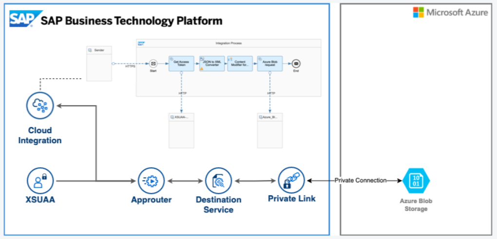
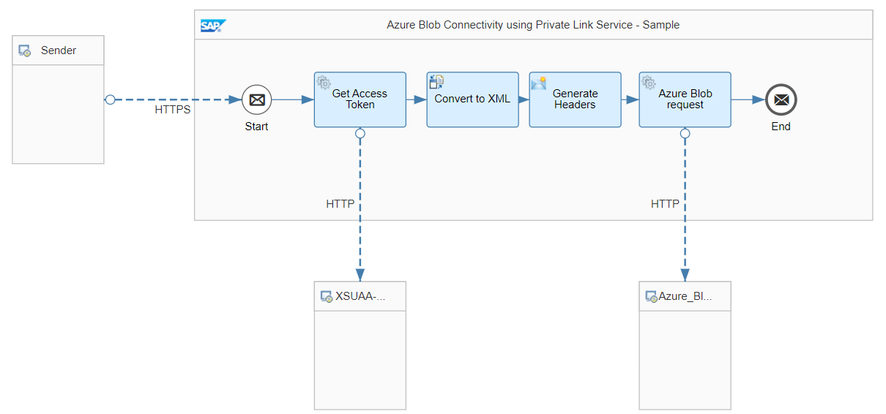

# Azure Blob Connectivity using SAP Private Link Service 

\| [Recipes by Topic](../../readme.md ) \| [Recipes by Author](../../author.md ) \| [Request Enhancement](https://github.com/SAP-samples/cloud-integration-flow/issues/new?assignees=&labels=Recipe%20Fix,enhancement&template=recipe-request.md&title=Improve%20Azure%20Blob%20Connectivity%20using%20SAP%20Private%20Link%20Service) \| [Report a bug](https://github.com/SAP-samples/cloud-integration-flow/issues/new?assignees=&labels=Recipe%20Fix,bug&template=bug_report.md&title=Issue%20with%20Azure%20Blob%20Connectivity%20using%20SAP%20Private%20Link%20Service)\| [Fix documentation](https://github.com/SAP-samples/cloud-integration-flow/issues/new?assignees=&labels=Recipe%20Fix,documentation&template=bug_report.md&title=Docu%20fix%20Azure%20Blob%20Connectivity%20using%20SAP%20Private%20Link%20Service) \| 

  | [SAP Business Accelerator Hub](https://api.sap.com/allcommunity) | 
 ----|----| 

Sample to showcase connectivity to Azure Blob Storage using SAP Private Link Service with Application Router as a Proxy

With the help of the SAP Private Link service, Azure Blob storage can now be linked to SAP Integration Suite Cloud Integration, enabling the easy exchange of massive amounts of unstructured data like images and documents. This integration provides a secure solution for businesses that need to transfer unstructured data between the two platforms.

The main idea of this package is to use the Application Router as a proxy for the private connectivity between Azure Blob Storage and SAP Integration Suite Cloud Integration.&nbsp;

## Architecture
 

[Download the integration package](PrivateLinkProxy.zip)\
[View package on the SAP Business Accelerator Hub](https://api.sap.com/package/PrivateLinkProxy)\
[View documentation](ConfigurationGuide-AzureBlobConnectivityusingPrivateLinkService.pdf)\
[View high level effort](effort.md)
## Integration flows
### Connect with Azure Blob using SAP Private Link Service 
Sample to showcase connectivity to Azure Blob Storage using SAP Private Link Service with Application Router as a Proxy \
 
