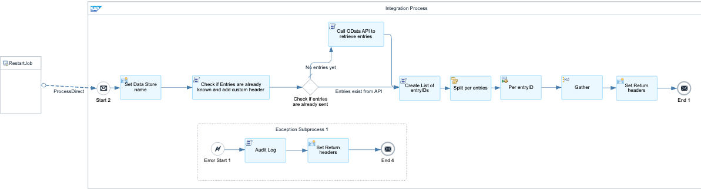

# Process Integration Pipeline Extension - Restart via Data Store 

\| [Recipes by Topic](../../readme.md ) \| [Recipes by Author](../../author.md ) \| [Request Enhancement](https://github.com/SAP-samples/cloud-integration-flow/issues/new?assignees=&labels=Recipe%20Fix,enhancement&template=recipe-request.md&title=Improve%20Process%20Integration%20Pipeline%20Extension%20-%20Restart%20via%20Data%20Store) \| [Report a bug](https://github.com/SAP-samples/cloud-integration-flow/issues/new?assignees=&labels=Recipe%20Fix,bug&template=bug_report.md&title=Issue%20with%20Process%20Integration%20Pipeline%20Extension%20-%20Restart%20via%20Data%20Store)\| [Fix documentation](https://github.com/SAP-samples/cloud-integration-flow/issues/new?assignees=&labels=Recipe%20Fix,documentation&template=bug_report.md&title=Docu%20fix%20Process%20Integration%20Pipeline%20Extension%20-%20Restart%20via%20Data%20Store) \| 

  | [SAP Business Accelerator Hub](https://api.sap.com/allcommunity) | 
 ----|----| 

Implementation of extension to the Process Integration Pipeline to enable custom error handling with retries from the Data Store as a reprocessing layer

The package consists of five Integration Flows and one central Script Collection:

<ul>
 <li style="font-family: &quot;arial&quot; , &quot;helvetica&quot; , sans-serif ; font-size: 12pt"><strong>Pipeline DS Retry - Custom Error Handling with Data Stores</strong>. This Integration Flow implements Custom Error Handling for exceptions occurring in the generic steps of the Process Integration Pipeline. It leverages the public Pipeline extension exit, as described in the <a href="https://help.sap.com/docs/migration-guide-po/migration-guide-for-sap-process-orchestration/monitoring-and-error-handling-pipeline-concept#loioed9b82cb928049e6990a4d784aa6aac7__section_pm1_ggs_5bc" rel="nofollow">Custom Exception Handling documentation</a>. Its primary function is to determine whether retries should continue through the JMS persistence layer or, if all configured JMS retries are exhausted, to move the message out of the queue into the Data Store while capturing all necessary restart attributes and forming the Data Store entry body.</li>
</ul>
<ul>
 <li style="font-family: &quot;arial&quot; , &quot;helvetica&quot; , sans-serif ; font-size: 12pt"><strong>Pipeline DS Retry - Restart Executor from Data Store to JMS</strong>. This Integration Flow handles message reprocessing by moving messages from the Data Store back to the source JMS processing queue, allowing the JMS layer to manage the actual retry process. It is triggered via Process Direct and requires XML input specifying the source Data Store, maximum retry count, and the retry subject – either a list of Data Store entry names or an Interface PID for dynamically retrying all associated Data Store entries.</li>
</ul>
<ul>
 <li style="font-family: &quot;arial&quot; , &quot;helvetica&quot; , sans-serif ; font-size: 12pt"><strong>Pipeline DS Retry - Template - Restart Job</strong>. This Integration Flow represents a Restart Job that automatically reprocesses messages from the Data Store based on assigned restart configuration profiles. Execution is scheduled using a Start Timer event. Provided as a template, this Integration Flow allows for the creation of multiple customized copies in a custom package, with different Job Profiles maintained in the Partner Directory.</li>
</ul>
<ul>
 <li style="font-family: &quot;arial&quot; , &quot;helvetica&quot; , sans-serif ; font-size: 12pt"><strong>Pipeline API - Data Store Manage Retries </strong>(Optional). This Integration Flow enables on-demand restart operations via API clients like Postman. It exposes an HTTP endpoint to trigger restarts for specified Data Store entries or based on selection criteria. Additional operations allow users to retrieve a list of Data Stores in the tenant, fetch entries from a specific Data Store, and move entries between Data Stores (e.g., transferring entries from the “Retry” Data Store to the “NoRetry” Data Store to prevent automatic retriggering).</li>
</ul>
<ul>
 <li style="font-family: &quot;arial&quot; , &quot;helvetica&quot; , sans-serif ; font-size: 12pt"><strong>Pipeline API - Data Store Manage Entries </strong>(Optional). This Integration Flow provides API-based management of Data Store entries, separate from the "Manage Retries" API, to enforce role-based access. It allows users to read messages from a selected Data Store, delete messages (individually or based on query conditions), and add messages to the Data Store (this capability can be disabled at the Integration Flow level).</li>
</ul>

More details on the PI pipeline concept can be found on the <a href="https://help.sap.com/docs/help/90c8ad90cb684ee5979856093efe7462/c344b1c395144095834a961699293889.html" rel="nofollow">Migration Guide for SAP Process Orchestration</a>. 

[Download the integration package](processintegrationpipelineextensionrestartviadatastore.zip)\
[View package on the SAP Business Accelerator Hub](https://api.sap.com/package/processintegrationpipelineextensionrestartviadatastore)\
[View documentation](processintegrationpipelineextensionrestartviadatastore.pdf)\
[View high level effort](effort.md)
## Integration flows
### Pipeline DS Retry - Custom Error Handling with Data Stores 
Implementing custom error handling for restart process \
 
### Pipeline API - Data Store Manage Retries 
API to operate with DS Retry functions \
 
 
### Pipeline API - Data Store Manage Entries 
API to operate with DS Entries \
 
 
### Pipeline DS Retry - Script Collection 
Script collection for all Groovy scripts used by the IFlows of this package \
 
### Pipeline DS Retry - Template - Restart Job 
Template for scheduler based restart job \
 
### Pipeline DS Retry - Restart Executor from Data Store to JMS 
To restart messages from Data Store according to supplied selection criteria \
 
 