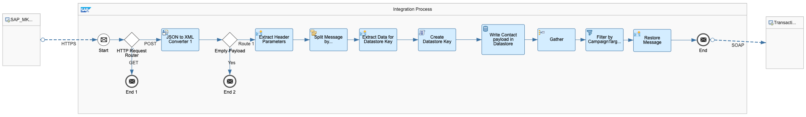
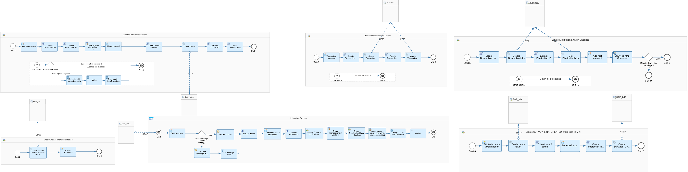

# Qualtrics Transaction-Based Survey Integration with SAP Marketing Cloud

\| [Recipes by Topic](../../readme.md ) \| [Recipes by Author](../../author.md ) \| [Request Enhancement](https://github.com/SAP-samples/cloud-integration-flow/issues/new?assignees=&labels=Recipe%20Fix,enhancement&template=recipe-request.md&title=Improve%20Qualtrics%20Transaction-Based%20Survey%20Integration%20with%20SAP%20Marketing%20Cloud ) \| [Report a bug](https://github.com/SAP-samples/cloud-integration-flow/issues/new?assignees=&labels=Recipe%20Fix,bug&template=bug_report.md&title=Issue%20with%20Qualtrics%20Transaction-Based%20Survey%20Integration%20with%20SAP%20Marketing%20Cloud ) \| [Fix documentation](https://github.com/SAP-samples/cloud-integration-flow/issues/new?assignees=&labels=Recipe%20Fix,documentation&template=bug_report.md&title=Docu%20fix%20Qualtrics%20Transaction-Based%20Survey%20Integration%20with%20SAP%20Marketing%20Cloud ) \|

 | [SAP Business Accelerator Hub](https://api.sap.com/allcommunity) |
----|----|

With this integration package, you can load data (customers and transactions) from SAP Marketing Cloud system to  Qualtrics. Within this integration you are able create a interaction in SAP Marketing Cloud, which triggers an Email Campaign to send out a Qualtrics survey.

This package enables you to do the following:

* Send Customers and Transactions from SAP Marketing Cloud to Qualtrics.
* Create Transaction-Based Survey Link and send it to SAP Marketing Cloud within a Trigger-Interaction ('Survey Link Created).

[Download the reuseable integration package](SAPAribaIntegrationwithThird-PartyforAnalyticalReporting.zip)\
[View package on the SAP Business Accelerator Hub](https://api.sap.com/package/QualtricsextendedIntegrationwithSAPMarketingCloud/overview)

## Integration Flows

### Open Channel Marketing Integration
Triggers the IFlow "Transaction-related Survey Link Creation" asynchronously.\
[View on SAP Business Accelerator Hub](https://api.sap.com/integrationflow/Open_Channel_Marketing_Integration)

### Transaction-related Survey Link Creation
Creates Contacts, Transactions and transaction-based survey links in Qualtrics.\
[View on SAP Business Accelerator Hub](https://api.sap.com/integrationflow/Personal_Survey_Link_Creation)

