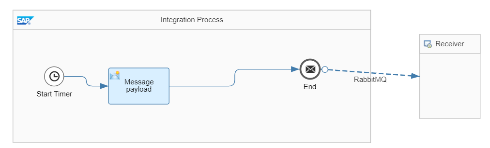
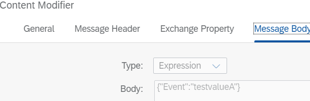
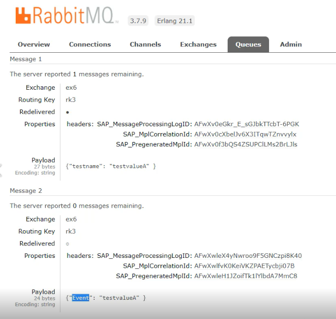

# Build custom Rabbit MQ integration adapter

\| [Recipes by Topic](../../readme.md ) \| [Recipes by Author](../../author.md ) \| [Request Enhancement](https://github.com/SAP/apibusinesshub-integration-recipes/issues/new?assignees=&labels=Recipe%20Fix,enhancement&template=recipe-request.md&title=Improve%20rabbitmq-integration-adapter%20 ) \| [Report a bug](https://github.com/SAP/apibusinesshub-integration-recipes/issues/new?assignees=&labels=Recipe%20Fix,bug&template=bug_report.md&title=Issue%20with%20rabbitmq-integration-adapter%20 ) \| [Fix documentation](https://github.com/SAP/apibusinesshub-integration-recipes/issues/new?assignees=&labels=Recipe%20Fix,documentation&template=bug_report.md&title=Docu%20fix%20rabbitmq-integration-adapter%20 ) \|

 | [Mayur Mohan Belur](https://github.com/mayurmohan ) |
----|----|

The rabbitmq: component allows you produce and consume messages from RabbitMQ instances. Using the RabbitMQ AMQP client, this component offers a pure RabbitMQ approach over the generic AMQP component.

This integration adapter enables an integration flow to persist or read messages in a RabbitMQ queue.

[Download the integration flow sample](IntegrationFlow/RabbitMQ-integrationflow.zip)\

[Instructions to build the adapter](../../build-deploy-camel-community-adapters.md)

## References
* [Apache Camel Community adapters usage in SAP Cloud Platform Integration](https://blogs.sap.com/2020/07/16/apache-camel-community-adapters-usage-in-sap-cloud-platform-integration/)\
* [RabbitMQ Camel component documentation](https://cwiki.apache.org/confluence/display/CAMEL/RabbitMQ)\

## Sample integration flow
In this integration flow the payload configured in the message payload will be persisted to RabbitMQ queue.

### Sample Input
The hard coded message in the content modifier will be pushed to the queue. \

### Sample Output
Here we see the message sent is visible on the RabbitMQ server\

