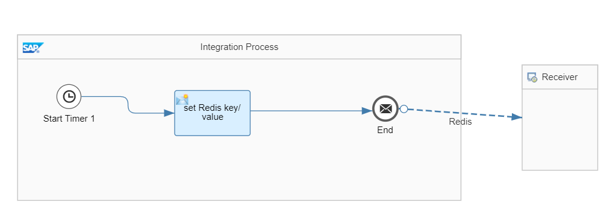
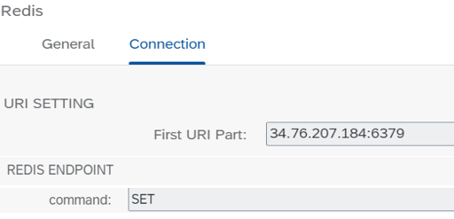
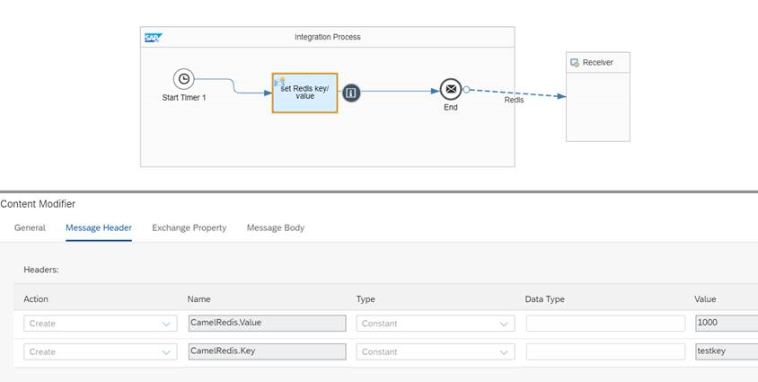
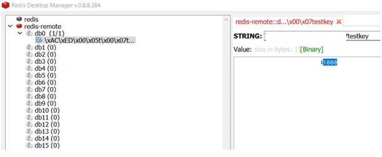

# Build custom Redis integration adapter

\| [Recipes by Topic](../../readme.md ) \| [Recipes by Author](../../author.md ) \| [Request Enhancement](https://github.com/SAP/apibusinesshub-integration-recipes/issues/new?assignees=&labels=Recipe%20Fix,enhancement&template=recipe-request.md&title=Improve%20redis-integration-adapter%20 ) \| [Report a bug](https://github.com/SAP/apibusinesshub-integration-recipes/issues/new?assignees=&labels=Recipe%20Fix,bug&template=bug_report.md&title=Issue%20with%20redis-integration-adapter%20 ) \| [Fix documentation](https://github.com/SAP/apibusinesshub-integration-recipes/issues/new?assignees=&labels=Recipe%20Fix,documentation&template=bug_report.md&title=Docu%20fix%20redis-integration-adapter%20 ) \|

 | [Mayur Mohan Belur](https://github.com/mayurmohan) |
----|----|

Redis is advanced key-value store where keys can contain strings, hashes, lists, sets and sorted sets. In addition it provides pub/sub functionality for inter-app communications.

This integration adapter allows an integration flow to access Redis.

[Download the integration flow Sample](IntegrationFlow/redis-integrationflow.zip)\

[Instructions to build the adapter](../../build-deploy-camel-community-adapters.md)

## References
* [Using Apache Camel Redis component as SAP Cloud Platform Integration Adapter](https://blogs.sap.com/2020/07/21/using-apache-camel-redis-component-as-sap-cloud-platform-integration-adapter)\
* [Redis Camel component documentation](https://cwiki.apache.org/confluence/display/CAMEL/Spring+Redis)\

## Sample integration flow
This integration flow uses the Redis integration adapter to persist a message in the Redis cache.\

### Sample Input
In the content modifier we can see the message hardcoded in the message header.\

### Sample Output
Connect to Redis server from any of standard Redis Client and check the value persisted from SAP Cloud Platform Integration flow message processing\

