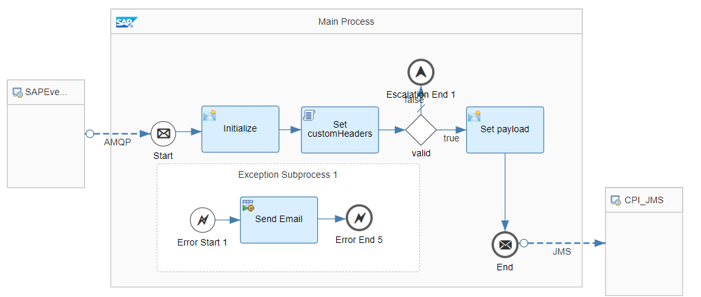
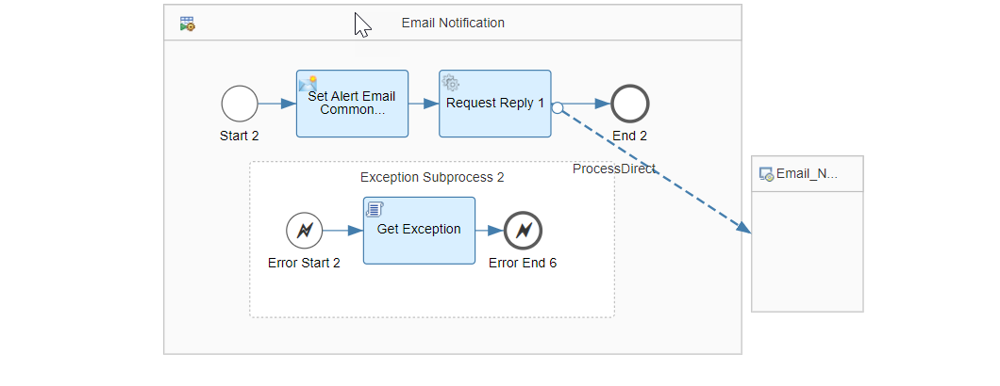
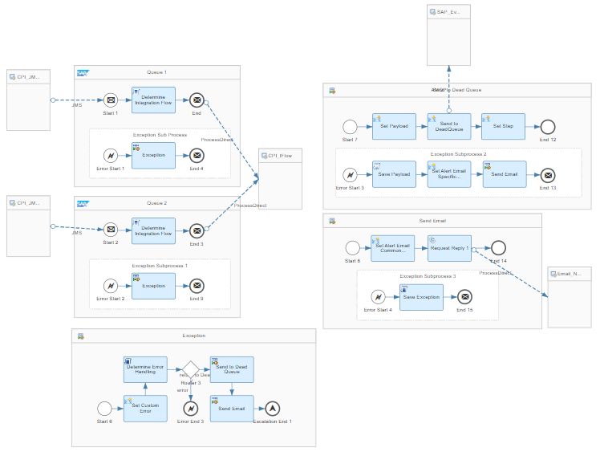
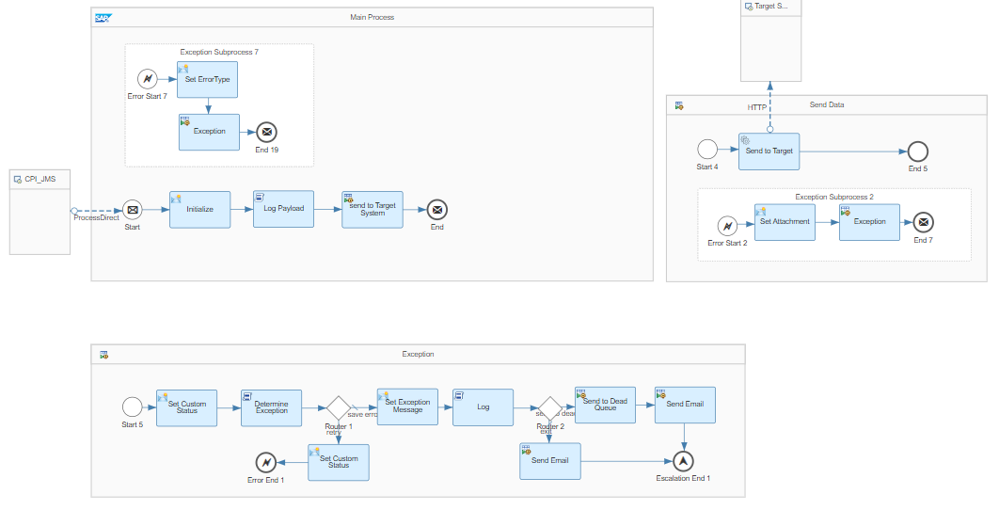
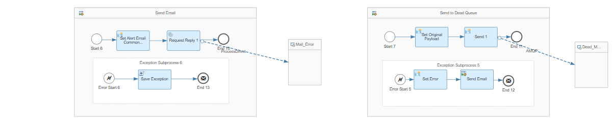
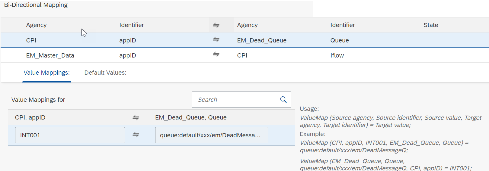

# Replay messages from Queues via SAP Event Mesh 

\| [Recipes by Topic](../../readme.md ) \| [Recipes by Author](../../author.md ) \| [Request Enhancement](https://github.com/SAP-samples/cloud-integration-flow/issues/new?assignees=&labels=Recipe%20Fix,enhancement&template=recipe-request.md&title=Improve%20Replay%20messages%20from%20Queues%20via%20SAP%20Event%20Mesh) \| [Report a bug](https://github.com/SAP-samples/cloud-integration-flow/issues/new?assignees=&labels=Recipe%20Fix,bug&template=bug_report.md&title=Issue%20with%20Replay%20messages%20from%20Queues%20via%20SAP%20Event%20Mesh)\| [Fix documentation](https://github.com/SAP-samples/cloud-integration-flow/issues/new?assignees=&labels=Recipe%20Fix,documentation&template=bug_report.md&title=Docu%20fix%20Replay%20messages%20from%20Queues%20via%20SAP%20Event%20Mesh) \| 

  | [SAP Business Accelerator Hub](https://api.sap.com/allcommunity) | 
 ----|----| 

This package provides a replay mechanism for SAP Event Mesh messages.

This package contains three integration flows:

<ol>
 <li>Retrieves the messages from SAP Event Mesh using AMQP Adapter and pushes the messages into a JMS Queue.</li>
 <li>Picks up the message in the JMS Queues and forwards it to the respective receiver endpoint using ProcessDirect.</li>
 <li>ProcessDirect integration flow that processes the message to the relevant receiver.</li>
</ol>

It also includes a Value Mapping that maps the message from a JMS Queue to the correct ProcessDirect Endpoint.

[Download the integration package](ReplaymessagesfromQueuesviaSAPEventMesh.zip)\
[View package on the SAP Business Accelerator Hub](https://api.sap.com/package/ReplaymessagesfromQueuesviaSAPEventMesh)\
[View documentation](ReplaymessagesfromQueuesviaSAPEventMesh.pdf)\
[View high level effort](effort.md)
## Integration flows
### Step 1 - Retrieving messages from SAP Event Mesh and send to JMS 
This is a sample Integration Flow for retrieving messages from SAP Event Mesh and sending them to JMS \
 
 
### Step 2 - JMS Router for SAP Event Mesh Messages 
This is the main Integration Flow which routes the messages from JMS Queue \
 
### Step 3 - Processing Message 
This is a sample Integration Flow to process JMS messages retrieved from SAP Event Mesh \
 
 
### Value Mapping for JMS Router 
This is the Value Mapping to determine routes from the JMS Queue \
 