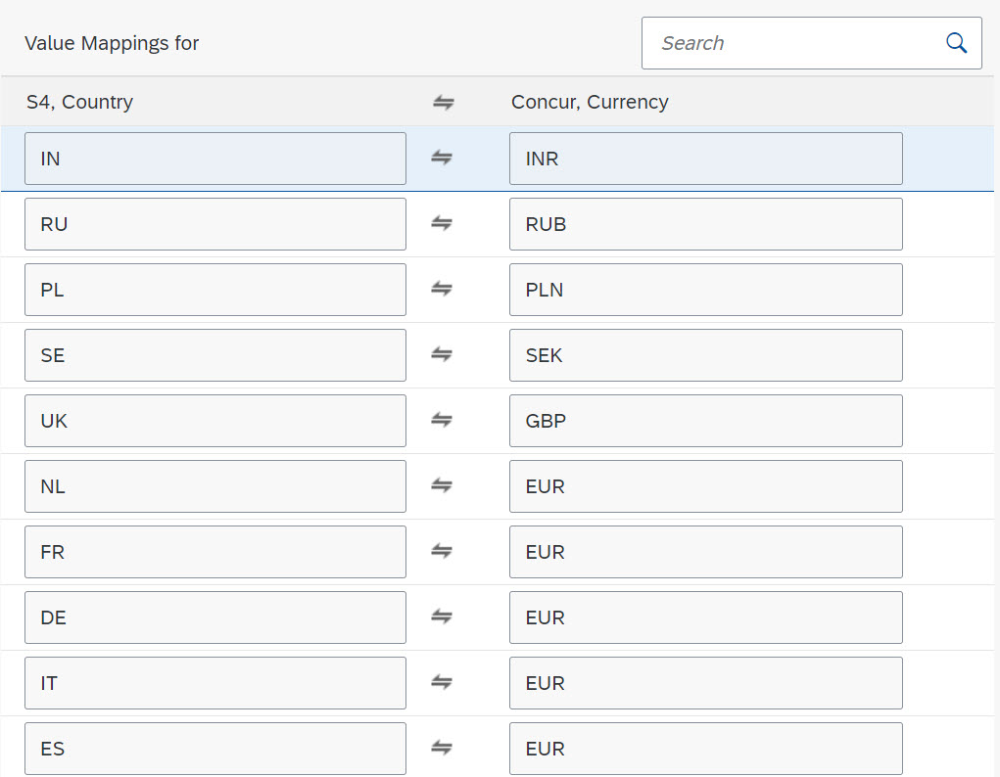
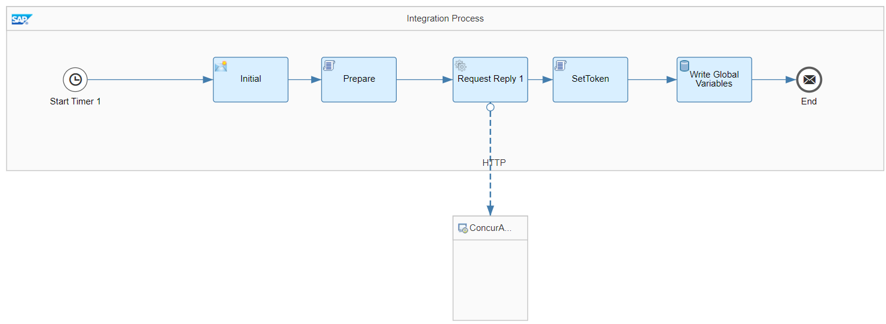
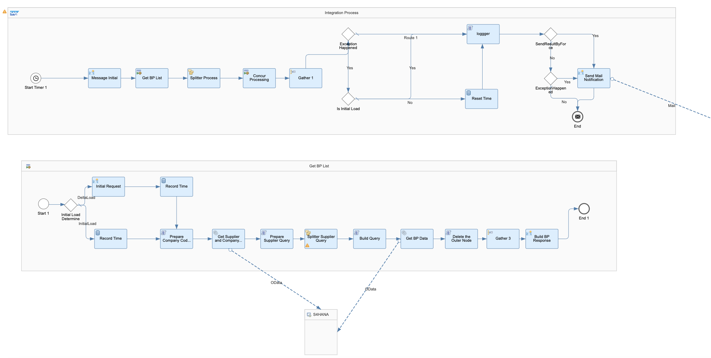
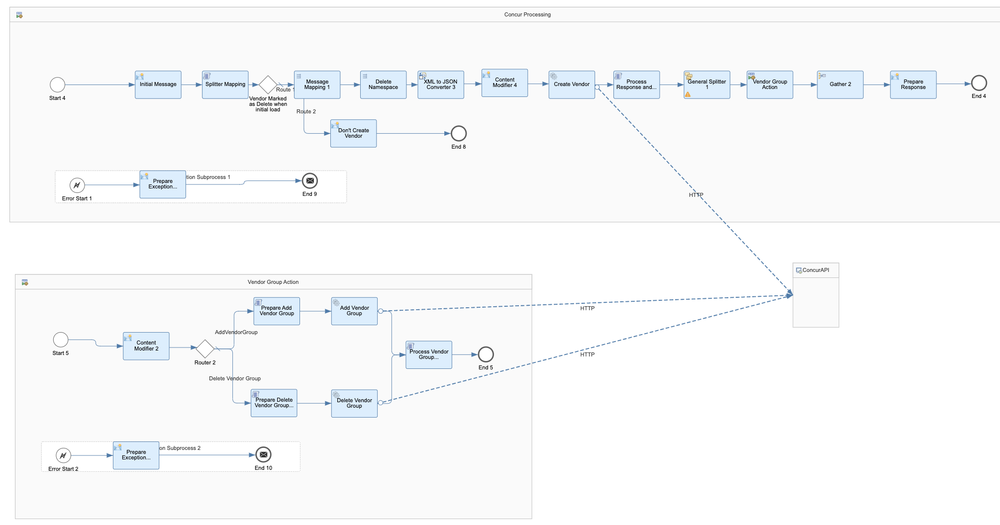

# Replicate vendor and vendor group from SAP S/4HANA to SAP Concur 

\| [Recipes by Topic](../../readme.md ) \| [Recipes by Author](../../author.md ) \| [Request Enhancement](https://github.com/SAP-samples/cloud-integration-flow/issues/new?assignees=&labels=Recipe%20Fix,enhancement&template=recipe-request.md&title=Improve%20Replicate%20vendor%20and%20vendor%20group%20from%20SAP%20S/4HANA%20to%20SAP%20Concur) \| [Report a bug](https://github.com/SAP-samples/cloud-integration-flow/issues/new?assignees=&labels=Recipe%20Fix,bug&template=bug_report.md&title=Issue%20with%20Replicate%20vendor%20and%20vendor%20group%20from%20SAP%20S/4HANA%20to%20SAP%20Concur)\| [Fix documentation](https://github.com/SAP-samples/cloud-integration-flow/issues/new?assignees=&labels=Recipe%20Fix,documentation&template=bug_report.md&title=Docu%20fix%20Replicate%20vendor%20and%20vendor%20group%20from%20SAP%20S/4HANA%20to%20SAP%20Concur) \| 

  | [SAP Accelerator Business Hub](https://api.sap.com/allcommunity) | 
 ----|----| 

Requests business partner information from SAP S/4HANA and handles the replication to SAP Concur.

This package is used to replicate vendor and vendor group information from SAP S/4HANA to SAP Concur system by requesting valid supplier information from SAP S/4HANA and then updating the vendor information and vendor group information in SAP Concur

It contains 3 artifacts to replicate the vendor and vendor groups from SAP S/4HANA to SAP Concur.

-&nbsp;Iflow to handle the authentication to SAP Concur APIs

- Iflow to replicate vendor and vendor group info from SAP S/4HANA to SAP Concur

- value mapping for supplier country and currency value mapping&nbsp;

[Download the integration package](ReplicatevendorandvendorgroupfromSAPS_4HANAtoSAPConcur.zip)\
[View package on the SAP Accelerator Business Hub](https://api.sap.com/package/ReplicatevendorandvendorgroupfromSAPS4HANAtoSAPConcur)\
[View documentation](ConfigurationGuide_replicatevendorandvendorgroupfromsaps4hanatosapconcur.pdf)\
[View high level effort](effort.md)
## Integration flows/Value mapping
### Value Mapping for Replicating of Vendor and Vendor Group from SAP S4HANA to SAP Concur 
Value Mapping for supplier country and currency value. \
 
### Request Token from SAP Concur 
Request session token from SAP Concur API on a scheduled basis. \
 
### Replicate Vendor and Vendor Group from SAP S4HANA to SAP Concur 
Requests business partner data from SAP S/4HANA based on a Timer, and creates or updates vendor and creates vendor group \
 \
 