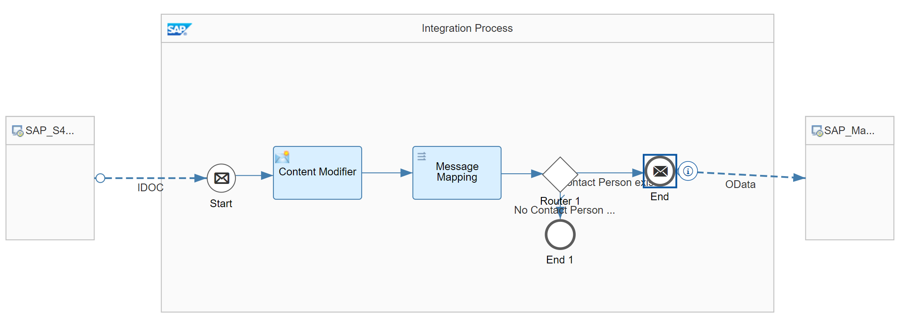

# SAP S/4HANA - Service Order Replication with SAP Marketing Cloud

\| [Recipes by Topic](../../readme.md ) \| [Recipes by Author](../../author.md ) \| [Request Enhancement](https://github.com/SAP-samples/cloud-integration-flow/issues/new?assignees=&labels=Recipe%20Fix,enhancement&template=recipe-request.md&title=Improve%20SAP%20S4HANA%20Service%20Order%20Replication%20with%20SAP%20Marketing%20Cloud%20 ) \| [Report a bug](https://github.com/SAP-samples/cloud-integration-flow/issues/new?assignees=&labels=Recipe%20Fix,bug&template=bug_report.md&title=Issue%20with%20SAP%20S4HANA%20Service%20Order%20Replication%20with%20SAP%20Marketing%20Cloud%20 ) \| [Fix documentation](https://github.com/SAP-samples/cloud-integration-flow/issues/new?assignees=&labels=Recipe%20Fix,documentation&template=bug_report.md&title=Docu%20fix%20SAP%20S4HANA%20Service%20Order%20Replication%20with%20SAP%20Marketing%20Cloud%20 ) \|

 | [SAP API Business Hub](https://api.sap.com/allcommunity) |
----|----|

Send Service Orders from SAP S/4HANA OnPremise to SAP Marketing Cloud. With this integration package, you can load Service Orders from SAP S/4 HANA OnPremise system to SAP Marketing Cloud..

This package enables you to do the following:

* Send Service Orders from SAP S/4HANA OnPremise to SAP Marketing Cloud

[Download the integration package](SAPS_4HANA-ServiceOrderIntegrationwithSAPMarketingCloud.zip)\
[View package on the SAP API Business Hub](https://api.sap.com/package/S4HANAServiceOrderIntegrationwithSAPMarketingCloud/overview)

## Integration Flows

### Replicate Service Orders From SAP S4HANA OnPremise To SAP Marketing Cloud
This Integration Flow is used to replicate Service Orders From SAP S/4HANA OnPremis to SAP Marketing Cloud\
[View on SAP API Business Hub](https://api.sap.com/integrationflow/Replicate_Service_Orders_From_SAP_S4_HANA_To_SAP_Marketing_Cloud)

