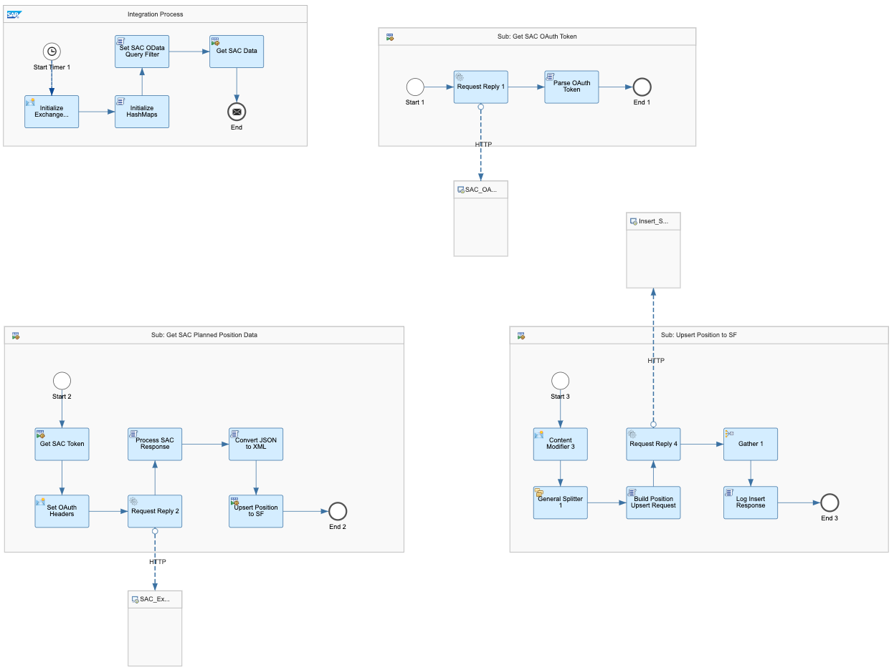

# SAP Analytics Cloud Integration with SAP SuccessFactors Position Write Back Outbound Flow

\| [Recipes by Topic](../../readme.md ) \| [Recipes by Author](../../author.md ) \| [Request Enhancement](https://github.com/SAP-samples/cloud-integration-flow/issues/new?assignees=&labels=Recipe%20Fix,enhancement&template=recipe-request.md&title=Improve%20SAP%20Analytics%20Cloud%20Integration%20with%20SAP%20SuccessFactors%20Position%20Write%20Back%20Outbound%20Flow) \| [Report a bug](https://github.com/SAP-samples/cloud-integration-flow/issues/new?assignees=&labels=Recipe%20Fix,bug&template=bug_report.md&title=Issue%20with%20SAP%20Analytics%20Cloud%20Integration%20with%20SAP%20SuccessFactors%20Position%20Write%20Back%20Outbound%20Flow)\| [Fix documentation](https://github.com/SAP-samples/cloud-integration-flow/issues/new?assignees=&labels=Recipe%20Fix,documentation&template=bug_report.md&title=Docu%20fix%20SAP%20Analytics%20Cloud%20Integration%20with%20SAP%20SuccessFactors%20Position%20Write%20Back%20Outbound%20Flow) \|

  | [SAP Business Accelerator Hub](https://api.sap.com/allcommunity) |
 ----|----|

The integration is designed to extract the Planned positions from the SAP SAC via API mechanism and Invoke the SuccessFactors Employee Central using&nbsp; to Create the Position

[Download the integration package](SAPAnalyticsCloudIntegrationwithSAPSuccessFactorsPositionWriteBackOutboundFlow.zip)\
[View package on the SAP Business Accelerator Hub](https://api.sap.com/package/SAPAnalyticsCloudIntegrationwithSAPSuccessFactorsPositionWriteBackOutboundFlow)\
[View documentation](SAPAnalyticsCloudIntegrationwithSAPSuccessFactorsPositionWriteBackOutboundFlow.pdf)\
[View high level effort](effort.md)
## Integration flows
### SAP Analytics Cloud Integration with SAP SuccessFactors Position Write Back Outbound Flow
Write back of SAP Analytics Cloud HXM planning to SAP SuccessFactors Positions. \
 
