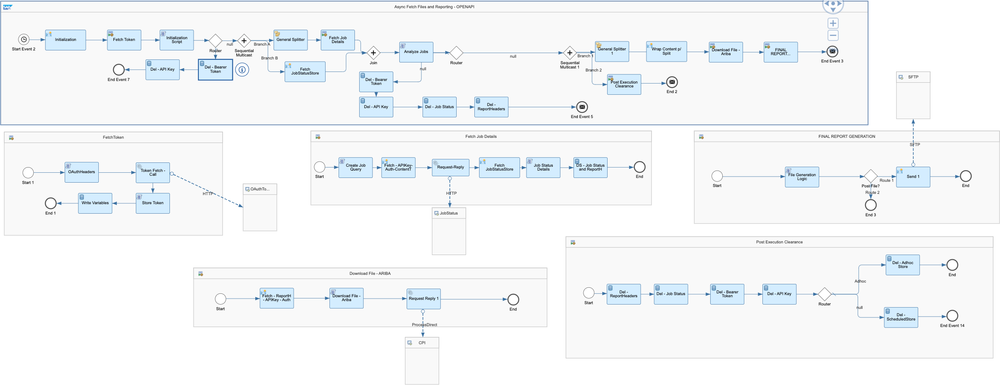
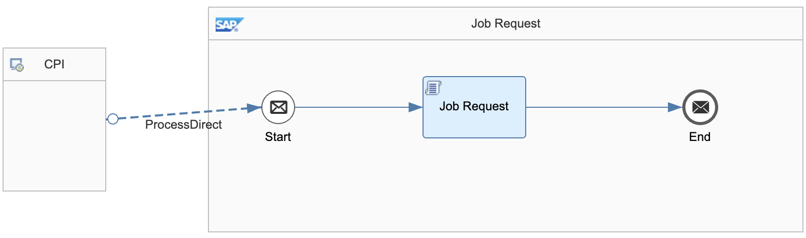
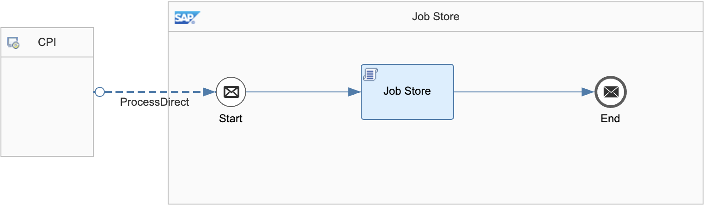
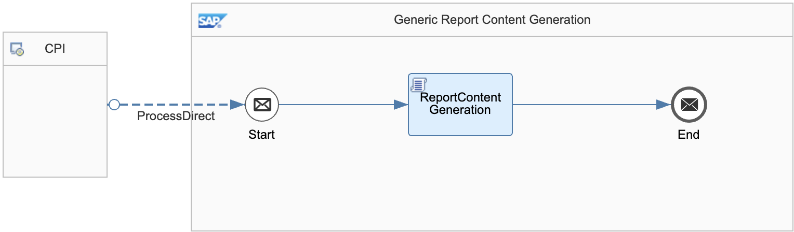

# SAP Ariba Integration with Third-Party for Analytical Reporting

\| [Recipes by Topic](../../readme.md ) \| [Recipes by Author](../../author.md ) \| [Request Enhancement](https://github.com/SAP-samples/cloud-integration-flow/issues/new?assignees=&labels=Recipe%20Fix,enhancement&template=recipe-request.md&title=ImproveSAP%20Ariba%20Integration%20with%20Third-Party%20for%20Analytical%20Reporting ) \| [Report a bug](https://github.com/SAP-samples/cloud-integration-flow/issues/new?assignees=&labels=Recipe%20Fix,bug&template=bug_report.md&title=Issue%20withSAP%20Ariba%20Integration%20with%20Third-Party%20for%20Analytical%20Reporting ) \| [Fix documentation](https://github.com/SAP-samples/cloud-integration-flow/issues/new?assignees=&labels=Recipe%20Fix,documentation&template=bug_report.md&title=Docu%20fixSAP%20Ariba%20Integration%20with%20Third-Party%20for%20Analytical%20Reporting ) \|

 | [SAP API Business Hub](https://api.sap.com/allcommunity) |
----|----|

The integration package provides iFlows for consumption of Ariba APIs for Analytical Reporting ( Standard/Custom Templates) with CSV Output for integrating with Third Party

The Analytical reporting APIs enable you to create a client application that extracts reportable data from reporting facts and dimensions such as you would select in the user interface when creating an analytical report. For example, you could use these APIs to extract and report on the analytical data that you need to import to a customer's warehouse or create dashboards for trend assessment.

This package enables consumption of below scenarios -

1. Analytical Reporting - Job Submission API
2. Analytical Reporting - Job Results API

[Download the reuseable integration package](IntegrationwithThird-PartyforAnalyticalReporting.zip)\
[View Package on the SAP API Business Hub](https://api.sap.com/package/SAPAribaAnalyticalReportingIntegrationwithThirdParty/overview)

## References
* [API Documentation](https://api.sap.com/package/SAPAribaOpenAPIs?section=Artifacts)
* [APP Registration](https://developer.ariba.com/api/manage/apps)

## Integration Flows

### Analytical Reporting - Template Name - Async Fetch and Reporting
Primary Orchestration iFlow - Copy per Template\
[View on SAP API Business Hub](https://api.sap.com/integrationflow/Analytical_Reporting_-_Template_Name_-_Async_Fetch_and_Reporting)

### Common Resource - Job Request
Responsible for handling Job Requests - consumed via Process Direct\
[View on SAP API Business Hub](https://api.sap.com/integrationflow/Common_Resource_-_Job_Request)

### Common Resource - Job Store
Responsible for handling Job Store - consumed via Process Direct\
[View on SAP API Business Hub](https://api.sap.com/integrationflow/Common_Resource_-_Job_Store)

### Generic Report Content Generation
Responsible for handling CSV content generation - consumed via Process Direct\
[View on SAP API Business Hub](https://api.sap.com/integrationflow/Generic_Report_Content_Generation)

