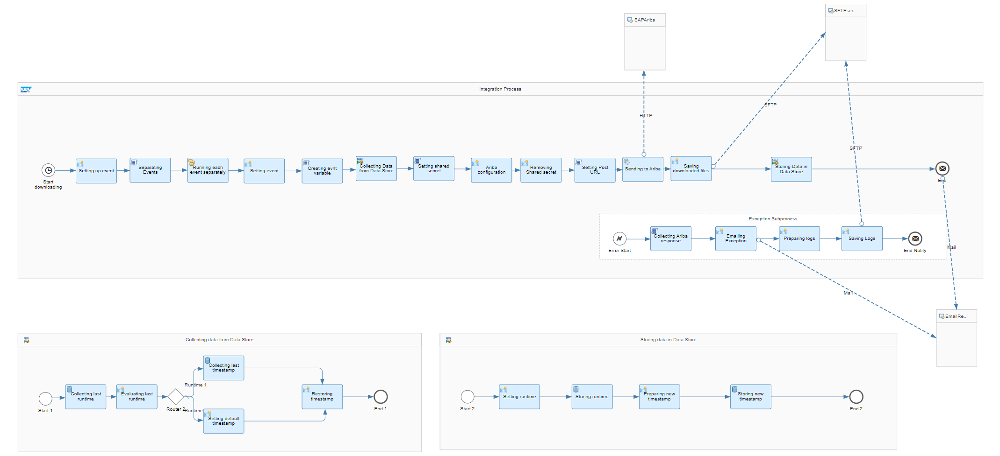
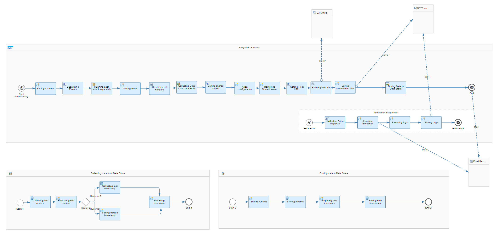
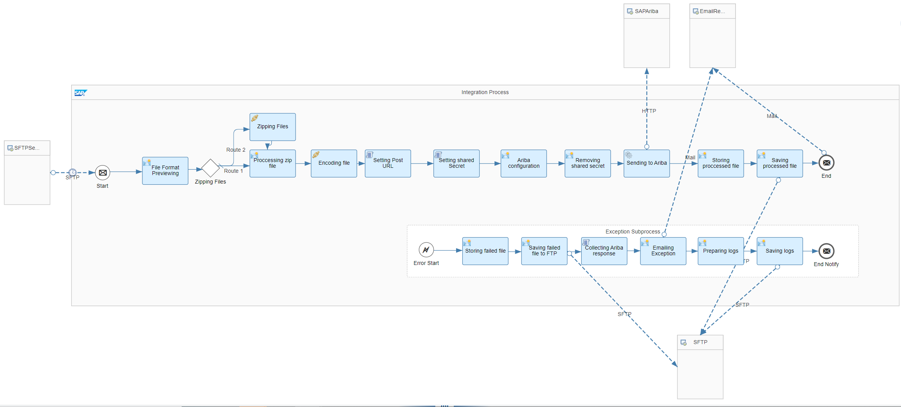
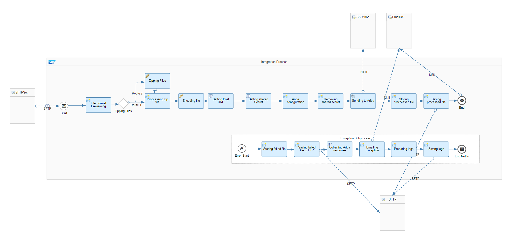
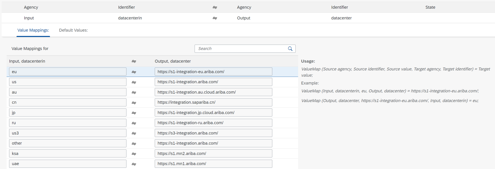

# SAP Ariba Integration Toolkit

\| [Recipes by Topic](../../readme.md ) \| [Recipes by Author](../../author.md ) \| [Request Enhancement](https://github.com/SAP-samples/cloud-integration-flow/issues/new?assignees=&labels=Recipe%20Fix,enhancement&template=recipe-request.md&title=Improve%20SAP%20Ariba%20Integration%20Toolkit%20 ) \| [Report a bug](https://github.com/SAP-samples/cloud-integration-flow/issues/new?assignees=&labels=Recipe%20Fix,bug&template=bug_report.md&title=Issue%20with%20SAP%20Ariba%20Integration%20Toolkit%20 ) \| [Fix documentation](https://github.com/SAP-samples/cloud-integration-flow/issues/new?assignees=&labels=Recipe%20Fix,documentation&template=bug_report.md&title=Docu%20fix%20SAP%20Ariba%20Integration%20Toolkit%20 ) \|

 | [SAP Business Accelerator Hub](https://api.sap.com/allcommunity) |
----|----|

Integration of SAP Ariba Buying and Sourcing solutions with third party systems. This package is an SAP BTP version of the previously used SAP Ariba Integration toolkit (ITK) tool. You can use it to connect SAP Ariba solutions with third party systems.

Please refer to the guideline documentation in the documents section (GitHub URL) as well as the SAP Ariba official documentation for the proper setup of the SAP Ariba tool.

This package allows you to do the following:

* Download files from SAP Ariba Buying and storing them on SFTP server.
* Download files from SAP Ariba Sourcing and storing them on SFTP server.
* Upload files from SFTP server into SAP Ariba Buying solution.
* Upload files from SFTP server into SAP Ariba Sourcing solution.
* Mapping of data centers to integation URLs.

[Download the integration package](SAPAribaIntegrationToolkit.zip)\
[View package on the SAP Business Accelerator Hub](https://api.sap.com/package/SAPAribaIntegrationToolkit/overview)\
[Documentation - SAP Ariba Integration File Download Events](SAPAribaIntegrationFileDownloadEvents.md)\
[Documentation - SAP Ariba Integration File Upload Events](SAPAribaIntegrationFileUploadEvents.md)

## Integration Flows/Value Mappings

### SAP Ariba Integration File Download Events - Buying
This integration downloads files from SAP Ariba Buying and stores them on an SFTP server.\
[View on SAP Business Accelerator Hub](https://api.sap.com/integrationflow/SAP_Ariba_Integration_File_Download_Events_-_Buying)

### SAP Ariba Integration File Download Events - Sourcing
This integration flow downloads files from SAP Ariba Sourcing and stores them on an SFTP server.\
[View on SAP Business Accelerator Hub](https://api.sap.com/integrationflow/SAP_Ariba_Integration_File_Download_Events_-_Sourcing)

### SAP Ariba Integration File Upload Events - Buying
This integration flow uploads files from an SFTP server into the SAP Ariba Buying solution.\
[View on SAP Business Accelerator Hub](https://api.sap.com/integrationflow/Ariba_Integration_File_Upload_Events_-_Buying)

### SAP Ariba Integration File Upload Events - Sourcing
This integration flow uploads files from an SFTP server into the SAP Ariba Sourcing solution.\
[View on SAP Business Accelerator Hub](https://api.sap.com/integrationflow/SAP_Ariba_Integration_File_Upload_Events_-_Sourcing)

### SAP Ariba Datacenter Value Mappings
This value mapping maps SAP Ariba data centers to integration URLs.\
[View on SAP Business Accelerator Hub](https://api.sap.com/valuemapping/Datacenter)

