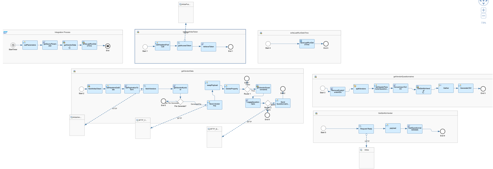

# SAP Ariba Integration with Third-Party for Vendor And Questionnaires

\| [Recipes by Topic](../../readme.md ) \| [Recipes by Author](../../author.md ) \| [Request Enhancement](https://github.com/SAP-samples/cloud-integration-flow/issues/new?assignees=&labels=Recipe%20Fix,enhancement&template=recipe-request.md&title=ImproveSAP%20Ariba%20Integration%20with%20Third-Party%20for%20Vendor%20And%20Questionnaires ) \| [Report a bug](https://github.com/SAP-samples/cloud-integration-flow/issues/new?assignees=&labels=Recipe%20Fix,bug&template=bug_report.md&title=Issue%20withSAP%20Ariba%20Integration%20with%20Third-Party%20for%20Vendor%20And%20Questionnaires ) \| [Fix documentation](https://github.com/SAP-samples/cloud-integration-flow/issues/new?assignees=&labels=Recipe%20Fix,documentation&template=bug_report.md&title=Docu%20fixSAP%20Ariba%20Integration%20with%20Third-Party%20for%20Vendor%20And%20Questionnaires ) \|

 | [SAP Accelerator Business Hub](https://api.sap.com/allcommunity) |
----|----|

The integration package provides iFlows for consumption of Ariba APIs for Vendor and Questionnaires with CSV Output for integrating with Third Party

This package enables consumption of below scenarios -

* Fetch Vendor and Questionnaires from Ariba.

[Download the reuseable integration package](SAP%20Ariba%20Integration%20with%20Third-Party%20for%20Vendor%20And%20Questionnaires)\
[View package on the SAP Accelerator Business Hub](https://api.sap.com/package/SAPAribaIntegrationwithThirdPartyforVendorAndQuestionnaires/overview)

## References
* [API Documentation](https://api.sap.com/package/SAPAribaOpenAPIs?section=Artifacts)
* [APP Registration](https://developer.ariba.com/api/manage/apps)

## Integration flows
### Fetch Vendor and Questionnaire
Integration Iflow for fetching the Vendor and Questionnaire data from SAP Ariba to Third Party using Ariba Open APIs\
[View on SAP Accelerator Business Hub](https://api.sap.com/integrationflow/Fetch_Vendor_and_Questionnaire)

