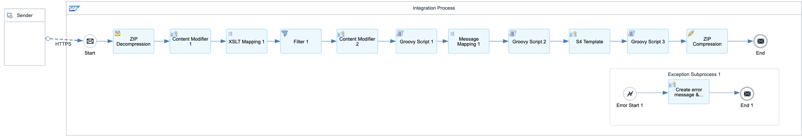

# SAP Business ByDesign Accounting Data Transformation to SAP S/4HANA Cloud Public Edition 

\| [Recipes by Topic](../../readme.md ) \| [Recipes by Author](../../author.md ) \| [Request Enhancement](https://github.com/SAP-samples/cloud-integration-flow/issues/new?assignees=&labels=Recipe%20Fix,enhancement&template=recipe-request.md&title=Improve%20SAP%20Business%20ByDesign%20Accounting%20Data%20Transformation%20to%20SAP%20S/4HANA%20Cloud%20Public%20Edition) \| [Report a bug](https://github.com/SAP-samples/cloud-integration-flow/issues/new?assignees=&labels=Recipe%20Fix,bug&template=bug_report.md&title=Issue%20with%20SAP%20Business%20ByDesign%20Accounting%20Data%20Transformation%20to%20SAP%20S/4HANA%20Cloud%20Public%20Edition)\| [Fix documentation](https://github.com/SAP-samples/cloud-integration-flow/issues/new?assignees=&labels=Recipe%20Fix,documentation&template=bug_report.md&title=Docu%20fix%20SAP%20Business%20ByDesign%20Accounting%20Data%20Transformation%20to%20SAP%20S/4HANA%20Cloud%20Public%20Edition) \| 

  | [SAP Business Accelerator Hub](https://api.sap.com/allcommunity) | 
 ----|----| 

Transform the data in accounting data objects of SAP Business ByDesign into a form suitable for migration into SAP S/4HANA Cloud Public Edition object.

This package supports you with the transformation of data in business objects of SAP Business ByDesign into a form suitable for migration into SAP S/4HANA Cloud Public Edition object. Each integration flow in this package provides the field level mapping of standard attributes in business object of SAP Business ByDesign to attributes in object of SAP S/4HANA Cloud Public Edition. The artifact in this package works without connecting the integration suite to source system and target system. The payload is passed manually to integration flows and the output is received as a file that is stored locally.

[Download the integration package](SAPBusinessByDesignAccountingDataTransformationtoSAPS4HANACloudPublicEdition.zip)\
[View package on the SAP Business Accelerator Hub](https://api.sap.com/package/SAPBusinessByDesignAccountingDataTransformationtoSAPS4HANACloudPublicEdition)\
[View documentation](SAPBusinessByDesignAccountingDataTransformationtoSAPS4HANACloudPublicEdition.pdf)\
[View high level effort](effort.md)
## Integration flows
### Inventory Data Transformation 
Transform the data in Inventory object of SAP Business ByDesign into the Material Inventory Balance migration template of SAP S/4HANA Cloud Public Edition, suitable for upload via Migration cockpit. \
 