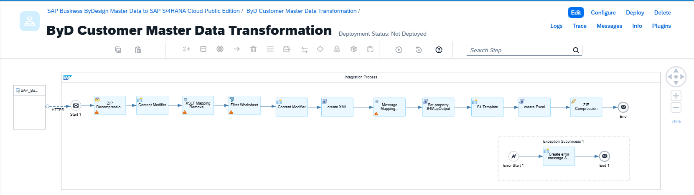

# SAP Business ByDesign Master Data to SAP S/4HANA Cloud Public Edition

\| [Recipes by Topic](../../readme.md ) \| [Recipes by Author](../../author.md ) \| [Request Enhancement](https://github.com/SAP-samples/cloud-integration-flow/issues/new?assignees=&labels=Recipe%20Fix,enhancement&template=recipe-request.md&title=Improve%20Enabling%20Exactly%20Once%20in%20Order%20via%20Cloud%20Integration) \| [Report a bug](https://github.com/SAP-samples/cloud-integration-flow/issues/new?assignees=&labels=Recipe%20Fix,bug&template=bug_report.md&title=Issue%20with%20Enabling%20Exactly%20Once%20in%20Order%20via%20Cloud%20Integration)\| [Fix documentation](https://github.com/SAP-samples/cloud-integration-flow/issues/new?assignees=&labels=Recipe%20Fix,documentation&template=bug_report.md&title=Docu%20fix%20Enabling%20Exactly%20Once%20in%20Order%20via%20Cloud%20Integration) \| 

  | [SAP Business Accelerator Hub](https://api.sap.com/allcommunity) | 
 ----|----| 

This package supports you with the transformation of data in business objects of SAP Business ByDesign (ByD) into a form suitable for migration into SAP S/4HANA Cloud Public Edition object.

Each integration flow in this package provides the field level mapping of standard attributes in business object of SAP Business ByDesign to attributes in object of SAP S/4HANA Cloud Public Edition.

The artifact in this package works without connecting the integration suite to source system and target system. The payload is passed manually to integration flows and the output is received as a file that is stored locally.

This package provides four IFlows:

1. ByD Customer Master Data Transformation&nbsp;

2. ByD Fixed Asset Master Data Transformation&nbsp;

3. ByD Material Master Data Transformation&nbsp;

4. ByD Supplier Master Data Transformation&nbsp;

&nbsp;

[View package on the SAP Business Accelerator Hub](https://api.sap.com/package/SAPBusinessByDesignMasterDatatoSAPS4HANACloudPublicEdition)\
[View documentation - ByD Customer Master Data Transformatio](ConfigurationGuide-ByDCustomerMasterDataTransformation.pdf)\
[View documentation - ByD Fixed Asset Master Data Transformation](ConfigurationGuide-ByDFixedAssetMasterDataTransformation.pdf)\
[View documentation - ByD Material Master Data Transformation](ConfigurationGuide-ByDMaterialMasterDataTransformation.pdf)\
[View documentation - ByD Supplier Master Data Transformation](ConfigurationGuide-ByDSupplierMasterDataTransformation.pdf)

[View high level effort](effort.md)

## Integration flows
### ByD Customer Master Data Transformation
Transform the data in Customer Master Data object of SAP Business ByDesign into the Customer migration template of SAP S/4HANA Cloud Public Edition, suitable for upload via Migration cockpit. \
 
### ByD Fixed Asset Master Data Transformation
Transform the data in Fixed Asset Master object of SAP Business ByDesign into the Fixed Asset Master migration template of SAP S/4HANA Cloud Public Edition, suitable for upload via Migration cockpit. \
 
### ByD Material Master Data Transformation
Transform the data in Material Master Data object of SAP Business ByDesign into the Product migration template of SAP S/4HANA Cloud Public Edition, suitable for upload via Migration cockpit. \
 
 ### ByD Supplier Master Data Transformation
Transform the data in Supplier Master Data object of SAP Business ByDesign into the Supplier migration template of SAP S/4HANA Cloud Public Edition, suitable for upload via Migration cockpit. \
 
