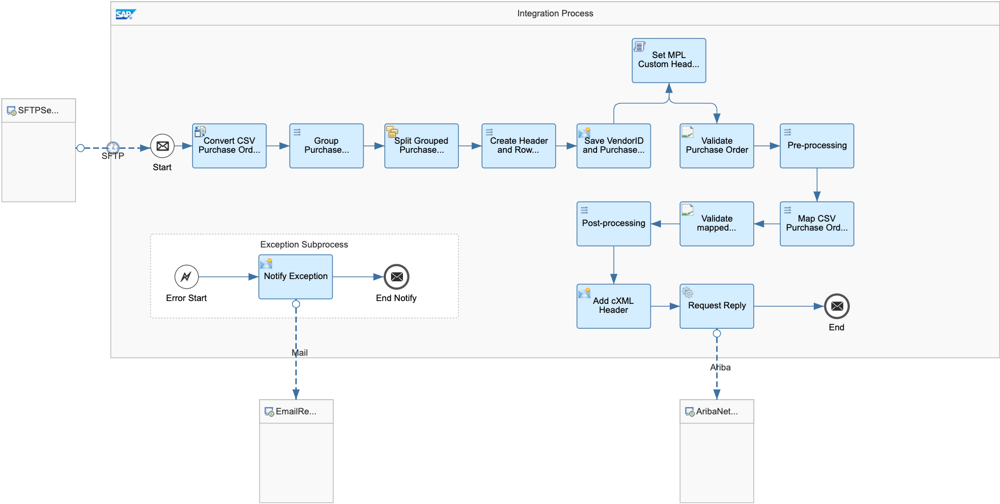
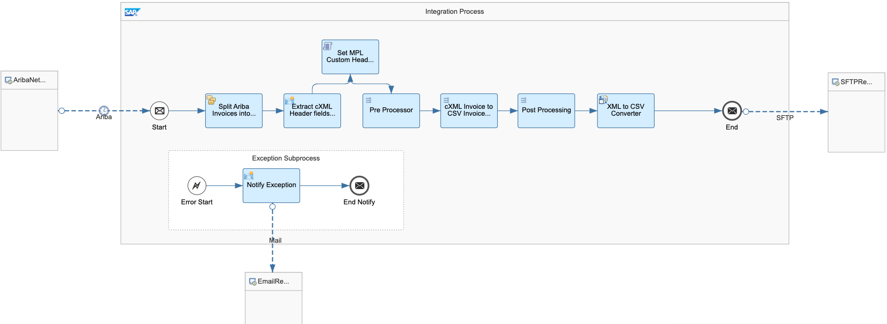

# SAP Business Network Integration with Non-SAP ERP

\| [Recipes by Topic](../../readme.md ) \| [Recipes by Author](../../author.md ) \| [Request Enhancement](https://github.com/SAP-samples/cloud-integration-flow/issues/new?assignees=&labels=Recipe%20Fix,enhancement&template=recipe-request.md&title=ImproveSAP%20Business%20Network%20Integration%20with%20Non-SAP%20ERP ) \| [Report a bug](https://github.com/SAP-samples/cloud-integration-flow/issues/new?assignees=&labels=Recipe%20Fix,bug&template=bug_report.md&title=Issue%20withSAP%20Business%20Network%20Integration%20with%20Non-SAP%20ERP ) \| [Fix documentation](https://github.com/SAP-samples/cloud-integration-flow/issues/new?assignees=&labels=Recipe%20Fix,documentation&template=bug_report.md&title=Docu%20fixSAP%20Business%20Network%20Integration%20with%20Non-SAP%20ERP ) \|

 | [SAP API Business Hub](https://api.sap.com/allcommunity) |
----|----|

This integration package can be used as a baseline template to support the Purchase Order, Invoice and other transactional documents with the SAP Business Network. This package leverages SFTP as the exchange protocol and CSV as the file format.

[Download the reuseable integration package](SAPBusinessNetworkIntegrationwithNon-SAPERP.zip)\
[View package on the SAP API Business Hub](https://api.sap.com/package/SAPBusinessNetworkIntegrationwithNonSAPERP/overview)

## Integration flows

### Translate CSV PO to cXML Order Request
Fetches CSV files containing PO transactions (one or more - batching is supported) form an SFTP sever, maps these to cXML Order Request and delivers them to SAP Business Network.\
[View on SAP API Business Hub](https://api.sap.com/integrationflow/Translate_CSV_PO_to_cXML_Order_Request)

### Translate cXML Invoice to CSV Invoice
Fetches cXML invoices from SAP Business Network, maps them to CSV files and delivers them to an SFTP server.\
[View on SAP API Business Hub](https://api.sap.com/integrationflow/Translate_cXML_Invoice_to_CSV_Invoice)

