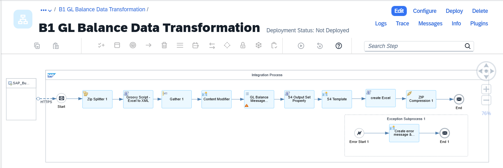
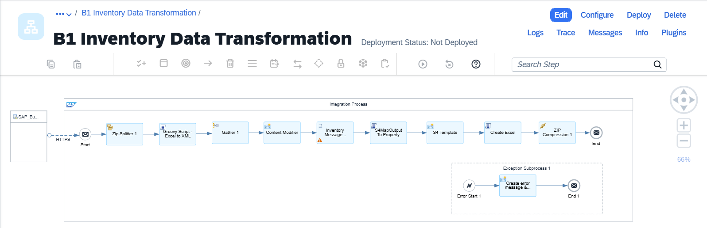

# SAP Business One Accounting Data Transformation to SAP S/4HANA Cloud Public Edition

\| [Recipes by Topic](../../readme.md ) \| [Recipes by Author](../../author.md ) \| [Request Enhancement](https://github.com/SAP-samples/cloud-integration-flow/issues/new?assignees=&labels=Recipe%20Fix,enhancement&template=recipe-request.md&title=Improve%20Enabling%20Exactly%20Once%20in%20Order%20via%20Cloud%20Integration) \| [Report a bug](https://github.com/SAP-samples/cloud-integration-flow/issues/new?assignees=&labels=Recipe%20Fix,bug&template=bug_report.md&title=Issue%20with%20Enabling%20Exactly%20Once%20in%20Order%20via%20Cloud%20Integration)\| [Fix documentation](https://github.com/SAP-samples/cloud-integration-flow/issues/new?assignees=&labels=Recipe%20Fix,documentation&template=bug_report.md&title=Docu%20fix%20Enabling%20Exactly%20Once%20in%20Order%20via%20Cloud%20Integration) \| 

  | [SAP Business Accelerator Hub](https://api.sap.com/allcommunity) | 
 ----|----| 

This package supports you with the transformation of data in business objects of SAP Business One (B1) into a form suitable for migration into SAP S/4HANA Cloud Public Edition object. Each integration flow in this package provides the field level mapping of standard attributes in business object of SAP Business One to attributes in object of SAP S/4HANA Cloud Public Edition. The artifact in this package works without connecting the integration suite to source system and target system. The payload is passed manually to integration flows and the output is received as a file that is stored locally.

This package provides two IFlows:

1. B1 GL Balance Data Transformation&nbsp;

2. B1 Inventory Data Transformation&nbsp;

&nbsp;

[Download the integration package](SAPBusinessOneAccountingDataTransformationtoSAPS4HANACloudPublicEdition.zip)\
[View package on the SAP Business Accelerator Hub](https://api.sap.com/package/SAPBusinessOneAccountingDataTransformationtoSAPS4HANACloudPublicEdition)\
[View documentation - B1 GL Balance Data Transformation](ConfigurationGuide-B1GLBalanceDataTransformation.pdf)\
[View documentation - B1 Inventory Data Transformation](ConfigurationGuide-B1InventoryDataTransformation.pdf)

[View high level effort](effort.md)

## Integration flows
### B1 GL Balance Data Transformation
Transform the data in G/L Balances object of SAP Business One into the G/L Account Balance migration template of SAP S/4HANA Cloud Public Edition, suitable for upload via Migration cockpit. \
 
 ### B1 Inventory Data Transformation
Transform the data in Inventory object of SAP Business One into the Material Inventory Balance migration template of SAP S/4HANA Cloud Public Edition, suitable for upload via Migration cockpit. \
 
