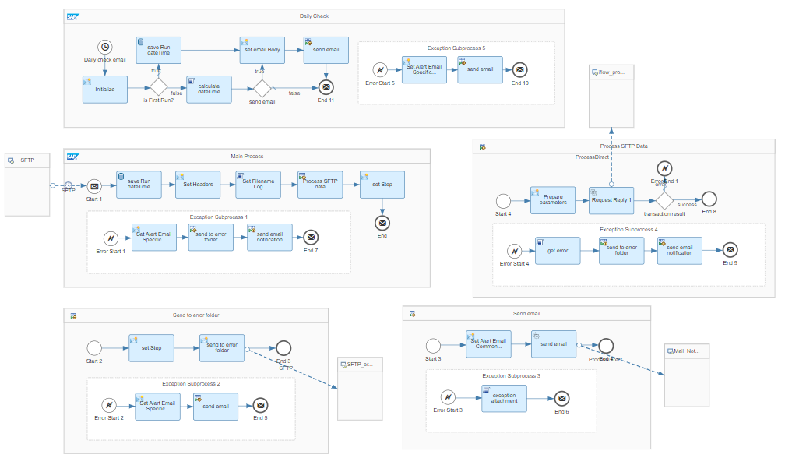
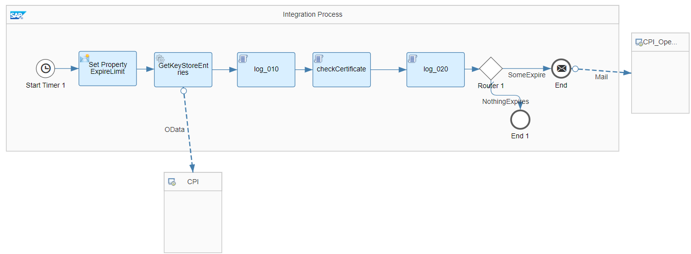

# SAP Integration Suite Cloud Integration Utilities 

\| [Recipes by Topic](../../readme.md ) \| [Recipes by Author](../../author.md ) \| [Request Enhancement](https://github.com/SAP-samples/cloud-integration-flow/issues/new?assignees=&labels=Recipe%20Fix,enhancement&template=recipe-request.md&title=Improve%20SAP%20Integration%20Suite%20Cloud%20Integration%20Utilities) \| [Report a bug](https://github.com/SAP-samples/cloud-integration-flow/issues/new?assignees=&labels=Recipe%20Fix,bug&template=bug_report.md&title=Issue%20with%20SAP%20Integration%20Suite%20Cloud%20Integration%20Utilities)\| [Fix documentation](https://github.com/SAP-samples/cloud-integration-flow/issues/new?assignees=&labels=Recipe%20Fix,documentation&template=bug_report.md&title=Docu%20fix%20SAP%20Integration%20Suite%20Cloud%20Integration%20Utilities) \| 

  | [SAP Business Accelerator Hub](https://api.sap.com/allcommunity) | 
 ----|----| 

This package provides content for handling specific operational topics related to the SAP Integration Suite Cloud Integration.

This packages covers integration flows regarding:

<ul>
 <li>Notification for certificates for which the expiration date has exceeded a predefined threshold.</li>
 <li>Notification for scenarios where no file has been picked up with an SFTP/FTP Sender Adapter.</li>
</ul>

[Download the integration package](SAPIntegrationSuiteCloudIntegrationUtilities.zip)\
[View package on the SAP Business Accelerator Hub](https://api.sap.com/package/SAPCloudIntegrationUtilities)\
[View documentation - Notify SFTP File Pick up failure](NotifySFTPFilePickupfailure.pdf)\
[View documentation - Alert Notification for expiring certificates on Cloud Integration](AlertNotificationforexpiringcertificatesontheSAPCloudIntegration.pdf)\
[View high level effort](effort.md)
## Integration flows
### Notify SFTP File Pick up failure 
It provides a notification via email if no file has been picked up from the SFTP server. \
 
### Mail Notification for expiring keystore entries 
This integration flow notifies via a mail distribution list when keystore entries (e.g. certificate) reach a predefined expiration limit (in days). \
 