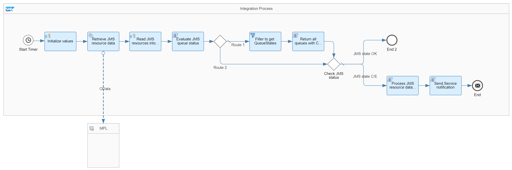

# SAP Cloud Integration with Alert Notification service for SAP BTP

\| [Recipes by Topic](../../readme.md ) \| [Recipes by Author](../../author.md ) \| [Request Enhancement](https://github.com/SAP-samples/cloud-integration-flow/issues/new?assignees=&labels=Recipe%20Fix,enhancement&template=recipe-request.md&title=Improve%20SAP%20Cloud%20Integration%20with%20Alert%20Notification%20service%20for%20SAP%20BTP%20 ) \| [Report a bug](https://github.com/SAP-samples/cloud-integration-flow/issues/new?assignees=&labels=Recipe%20Fix,bug&template=bug_report.md&title=Issue%20with%20SAP%20Cloud%20Integration%20with%20Alert%20Notification%20service%20for%20SAP%20BTP%20 ) \| [Fix documentation](https://github.com/SAP-samples/cloud-integration-flow/issues/new?assignees=&labels=Recipe%20Fix,documentation&template=bug_report.md&title=Docu%20fix%20SAP%20Cloud%20Integration%20with%20Alert%20Notification%20service%20for%20SAP%20BTP%20 ) \|

 | [SAP API Business Hub](https://api.sap.com/allcommunity) |
----|----|

Integrate SAP Alert Notification service for SAP BTP with Cloud Integration to get exhausted JMS resources. This integration flow "SAP Cloud Integration with Alert Notification service for SAP BTP" pulls JMS resource capacity of a Cloud Integration tenant and sends automated notifications to SAP Alert Notification service for SAP BTP in case the JMS resources are critical or exhausted. If all JMS resources are "OK", no notification is sent.

This package allows you to do the following:

* Send notifications for JMS resource overload with Alert Notification service

[Download the integration package](SAPCloudIntegrationwithAlertNotificationserviceforSAPBTP.zip)\
[View package on the SAP API Business Hub](https://api.sap.com/package/SAPCloudIntegrationwithAlertNotificationserviceforSAPBTP/overview)\
[View documentation](SAPCloudIntegrationwithAlertNotificationserviceforSAPBTP.pdf)\
[View high level effort](effort.md)

## Integration Flows

### Send notifications for JMS resource overload with Alert Notification service
Pulls JMS resource capacity and sends automated notifications to SAP Alert Notification service for SAP BTP in case the JMS resources are critical or exhausted.\
[View on SAP API Business Hub](https://api.sap.com/integrationflow/Send_notifications_for_JMS_resource_overload_with_Alert_Notification_service)

