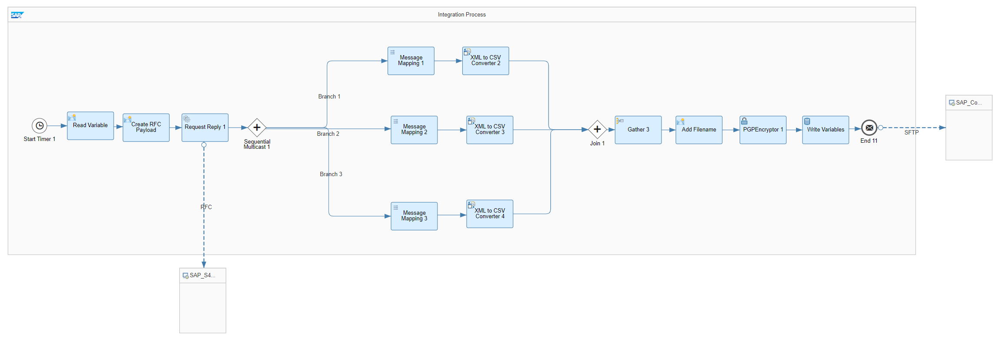
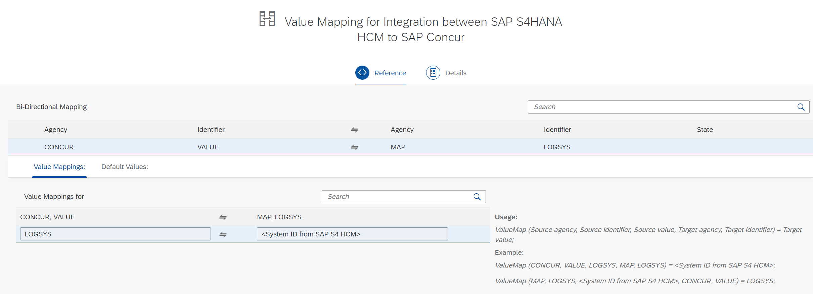

# SAP S/4HANA OnPremise HCM Integration with SAP Concur

\| [Recipes by Topic](../../readme.md ) \| [Recipes by Author](../../author.md ) \| [Request Enhancement](https://github.com/SAP-samples/cloud-integration-flow/issues/new?assignees=&labels=Recipe%20Fix,enhancement&template=recipe-request.md&title=Improve%20SAP%20S4HANA%20OnPremise%20HCM%20Integration%20with%20SAP%20Concur%20 ) \| [Report a bug](https://github.com/SAP-samples/cloud-integration-flow/issues/new?assignees=&labels=Recipe%20Fix,bug&template=bug_report.md&title=Issue%20with%20SAP%20S4HANA%20OnPremise%20HCM%20Integration%20with%20SAP%20Concur%20 ) \| [Fix documentation](https://github.com/SAP-samples/cloud-integration-flow/issues/new?assignees=&labels=Recipe%20Fix,documentation&template=bug_report.md&title=Docu%20fix%20SAP%20S4HANA%20OnPremise%20HCM%20Integration%20with%20SAP%20Concur%20 ) \|

 | [SAP API Business Hub](https://api.sap.com/allcommunity) |
----|----|

SAP S/4HANA OnPremise HCM Integration with SAP Concur in order to replicate employee data via a custom BAPI and using an SFTP Server.

This package allows you to do the following:

* Replicate Employee data from SAP S4HANA HCM to SAP Concur
* Value Mapping for Integration between SAP S4HANA HCM to SAP Concur

[Download the integration package](SAPS_4HANAOnPremiseHCMIntegrationwithSAPConcur.zip)\
[View package on the SAP API Business Hub](https://api.sap.com/package/SAPConcurIntegrationwithS4HANAOnPremiseHCM/overview)\
[View documentation](ReplicateEmployeedatafromSAPS4HANAHCMtoSAPConcur.pdf)\
[View high level effort estimate](effort.md)

## Integration Flows/Value Mappings

### Replicate Employee data from SAP S4HANA HCM to SAP Concur
Replicate Employee data from SAP S/4HANA HCM via a custom BAPI to SAP Concur to an SFTP Server\
[View on SAP API Business Hub](https://api.sap.com/integrationflow/Concur_HCM_EMPLOYEEIMPORT)

### Value Mapping for Integration between SAP S4HANA HCM to SAP Concur
Value Mapping for Integration between SAP S4HANA HCM to SAP Concur in order to map the SystemID correctly\
[View on SAP API Business Hub](https://api.sap.com/valuemapping/Concur_HCM_EMPLOYEEIMPORT_Value_Mapping)

