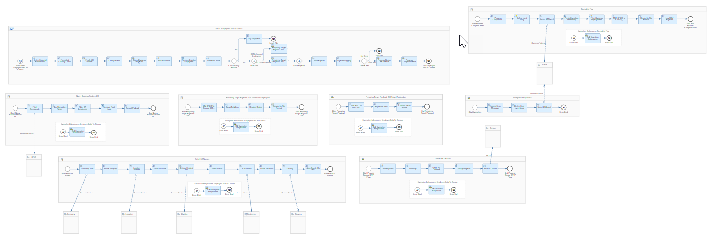
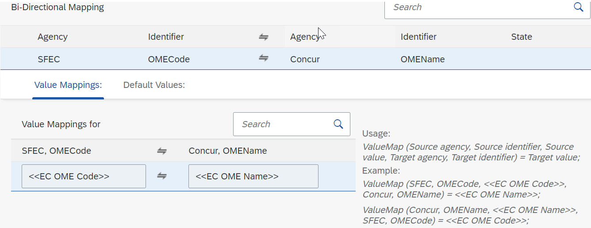

# SAP SuccessFactors Employee Central Integration with SAP Concur

\| [Recipes by Topic](../../readme.md ) \| [Recipes by Author](../../author.md ) \| [Request Enhancement](https://github.com/SAP-samples/cloud-integration-flow/issues/new?assignees=&labels=Recipe%20Fix,enhancement&template=recipe-request.md&title=Improve%20SAP%20SuccessFactors%20Employee%20Central%20Integration%20with%20SAP%20Concur%20 ) \| [Report a bug](https://github.com/SAP-samples/cloud-integration-flow/issues/new?assignees=&labels=Recipe%20Fix,bug&template=bug_report.md&title=Issue%20with%20SAP%20SuccessFactors%20Employee%20Central%20Integration%20with%20SAP%20Concur%20 ) \| [Fix documentation](https://github.com/SAP-samples/cloud-integration-flow/issues/new?assignees=&labels=Recipe%20Fix,documentation&template=bug_report.md&title=Docu%20fix%20SAP%20SuccessFactors%20Employee%20Central%20Integration%20with%20SAP%20Concur%20 ) \|

 | [SAP Business Accelerator Hub](https://api.sap.com/allcommunity) |
----|----|

This integration flow fetches employee details from SAP SuccessFactors Employee Central and based on the events/data changes, determines the records to be sent to SAP Concur.
It generated below types of employee mini master file:
-100 (Import Settings)
-305 (Enhanced Employee)
-350 (Travel Addendum)
The file is then sent to the SAP Concur SFTP server in CSV format.

This package allows you to do the following:

* Send Employee Information to SAP Concur SFTP Server
* Value Mapping for SAP SuccessFactors EC and Concur integration

[Download the integration package](SendEmployeeInformationtoSAPConcurSFTPServer.zip)\
[View package on the SAP Business Accelerator Hub](https://api.sap.com/package/SAPConcurIntegrationWithSAPSuccessfactorsEmployeeCentral/overview)\
[View documentation](SendEmployeeInformationtoSAPConcurSFTPServer.pdf)\
[View high level effort estimate](effort.md)

## Integration Flows/Value Mappings

### Send Employee Information to SAP Concur SFTP Server
Replicate Employee information (Delta Load) from SAP SuccessFactors Employee Central to SAP Concur SFTP server.\
[View on SAP Business Accelerator Hub](https://api.sap.com/integrationflow/Send_Employee_Information_to_SAP_Concur_SFTP_Server)

### Value Mapping for SAP SuccessFactors EC and Concur integration
This value mapping is used to define logical system in SAP Concur based on SF EC Company Code and to convert SF EC OMECode to SAP Concur OME Name\
[View on SAP Business Accelerator Hub](https://api.sap.com/valuemapping/Value_Mappings)

