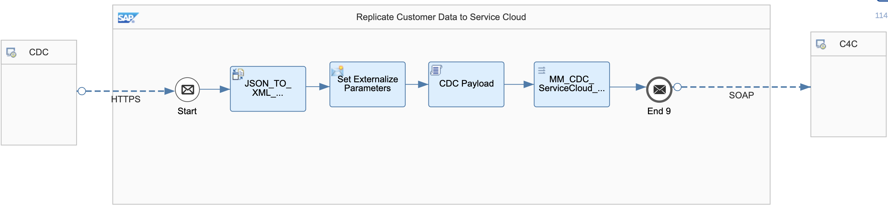

# SAP Customer Data Cloud Integration with SAP Service Cloud for Replicating Customer Details

\| [Recipes by Topic](../../readme.md ) \| [Recipes by Author](../../author.md ) \| [Request Enhancement](https://github.com/SAP-samples/cloud-integration-flow/issues/new?assignees=&labels=Recipe%20Fix,enhancement&template=recipe-request.md&title=Improve%20SAP%20Customer%20Data%20Cloud%20Integration%20with%20SAP%20Service%20Cloud%20for%20Replicating%20Customer%20Details ) \| [Report a bug](https://github.com/SAP-samples/cloud-integration-flow/issues/new?assignees=&labels=Recipe%20Fix,bug&template=bug_report.md&title=Issue%20with%20SAP%20Customer%20Data%20Cloud%20Integration%20with%20SAP%20Service%20Cloud%20for%20Replicating%20Customer%20Details ) \| [Fix documentation](https://github.com/SAP-samples/cloud-integration-flow/issues/new?assignees=&labels=Recipe%20Fix,documentation&template=bug_report.md&title=Docu%20fix%20SAP%20Customer%20Data%20Cloud%20Integration%20with%20SAP%20Service%20Cloud%20for%20Replicating%20Customer%20Details ) \|

 | [SAP API Business Hub](https://api.sap.com/allcommunity) |
----|----|

This package supports integration of SAP Customer Data Cloud to SAP Service Cloud.

Integration provided in this package :
* Replication of Customer Data.
Supported Format - JSON

[Download the integration package](SAPCustomerDataCloudIntegrationwithSAPServiceCloudReplicateCustomerDetails.zip)\
[View package on the SAP API Business Hub](https://api.sap.com/package/SAPCustomerDataCloudIntegrationwithSAPServiceCloudReplicateCustomerDetails/overview)\
[View documentation on the SAP API Business Hub](https://api.sap.com/odata/1.0/catalog.svc/Files('6de5128612014acea503270715e864ed')/$value)

## Integration flow
### Replicate SAP Customer Data to SAP Service Cloud

