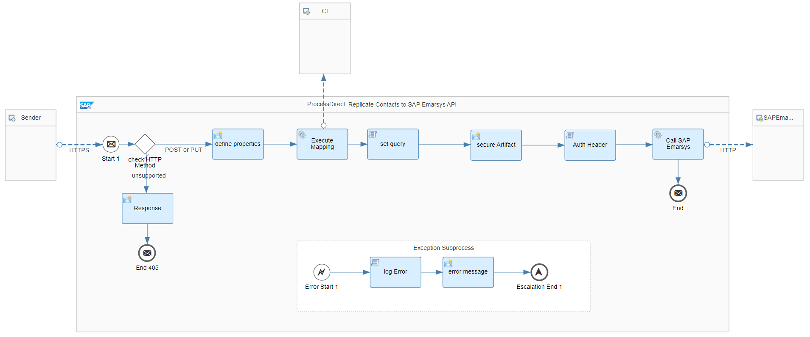
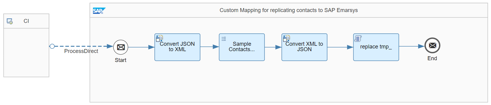

# SAP Emarsys Integration with SAP Emarsys APIs 

\| [Recipes by Topic](../../readme.md ) \| [Recipes by Author](../../author.md ) \| [Request Enhancement](https://github.com/SAP-samples/cloud-integration-flow/issues/new?assignees=&labels=Recipe%20Fix,enhancement&template=recipe-request.md&title=Improve%20SAP%20Emarsys%20Integration%20with%20SAP%20Emarsys%20APIs) \| [Report a bug](https://github.com/SAP-samples/cloud-integration-flow/issues/new?assignees=&labels=Recipe%20Fix,bug&template=bug_report.md&title=Issue%20with%20SAP%20Emarsys%20Integration%20with%20SAP%20Emarsys%20APIs)\| [Fix documentation](https://github.com/SAP-samples/cloud-integration-flow/issues/new?assignees=&labels=Recipe%20Fix,documentation&template=bug_report.md&title=Docu%20fix%20SAP%20Emarsys%20Integration%20with%20SAP%20Emarsys%20APIs) \| 

  | [SAP Business Accelerator Hub](https://api.sap.com/allcommunity) | 
 ----|----| 

This integration flow allows you to connect to the SAP Emarsys APIs

The integration of SAP Emarsys Integration with SAP Emarsys APIs illustrates how to use WSSE authentication over SSL and communicate with the SAP Emarsys APIs.

It can be used to integrate scenarios related to&nbsp;the Customer Engagement platform.

For example, it can be used to integrate Business Partners, Sales Orders from SAP S/4HANA with SAP Emarsys by exposing a REST endpoint in Cloud Integration.

Please also refer to: <a href="https://dev.emarsys.com/" rel="nofollow">https://dev.emarsys.com/</a>

&nbsp;

&nbsp;

[Download the integration package](SAPEmarsysIntegrationwithSAPEmarsysAPIs.zip)\
[View package on the SAP Business Accelerator Hub](https://api.sap.com/package/SAPEmarsysIntegration)\
[View documentation](EmarsysStarterPack_SampleIntegrationforContactsReplication.pdf)\
[View high level effort](effort.md)
## Integration flows
### Replicate Contacts to SAP Emarsys API 
This integration flow illustrates authentication handling and consumption of SAP Emarsys APIs \
 
### Custom Mapping for replicating Contacts to SAP Emarsys 
Sample iFlow to extend/customize the Contacts replication mapping \
 