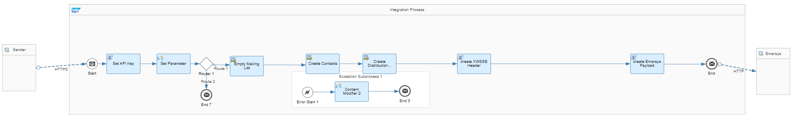

# SAP Emarsys Integration with SAP Qualtrics 

\| [Recipes by Topic](../../readme.md ) \| [Recipes by Author](../../author.md ) \| [Request Enhancement](https://github.com/SAP-samples/cloud-integration-flow/issues/new?assignees=&labels=Recipe%20Fix,enhancement&template=recipe-request.md&title=Improve%20SAP%20Emarsys%20Integration%20with%20SAP%20Qualtrics) \| [Report a bug](https://github.com/SAP-samples/cloud-integration-flow/issues/new?assignees=&labels=Recipe%20Fix,bug&template=bug_report.md&title=Issue%20with%20SAP%20Emarsys%20Integration%20with%20SAP%20Qualtrics)\| [Fix documentation](https://github.com/SAP-samples/cloud-integration-flow/issues/new?assignees=&labels=Recipe%20Fix,documentation&template=bug_report.md&title=Docu%20fix%20SAP%20Emarsys%20Integration%20with%20SAP%20Qualtrics) \| 

  | [SAP Business Accelerator Hub](https://api.sap.com/allcommunity) | 
 ----|----| 

Create personalized survey links and send them with a triggered email from SAP Emarsys. Receive survey response data (NPS Score) in SAP Emarsys

With this integration package, you can load data (customers) from SAP Emarsys system to SAP Qualtrics. Within this integration you are able triggers an Email Campaign in SAP Emarsys to send out a SAP Qualtrics survey.

This package enables you to do the following:

<ul>
 <li>Send Customers from SAP Emarsys to SAP Qualtrics.</li>
 <li>Create personalized survey links and send it to SAP Emarsys for triggering an email.</li>
 <li>Send survey response data (NPS Score) from SAP Qualtrics to SAP Emarsys</li>
</ul>

[Download the integration package](SAPEmarsysIntegrationwithQualtrics.zip)\
[View package on the SAP Business Accelerator Hub](https://api.sap.com/package/SAPEmarsysIntegrationwithQualtrics)\
[View documentation](CreatePersonalizedLinksInSAPQualtrics.pdf)\
[View high level effort](effort.md)
## Integration flows
### Send response from SAP Qualtrics to SAP Emarsys 
Sends specific information of one response to SAP Emarsys and updates the contact profile. \
 
### Create personalized links in SAP Qualtrics 
Creates contacts and personalised survey links in SAP Qualtrics and sends them to SAP Emarsys as an external event. \
  \
 