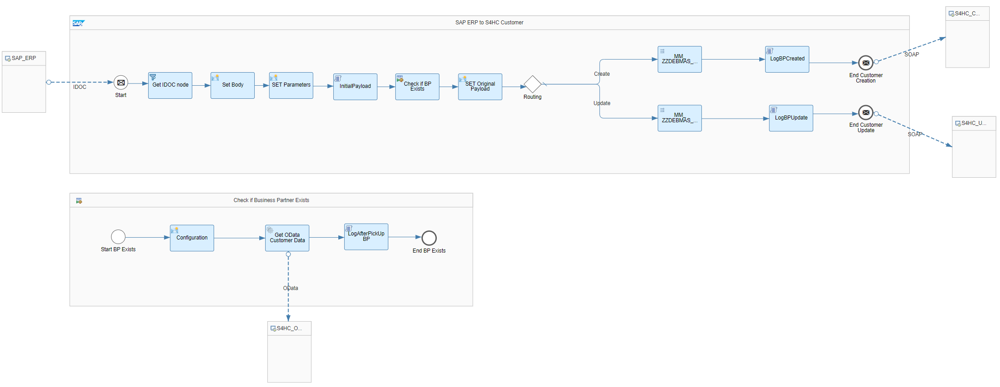
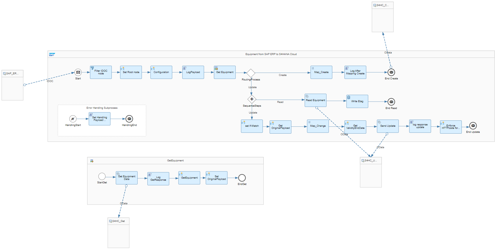

# SAP ERP Master Data Integration with SAP S/4HANA Cloud 

\| [Recipes by Topic](../../readme.md ) \| [Recipes by Author](../../author.md ) \| [Request Enhancement](https://github.com/SAP-samples/cloud-integration-flow/issues/new?assignees=&labels=Recipe%20Fix,enhancement&template=recipe-request.md&title=Improve%20SAP%20ERP%20Master%20Data%20Integration%20with%20SAP%20S/4HANA%20Cloud) \| [Report a bug](https://github.com/SAP-samples/cloud-integration-flow/issues/new?assignees=&labels=Recipe%20Fix,bug&template=bug_report.md&title=Issue%20with%20SAP%20ERP%20Master%20Data%20Integration%20with%20SAP%20S/4HANA%20Cloud)\| [Fix documentation](https://github.com/SAP-samples/cloud-integration-flow/issues/new?assignees=&labels=Recipe%20Fix,documentation&template=bug_report.md&title=Docu%20fix%20SAP%20ERP%20Master%20Data%20Integration%20with%20SAP%20S/4HANA%20Cloud) \| 

  | [SAP Accelerator Business Hub](https://api.sap.com/allcommunity) | 
 ----|----| 

This package enables creation or change of master data in SAP S/4HANA Cloud from SAP ERP.

This package enables&nbsp;Master data integration between SAP ERP and SAP S/4HANA Cloud using SOAP and ODATA services allows you to replicate supported master data objects from SAP ERP to S/4HANA Cloud solutions.

This Package has the following IFlows:&nbsp;

<ul>
 <li>Create or Change Equipment from SAP ERP to SAP S4HANA Cloud</li>
 <li>Create or Update Customer Master Data from SAP ERP to SAP S4HANA Cloud</li>
</ul>

[Download the integration package](SAPERPMasterDataIntegrationwithSAPS4HANACloud.zip)\
[View package on the SAP Accelerator Business Hub](https://api.sap.com/package/SAPERPMasterDataIntegrationWithSAPS4HANACloud)\
[View documentation for master data integration](CreateOrUpdateCustomerMasterDataFromSAPERPtoSAPS4HANACloud.pdf)\
[View documentation for equipment data integration](CreateOrChangeEquipmentFromSAPERPtoS4HANACloud.pdf)\
[View high level effort](effort.md)
## Integration flows
### Create or Update Customer Master Data from SAP ERP to SAP S4HANA Cloud 
Create or Update Customer Master Data from SAP ERP (via IDoc) to SAP S4HANA Cloud (via SOAP) \
 
### Create or Change Equipment from SAP ERP to SAP S4HANA Cloud 
Send IDOC Equipment create or change from SAP ERP to SAP S/4HANA Cloud using OData Service. \
 