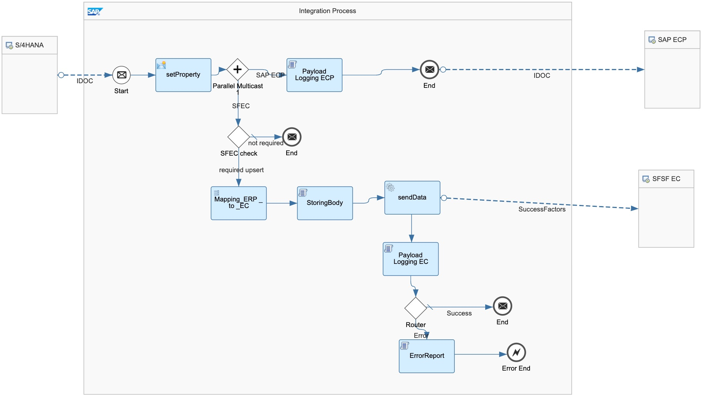

# SAP ERP or SAP S/4HANA Integration with SAP SuccessFactors Employee Central

\| [Recipes by Topic](../../readme.md ) \| [Recipes by Author](../../author.md ) \| [Request Enhancement](https://github.com/SAP-samples/cloud-integration-flow/issues/new?assignees=&labels=Recipe%20Fix,enhancement&template=recipe-request.md&title=Improve%20SAP%20ERP%20or%20SAP%20S/4HANA%20Integration%20with%20SAP%20SuccessFactors%20Employee%20Central) \| [Report a bug](https://github.com/SAP-samples/cloud-integration-flow/issues/new?assignees=&labels=Recipe%20Fix,bug&template=bug_report.md&title=Issue%20with%20SAP%20ERP%20or%20SAP%20S/4HANA%20Integration%20with%20SAP%20SuccessFactors%20Employee%20Central)\| [Fix documentation](https://github.com/SAP-samples/cloud-integration-flow/issues/new?assignees=&labels=Recipe%20Fix,documentation&template=bug_report.md&title=Docu%20fix%20SAP%20ERP%20or%20SAP%20S/4HANA%20Integration%20with%20SAP%20SuccessFactors%20Employee%20Central) \|

  | [SAP Business Accelerator Hub](https://api.sap.com/allcommunity) |
 ----|----| 

Replication of Bank Key data from SAP ERP or SAP S/4HANA to SAP SuccessFactors Employee Central enables you to manage your bank key in SAP ERP or SAP S/4HANA.

[Download the integration package](SAPERPorSAPS4HANAIntegrationwithSAPSuccessFactorsEmployeeCentralBankKey.zip)\
[View package on the SAP Business Accelerator Hub](https://api.sap.com/package/SAPERPorSAPS4HANAIntegrationwithSAPSuccessFactorsEmployeeCentralBankKey)\
[View documentation](ConfigGuide_BankKeysReplicationfromS4HANAtoSFECandSAPECP.pdf)\
[View ABAP report code](ABAP_Report_zhcmsfsfp_bankkeysreplication.pdf)
 ## Integration flows
### Replicate Bank Keys from SAP ERP or SAP S4HANA to SAP SuccessFactors Employee Central
This Integration flow replicates the Bank Keys from SAP ERP or SAP S/4HANA to SAP SuccessFactors Employee Central \
 
