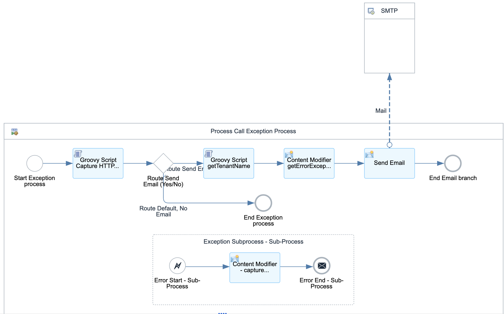

# SAP FieldGlass Generic Upload Integration 

\| [Recipes by Topic](../../readme.md ) \| [Recipes by Author](../../author.md ) \| [Request Enhancement](https://github.com/SAP-samples/cloud-integration-flow/issues/new?assignees=&labels=Recipe%20Fix,enhancement&template=recipe-request.md&title=Improve%20SAP%20FieldGlass%20Generic%20Upload%20Integration) \| [Report a bug](https://github.com/SAP-samples/cloud-integration-flow/issues/new?assignees=&labels=Recipe%20Fix,bug&template=bug_report.md&title=Issue%20with%20SAP%20FieldGlass%20Generic%20Upload%20Integration)\| [Fix documentation](https://github.com/SAP-samples/cloud-integration-flow/issues/new?assignees=&labels=Recipe%20Fix,documentation&template=bug_report.md&title=Docu%20fix%20SAP%20FieldGlass%20Generic%20Upload%20Integration) \| 

  | [SAP Business Accelerator Hub](https://api.sap.com/allcommunity) | 
 ----|----| 

Generic Integration to Upload Fieldglass content using connectors and OAuth2 authentication

Can be used to upload data in CSV format using Fieldglass connectors.

[Download the integration package](SAPFieldGlassGenericUploadIntegration.zip)\
[View package on the SAP Business Accelerator Hub](https://api.sap.com/package/SAPFieldGlassGenericUploadIntegration)\
[View documentation](SAPFieldGlassGenericUploadIntegration.pdf)\
[View high level effort](effort.md)
## Integration flows
### Integration between Third Party and SAP Fieldglass Generic Upload 
converting inbound data to SAP Fieldglass required data(.csv) format and upload files to SAP FieldGlass using Connectors
Supports Input formats: XML, JSON or CSV \
 