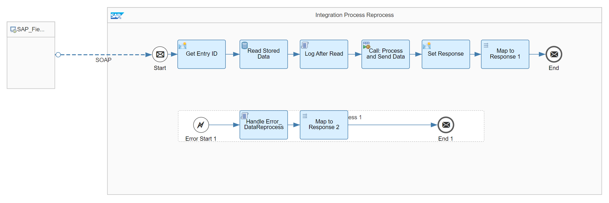
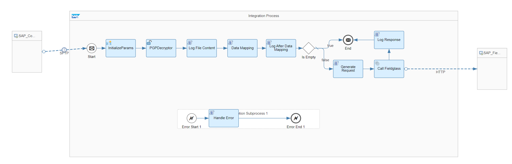

# SAP Fieldglass User Integration with SAP Concur

\| [Recipes by Topic](../../readme.md ) \| [Recipes by Author](../../author.md ) \| [Request Enhancement](https://github.com/SAP-samples/cloud-integration-flow/issues/new?assignees=&labels=Recipe%20Fix,enhancement&template=recipe-request.md&title=Improve%20SAP%20Fieldglass%20User%20Integration%20with%20SAP%20Concur%20 ) \| [Report a bug](https://github.com/SAP-samples/cloud-integration-flow/issues/new?assignees=&labels=Recipe%20Fix,bug&template=bug_report.md&title=Issue%20with%20SAP%20Fieldglass%20User%20Integration%20with%20SAP%20Concur%20 ) \| [Fix documentation](https://github.com/SAP-samples/cloud-integration-flow/issues/new?assignees=&labels=Recipe%20Fix,documentation&template=bug_report.md&title=Docu%20fix%20SAP%20Fieldglass%20User%20Integration%20with%20SAP%20Concur%20 ) \|

 | [SAP API Business Hub](https://api.sap.com/allcommunity) |
----|----|

Transfer new hires from SAP Fieldglass to SAP Concur and synch their expenses with SAP Fieldglass.
Once a new contractor has been added to SAP Fieldglass, this package can
1) automate the creation of their master record in SAP Concur
2) pull any expense reports created by the contractors into SAP Fieldglass

This package allows you to do the following:

* Replicate User Master Data from SAP Fieldglass to SAP Concur
* Replicate Expense Report from SAP Concur to SAP Fieldglass

[Download the integration package](SAPFieldglassUserIntegrationwithSAPConcur.zip.zip)\
[View package on the SAP API Business Hub](https://api.sap.com/package/SAPFieldglassUserIntegrationwithSAPConcur/overview)

## Integration Flows

### Replicate User Master Data from SAP Fieldglass to SAP Concur
Synch SAP Fieldglass users with SAP Concur using 305 file.\
[View on SAP API Business Hub](https://api.sap.com/integrationflow/Replicate_User_Master_Data_from_Fieldglass_To_Concur)

### Replicate Expense Report from SAP Concur to SAP Fieldglass
Synch SAP Concur SAE file data with SAP Fieldglass.\
[View on SAP API Business Hub](https://api.sap.com/integrationflow/Replicate_Expense_Report_from_Concur_To_Fieldglass)

