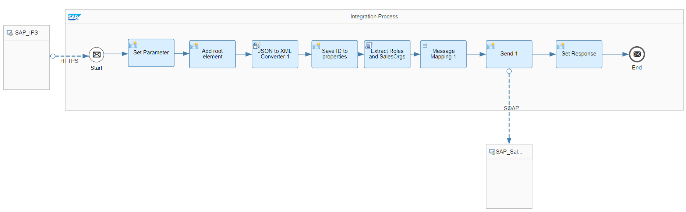
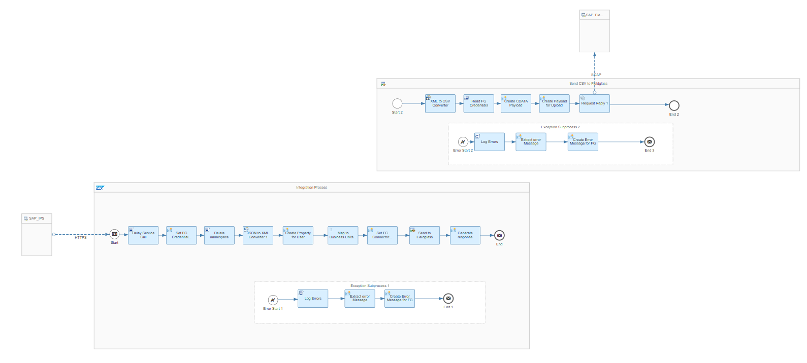

# SAP Cloud Identity Services Integration with SAP Sales Cloud and SAP Fieldglass 

\| [Recipes by Topic](../../readme.md ) \| [Recipes by Author](../../author.md ) \| [Request Enhancement](https://github.com/SAP-samples/cloud-integration-flow/issues/new?assignees=&labels=Recipe%20Fix,enhancement&template=recipe-request.md&title=Improve%20SAP%20Cloud%20Identity%20Services%20Integration%20with%20SAP%20Sales%20Cloud%20and%20SAP%20Fieldglass) \| [Report a bug](https://github.com/SAP-samples/cloud-integration-flow/issues/new?assignees=&labels=Recipe%20Fix,bug&template=bug_report.md&title=Issue%20with%20SAP%20Cloud%20Identity%20Services%20Integration%20with%20SAP%20Sales%20Cloud%20and%20SAP%20Fieldglass)\| [Fix documentation](https://github.com/SAP-samples/cloud-integration-flow/issues/new?assignees=&labels=Recipe%20Fix,documentation&template=bug_report.md&title=Docu%20fix%20SAP%20Cloud%20Identity%20Services%20Integration%20with%20SAP%20Sales%20Cloud%20and%20SAP%20Fieldglass) \| 

  | [SAP API Business Hub](https://api.sap.com/allcommunity) | 
 ----|----| 

SAP Cloud Identity Services Identity Provisioning triggers the replication of user roles to SAP Sales Cloud and SAP Fieldglass. The user roles are mapped from the associated business units of the user in Identity Provisioning Service.

The package provides iflows replicating user roles from SAP Cloud Identity Services Identity Provisioning (IPS) to SAP Sales Cloud and SAP Fieldglass.

[Download the integration package](SAPCloudIdentityServicesIntegrationwithSAPSalesCloudandSAPFieldglass.zip)\
[View package on the SAP API Business Hub](https://api.sap.com/package/SAPIPSIntegration)\
[View documentation - Replicate Users to SAP Fieldglass](ReplicateUserfromSAPIPStoSAPFieldglass.pdf)\
[View documentation - Replicate Users to SAP Sales Cloud](ReplicateUserfromSAPIPStoSAPSalesCloud.pdf)\
[View high level effort](effort.md)
## Integration flows
### Replicate User from Identity Provisioning Service to SAP Sales Cloud 
Replication of Employee Data from SAP Identity Management via IPS to SAP Sales Cloud. \
 
### Replicate User from Identity Provisioning Service to SAP Fieldglass 
Replication of Employee Data from SAP Identity Management via IPS to SAP Fieldglass \
 
