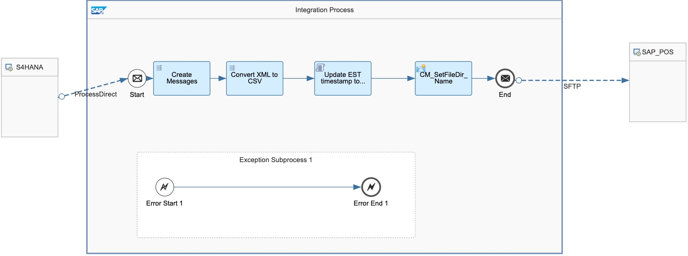
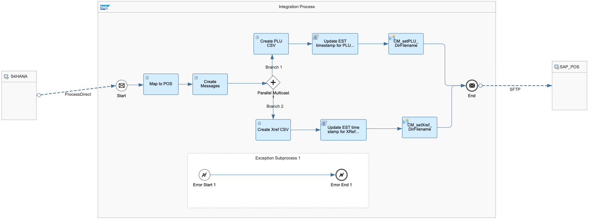
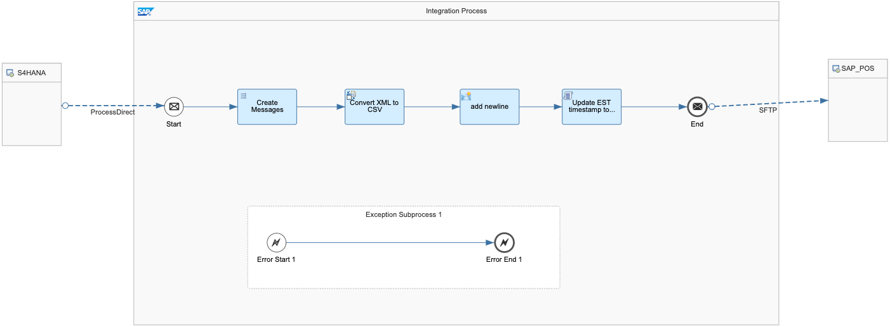
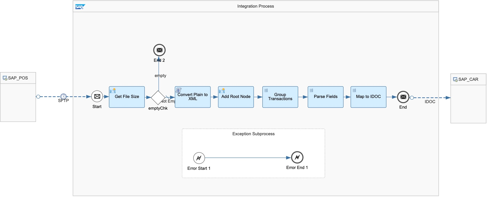

# SAP Retail Integration with SAP Point-of-Sale

\| [Recipes by Topic](../../readme.md ) \| [Recipes by Author](../../author.md ) \| [Request Enhancement](https://github.com/SAP-samples/cloud-integration-flow/issues/new?assignees=&labels=Recipe%20Fix,enhancement&template=recipe-request.md&title=Improve%20SAP%20Retail%20Integration%20with%20SAP%20Point-of-Sale) \| [Report a bug](https://github.com/SAP-samples/cloud-integration-flow/issues/new?assignees=&labels=Recipe%20Fix,bug&template=bug_report.md&title=Issue%20with%20SAP%20Retail%20Integration%20with%20SAP%20Point-of-Sale)\| [Fix documentation](https://github.com/SAP-samples/cloud-integration-flow/issues/new?assignees=&labels=Recipe%20Fix,documentation&template=bug_report.md&title=Docu%20fix%20SAP%20Retail%20Integration%20with%20SAP%20Point-of-Sale) \|

  | [SAP API Business Hub](https://api.sap.com/allcommunity) |
 ----|----|

This integration package enables you to build integration between SAP Retail solution (SAP S/4HANA Retail and SAP Customer Activity Repository) and SAP POS (Point-of-Sale).

The integration scope includes a POS inbound scenario, uploading POS sales data from SAP POS to SAP CAR, and a POS outbound scenario, download article master and price, EAN/UPC (xref), department, and promotions from SAP S/4HANA to SAP POS.

[Download the integration package](SAPRetailIntegrationwithSAPPoint-of-Sale.zip)\
[View package on the SAP API Business Hub](https://api.sap.com/package/SAPRetailIntegrationwithSAPPOS)\
[Documentation to Replicate Promotions from SAP S4HANA to SAP POS](Replicate_Promotions_from_SAP_S4HANA_to_POS.pdf)\
[Documentation to Replicate MixMatch from SAP S4HANA to SAP POS](Replicate_MixMatch_from_SAP_S4HANA_to_POS.pdf)\
[Documentation to Replicate Department from SAP S4HANA to SAP POS](Replicate_Department_from_SAP_S4HANA_to_POS.pdf)\
[Documentation to Upload Sales Data from SAP POS to SAP Customer Activity Repository](Upload_Sales_Data_from_SAP_Point-of-Sale_to_SAP_Customer_Activity_Repository.pdf)\
[View high level effort](effort.md)

 ## Integration flows
### Replicate Promotions from SAP S4HANA to SAP Point-of-Sale
Replicate Promotions from SAP S/4HANA to SAP Point-of-Sale (or other 3rd party Point-of-Sale system) \
 
### Replicate Article Master from SAP S4HANA to SAP Point-of-Sale
 Replicate Article master data including price from SAP S/4HANA to SAP Point-of-Sale (or other 3rd party Point-of-Sale system) \
 
### Replicate MixMatch from SAP S4HANA to SAP Point-of-Sale
MixMatch Replication From SAP S/4HANA To SAP Point-of-Sale (or other 3rd party Point-of-Sale system) \
 
### Replicate Department from SAP S4HANA to SAP Point-of-Sale
 Department Replication From SAP S/4HANA To SAP Point-of-Sale (or other 3rd party Point-of-Sale system) \
 
### Upload Sales Data from SAP Point-of-Sale to SAP Customer Activity Repository
Sales data Upload From SAP Point-of-Sale (or other 3rd party Point-of-Sale system) To SAP Customer Activity Repository \
 
