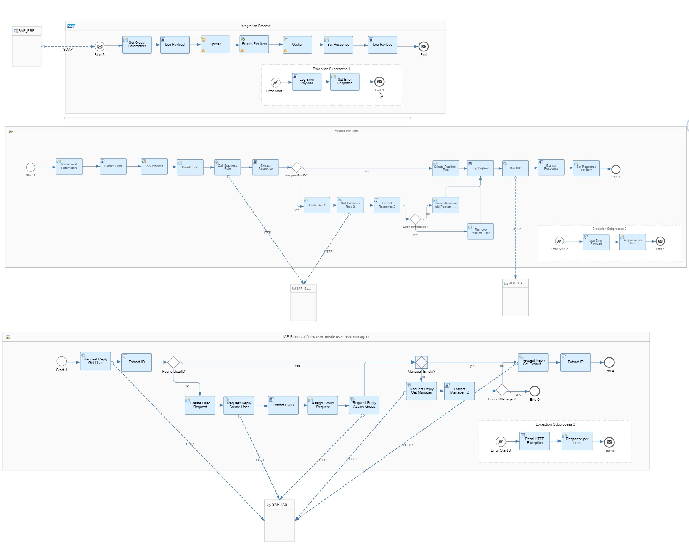

# SAP S/4HANA Access Request Integration with SAP Cloud Identity Access Governance 

\| [Recipes by Topic](../../readme.md ) \| [Recipes by Author](../../author.md ) \| [Request Enhancement](https://github.com/SAP-samples/cloud-integration-flow/issues/new?assignees=&labels=Recipe%20Fix,enhancement&template=recipe-request.md&title=Improve%20Email%20Integration%20with%20S/4HANA%20Cloud%20Custom%20Business%20Object) \| [Report a bug](https://github.com/SAP-samples/cloud-integration-flow/issues/new?assignees=&labels=Recipe%20Fix,bug&template=bug_report.md&title=Issue%20with%20Email%20Integration%20with%20S/4HANA%20Cloud%20Custom%20Business%20Object)\| [Fix documentation](https://github.com/SAP-samples/cloud-integration-flow/issues/new?assignees=&labels=Recipe%20Fix,documentation&template=bug_report.md&title=Docu%20fix%20Email%20Integration%20with%20S/4HANA%20Cloud%20Custom%20Business%20Object) \| 

  | [SAP API Business Hub](https://api.sap.com/allcommunity) | 
 ----|----| 

Integrate SAP Cloud Identity Access Governance solution with your S/4HANA HR systems to enable changes in employee status (HR triggers) to initiate access requests via SAP Cloud Identity Access Governance.

[Download the integration package](SAPS_4HANAAccessRequestIntegrationwithSAPCloudIdentityAccessGovernance.zip)\
[View package on the SAP API Business Hub](https://api.sap.com/package/saps4hanaaccessrequestintegrationwithsapcloudidentityaccessgovernance)\
[View documentation](SAPS4HANAAccessRequestIntegrationwithSAPCloudIdentityAccessGovernance.pdf)\
[View high level effort](effort.md)
## Integration flows
### SAP S/4HANA Access Request Integration with SAP Cloud Identity Access Governance 
Read, Insert, Update and Delete data in a custom business object by emailing an iFlow as an approved sender \
 
