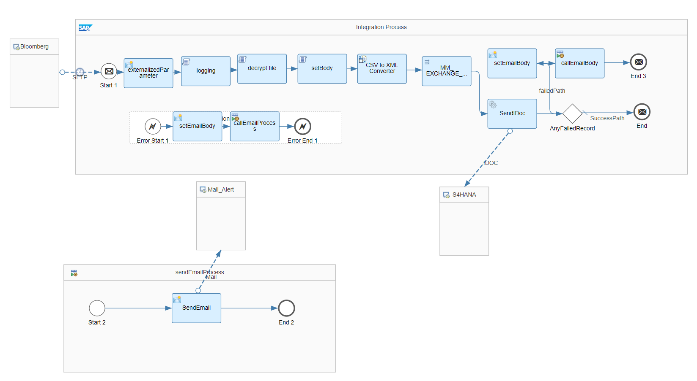

# SAP S/4HANA Integration with Third-Party - Exchange Rate Load

\| [Recipes by Topic](../../readme.md ) \| [Recipes by Author](../../author.md ) \| [Request Enhancement](https://github.com/SAP-samples/cloud-integration-flow/issues/new?assignees=&labels=Recipe%20Fix,enhancement&template=recipe-request.md&title=Improve%20SSAP%20S4HANA%20Integration%20with%20Third%20Party%20Exchange%20Rate%20Load%20 ) \| [Report a bug](https://github.com/SAP-samples/cloud-integration-flow/issues/new?assignees=&labels=Recipe%20Fix,bug&template=bug_report.md&title=Issue%20with%20SAP%20S4HANA%20Integration%20with%20Third%20Party%20Exchange%20Rate%20Load%20 ) \| [Fix documentation](https://github.com/SAP-samples/cloud-integration-flow/issues/new?assignees=&labels=Recipe%20Fix,documentation&template=bug_report.md&title=Docu%20fix%20SAP%20S4HANA%20Integration%20with%20Third%20Party%20Exchange%20Rate%20Load%20 ) \|

 | [SAP Business Accelerator Hub](https://api.sap.com/allcommunity) |
----|----|

Integration between SAP S/4HANA with Bloomberg Bank for Exchange Rate where the file is picked from BANK SFTP and will be processed in SAP S/4HANA using IDoc. File based integration for sending Exchange Rate from Bloomberg to SAP S/4HANA using IDoc (Message Type: EXCHANGE_RATE; Basic Type: EXCHANGE_RATE01).

This package allows you to do the following:

* Replicate Exchange Rate

[Download the integration package](SAPS_4HANAIntegrationwithThird-Party-ExchangeRateLoad.zip)\
[View package on the SAP Business Accelerator Hub](https://api.sap.com/package/SAPS4HANAIntegrationwithBloombergBank/overview)\
[View high level effort](effort.md)

## Integration Flows

### Replicate Exchange Rate
Interface for sending Exchange Rate from Bloomberg to SAP S/4HANA\
[View on SAP Business Accelerator Hub](https://api.sap.com/integrationflow/Replicate_Exchange_Rate)

