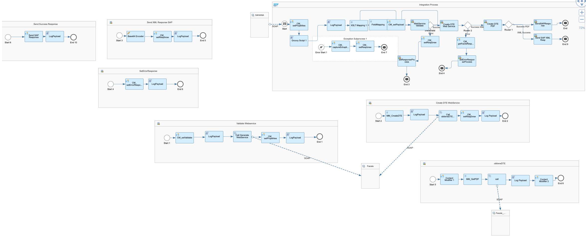
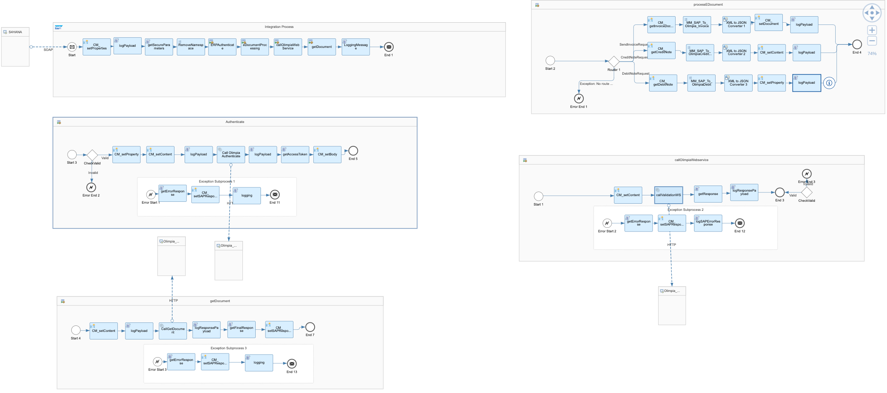
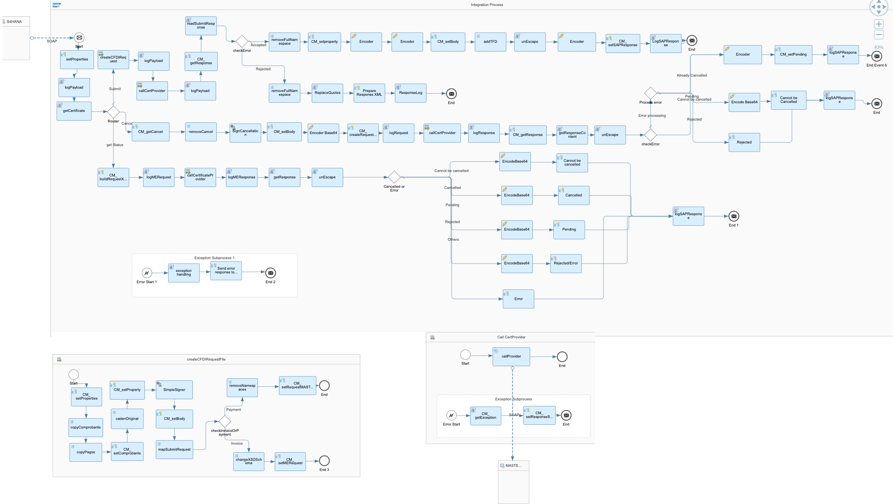

# SAP Document Compliance with Third Party 

\| [Recipes by Topic](../../readme.md ) \| [Recipes by Author](../../author.md ) \| [Request Enhancement](https://github.com/SAP-samples/cloud-integration-flow/issues/new?assignees=&labels=Recipe%20Fix,enhancement&template=recipe-request.md&title=Improve%20SAP%20Document%20Compliance%20with%20Third%20Party%20-%20eDocuments ) \| [Report a bug](https://github.com/SAP-samples/cloud-integration-flow/issues/new?assignees=&labels=Recipe%20Fix,bug&template=bug_report.md&title=Issue%20with%20SAP%20Document%20Compliance%20with%20Third%20Party%20-%20eDocuments ) \| [Fix documentation](https://github.com/SAP-samples/cloud-integration-flow/issues/new?assignees=&labels=Recipe%20Fix,documentation&template=bug_report.md&title=Docu%20fix%20SAP%20Document%20Compliance%20with%20Third%20Party%20-%20eDocuments ) \|

 | [SAP Accelerator Business Hub](https://api.sap.com/allcommunity) |
----|----|

Exchange electronic invoices with the tax authorities for Chile, Colombia and Mexico. The integration package is available for SAP S/4HANA, and SAP ERP (available as of SAP ERP 6.0 EHP5).

[Download the reuseable integration package](SAPDocumentCompliancewithThirdParty-eDocuments.zip)\
[View package on the SAP Accelerator Business Hub](https://api.sap.com/package/SAPS4HANAIntegrationwithThirdPartyeDocuments/overview)

## Integration flows

### Chile Document Compliance from S4HANA to Facele
Sends the eDocument from SAP S/4HANA to Facele to exchange electronic documents with SII\
[View on SAP Accelerator Business Hub](https://api.sap.com/integrationflow/Chile_Document_Compliance_from_S4HANA_to_Facele)

### Colombia Document Compliance from S4HANA to Olimpia
Sends the Invoice/Credit Note and Debit Note from SAP S/4HANA to Olimpia\
[View on SAP Accelerator Business Hub](https://api.sap.com/integrationflow/Colombia_Document_Compliance_from_S4HANA_to_Olimpia)

### Mexico Document Compliance from S4HANA to MasterEDI
Signs the eDocument/ePayment from SAP S/4HANA and allows Submit/Cancel/Get Status to SAT through PAC MASTEREDI\
[View on SAP Accelerator Business Hub](https://api.sap.com/integrationflow/Mexico_Document_Compliance_from_S4HANA_to_MasterEDI)

