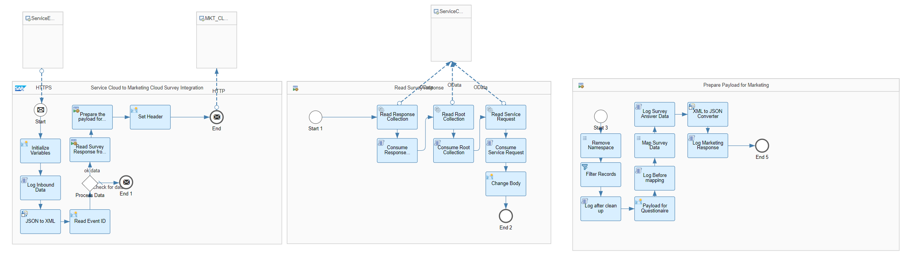

# SAP Service Cloud Integration with SAP Marketing Cloud for Replicating Survey Details

\| [Recipes by Topic](../../readme.md ) \| [Recipes by Author](../../author.md ) \| [Request Enhancement](https://github.com/SAP-samples/cloud-integration-flow/issues/new?assignees=&labels=Recipe%20Fix,enhancement&template=recipe-request.md&title=Improve%20SAP%20Service%20Cloud%20Integration%20with%20SAP%20Marketing%20Cloud%20for%20Replicating%20Survey%20Details%20 ) \| [Report a bug](https://github.com/SAP-samples/cloud-integration-flow/issues/new?assignees=&labels=Recipe%20Fix,bug&template=bug_report.md&title=Issue%20with%20SAP%20Service%20Cloud%20Integration%20with%20SAP%20Marketing%20Cloud%20for%20Replicating%20Survey%20Details%20 ) \| [Fix documentation](https://github.com/SAP-samples/cloud-integration-flow/issues/new?assignees=&labels=Recipe%20Fix,documentation&template=bug_report.md&title=Docu%20fix%20SAP%20Service%20Cloud%20Integration%20with%20SAP%20Marketing%20Cloud%20for%20Replicating%20Survey%20Details%20 ) \|

 | [SAP Accelerator Business Hub](https://api.sap.com/allcommunity) |
----|----|

This integration package is used to replicate survey details from SAP Service Cloud to SAP Marketing Cloud.

This package supports integration of SAP Service Cloud with SAP Marketing Cloud .

Replication of Survey Data.
Supported Format - JSON

[Download the integration package](SAPServiceCloudIntegrationwithSAPMarketingCloudforReplicatingSurveyDetails.zip)\
[View package on the SAP Accelerator Business Hub](https://api.sap.com/package/SAPServiceCloudIntegrationwithSAPMarketingCloudReplicateSurveyDetails/overview)\
[View Documentation](ReplicateSurveyDatafromSAPServiceCloudtoSAPMarketingCloud.pdf)\
[View high level effort](effort.md)

## Integration Flows

### Replicate Survey Data from SAP Service Cloud with SAP Marketing Cloud
Integration Flow for transfer of Survey questions from SAP Service Cloud to SAP Marketing Cloud\
[View on SAP Accelerator Business Hub](https://api.sap.com/integrationflow/Replicate_Survey_Data_from_Service_Cloud_to_Marketing_Cloud)

