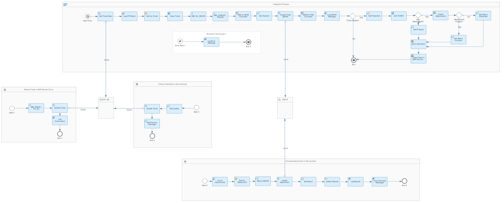

# SAP Service Cloud Integration with ServiceNow 

\| [Recipes by Topic](../../readme.md ) \| [Recipes by Author](../../author.md ) \| [Request Enhancement](https://github.com/SAP-samples/cloud-integration-flow/issues/new?assignees=&labels=Recipe%20Fix,enhancement&template=recipe-request.md&title=Improve%20SAP%20Service%20Cloud%20Integration%20with%20ServiceNow) \| [Report a bug](https://github.com/SAP-samples/cloud-integration-flow/issues/new?assignees=&labels=Recipe%20Fix,bug&template=bug_report.md&title=Issue%20with%20SAP%20Service%20Cloud%20Integration%20with%20ServiceNow)\| [Fix documentation](https://github.com/SAP-samples/cloud-integration-flow/issues/new?assignees=&labels=Recipe%20Fix,documentation&template=bug_report.md&title=Docu%20fix%20SAP%20Service%20Cloud%20Integration%20with%20ServiceNow) \| 

  | [SAP API Business Hub](https://api.sap.com/allcommunity) | 
 ----|----| 

This package supports integration between SAP Service Cloud and ServiceNow in respect of ticket data replication

This package has the iFlow Replicate Ticket Data from SAP Service Cloud to ServiceNow.

The purpose of this integration is to collect identified tickets created on SAP Service Cloud, enrich the content of the message with information with the attachments created on the system and send it to ServiceNow. Once the ticket is created on ServiceNow, the integration flow should returns the created ID to updated the ticket back on SAP Service Cloud.

[Download the integration package](SAPServiceCloudIntegrationwithServiceNow.zip)\
[View package on the SAP API Business Hub](https://api.sap.com/package/SAPServiceCloudIntegrationwithServiceNow)\
[View documentation](ReplicateTicketDataFromSAPServiceCloudToServiceNow.pdf)\
[View high level effort](effort.md)
## Integration flows
### Replicate Ticket Data from SAP Service Cloud to ServiceNow 
This integration will fetch tickets data from SAP Service Cloud and send them to ServiceNow \
 