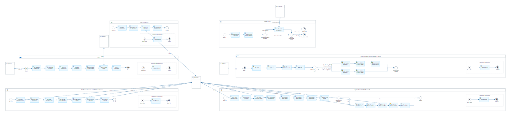
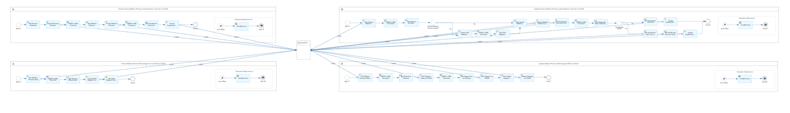
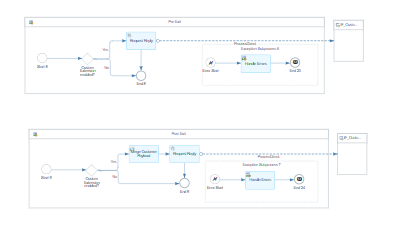
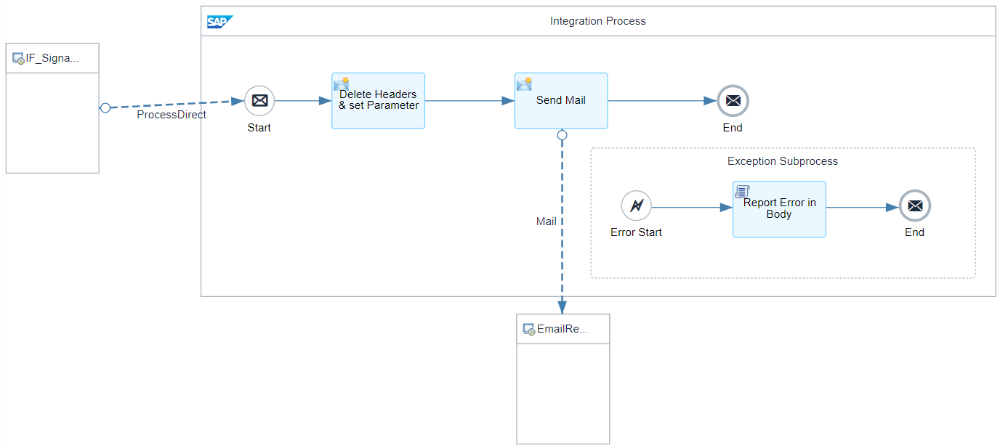

# SAP Signavio Integration with SAP Cloud ALM 

\| [Recipes by Topic](../../readme.md ) \| [Recipes by Author](../../author.md ) \| [Request Enhancement](https://github.com/SAP-samples/cloud-integration-flow/issues/new?assignees=&labels=Recipe%20Fix,enhancement&template=recipe-request.md&title=Improve%20SAP%20Signavio%20Integration%20with%20SAP%20Cloud%20ALM) \| [Report a bug](https://github.com/SAP-samples/cloud-integration-flow/issues/new?assignees=&labels=Recipe%20Fix,bug&template=bug_report.md&title=Issue%20with%20SAP%20Signavio%20Integration%20with%20SAP%20Cloud%20ALM)\| [Fix documentation](https://github.com/SAP-samples/cloud-integration-flow/issues/new?assignees=&labels=Recipe%20Fix,documentation&template=bug_report.md&title=Docu%20fix%20SAP%20Signavio%20Integration%20with%20SAP%20Cloud%20ALM) \| 

  | [SAP Business Accelerator Hub](https://api.sap.com/allcommunity) | 
 ----|----| 

Import business processes between SAP Signavio and SAP Cloud ALM.

The Integration Suite community solution for the integration of SAP Signavio and SAP Cloud ALM provides Integration Flows to transfer Process Diagrams from SAP Signavio into SAP Cloud ALM as Solution Processes into the custom process repository.

The Process Diagrams (BPMN) are transferred as Scalable Vector Graphics (SVGs) into the Process Authoring microservice of SAP Cloud ALM upon approval via the SAP Signavio Process Governance workflow. 
  Continuous process updates of the process can be sent from SAP Signavio to SAP Cloud ALM without loosing the reference to the assigned artefacts e.g. requirements, test cases, ... 
  Besides the Process Information a backlink to SAP Signavio from SAP Cloud ALM is provided. 
  The community solution can easily be consumed directly via the provided community template. 
  The Integration Suite Community Solution is a custom solution and not a standard SAP product.

Consulting Services to support the implementation are available.

To learn more contact alm.consulting@sap.com

[Download the integration package](SAPSignavioIntegrationwithSAPCloudALM.zip)\
[View package on the SAP Business Accelerator Hub](https://api.sap.com/package/SAPSignavioIntegrationwithSAPCloudALM)\
[View documentation](SignavioCALM_Documentation.pdf)\
[View methodology usage concept](Methodology_Usage_Concept.pdf)\
[View high level effort](effort.md)
## Integration flows
### Import processes from SAP Signavio to SAP Cloud ALM 
This IFlow imports processes from SAP Signavio to SAP Cloud ALM. \
 
 
 
### Send Error Notification E-Mail 
When the main IFlow fails/ throws an exception, this IFlow sends an e-mail to a configured address. \
 