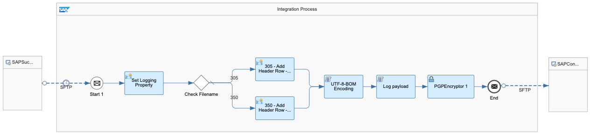

# Employee Integration between SAP SuccessFactors and SAP Concur Integration

\| [Recipes by Topic](../../readme.md ) \| [Recipes by Author](../../author.md ) \| [Request Enhancement](https://github.com/SAP-samples/cloud-integration-flow/issues/new?assignees=&labels=Recipe%20Fix,enhancement&template=recipe-request.md&title=Improve%20Employee%20Integration%20between%20SAP%20SuccessFactors%20and%20SAP%20Concur%20Integration) \| [Report a bug](https://github.com/SAP-samples/cloud-integration-flow/issues/new?assignees=&labels=Recipe%20Fix,bug&template=bug_report.md&title=Issue%20with%20Employee%20Integration%20between%20SAP%20SuccessFactors%20and%20SAP%20Concur%20Integration)\| [Fix documentation](https://github.com/SAP-samples/cloud-integration-flow/issues/new?assignees=&labels=Recipe%20Fix,documentation&template=bug_report.md&title=Docu%20fix%20Employee%20Integration%20between%20SAP%20SuccessFactors%20and%20SAP%20Concur%20Integration) \|

  | [SAP Accelerator Business Hub](https://api.sap.com/allcommunity) |
 ----|----|

This package provides a way to integrate employees from SAP SuccessFactors to SAP Concur via SFTP. The integration uses the employee file structure for 305 and 350 and also encrypts the payload

[Download the integration package](SAPSuccessFactorsandSAPConcurIntegration.zip)\
[View package on the SAP Accelerator Business Hub](https://api.sap.com/package/SAPSuccessFactorsandSAPConcurIntegration)\
[View documentation](ConfigurationGuide.pdf)

[View high level effort](effort.md)
 ## Integration flows
### Employee Integration from SAP SuccessFactors to SAP Concur
This IFlow takes employee master data CSV files from the SAP SuccessFactors SFTP, transforms, pgb encrypts and sends them to the SAP Concur SFTP Server. \
 
