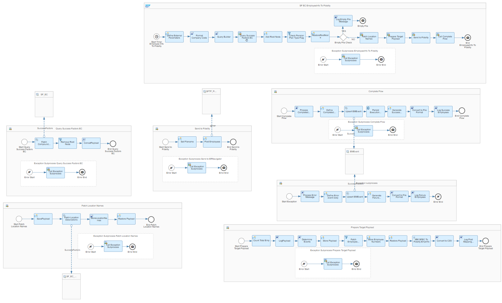

# SAP SuccessFactors Employee Central Integration with Fidelity 

\| [Recipes by Topic](../../readme.md ) \| [Recipes by Author](../../author.md ) \| [Request Enhancement](https://github.com/SAP-samples/cloud-integration-flow/issues/new?assignees=&labels=Recipe%20Fix,enhancement&template=recipe-request.md&title=Improve%20SAP%20SuccessFactors%20Employee%20Central%20Integration%20with%20Fidelity) \| [Report a bug](https://github.com/SAP-samples/cloud-integration-flow/issues/new?assignees=&labels=Recipe%20Fix,bug&template=bug_report.md&title=Issue%20with%20SAP%20SuccessFactors%20Employee%20Central%20Integration%20with%20Fidelity)\| [Fix documentation](https://github.com/SAP-samples/cloud-integration-flow/issues/new?assignees=&labels=Recipe%20Fix,documentation&template=bug_report.md&title=Docu%20fix%20SAP%20SuccessFactors%20Employee%20Central%20Integration%20with%20Fidelity) \| 

  | [SAP Business Accelerator Hub](https://api.sap.com/allcommunity) | 
 ----|----| 

This integration package provides integration flow which allows you to read and send employee data from SAP SuccessFactors Employee Central to the Fidelity sever.

Fidelity is a 3rd party solution that manages employee deductions and loans. This integration flow fetches employee details from SAP SuccessFactors Employee Central and based on the events/data changes, determines the records to be sent to Fidelity system. The employee mini master file is hence generated keeping the fixed field lengths intact. The file is then sent to the Fidelity SFTP server.

[Download the integration package](SAPSuccessFactorsEmployeeCentralIntegrationwithFidelity.zip)\
[View package on the SAP Business Accelerator Hub](https://api.sap.com/package/SAPSuccessFactorsEmployeeCentralIntegrationwithFidelity)\
[View documentation](Configuration%20Guide%20-%20Send%20Employee%20Information%20to%20Fidelity%20SFTP%20Server.pdf)\
[View high level effort](effort.md)
## Integration flows
### Send Employee Information to Fidelity SFTP Server 
Replicate employee information from SAP SuccessFactors Employee Central to Fidelity SFTP server. \
 
